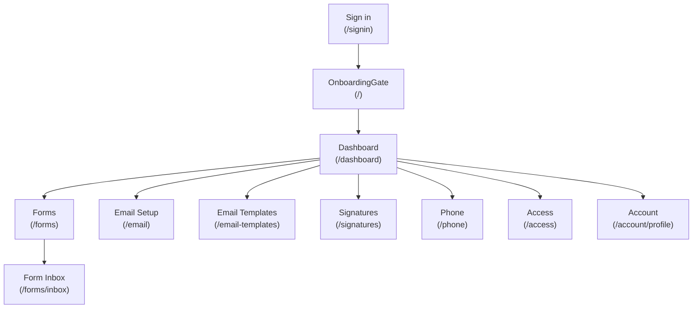
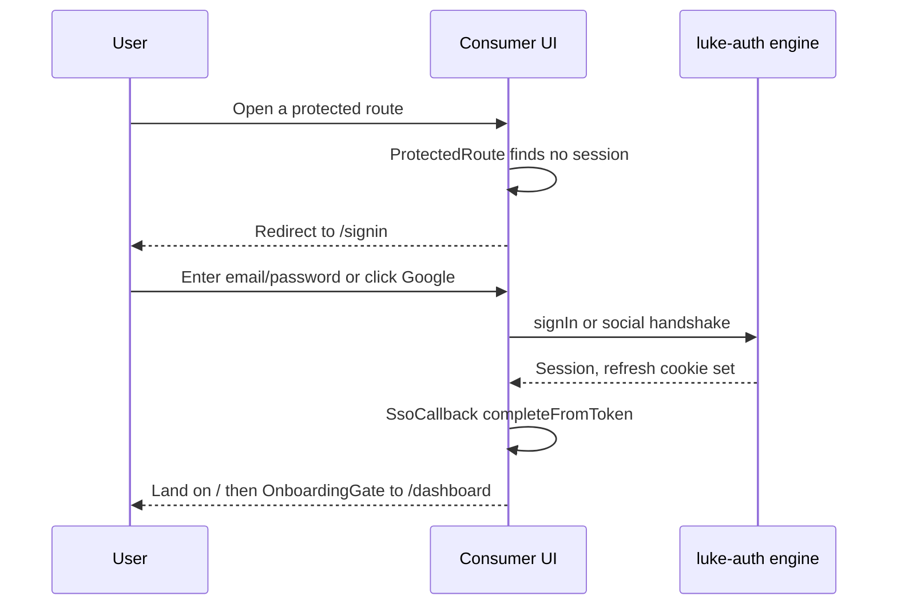
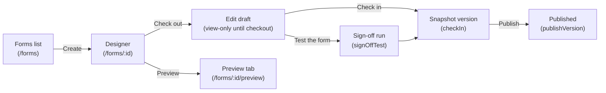
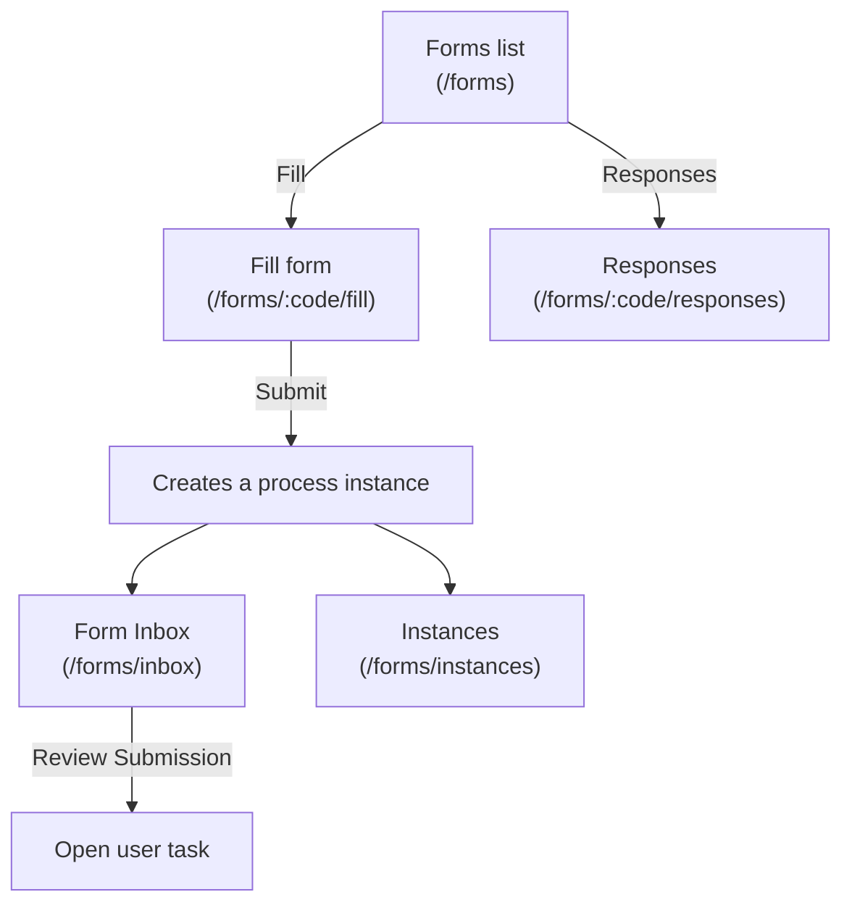
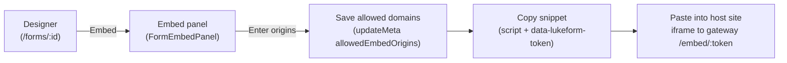
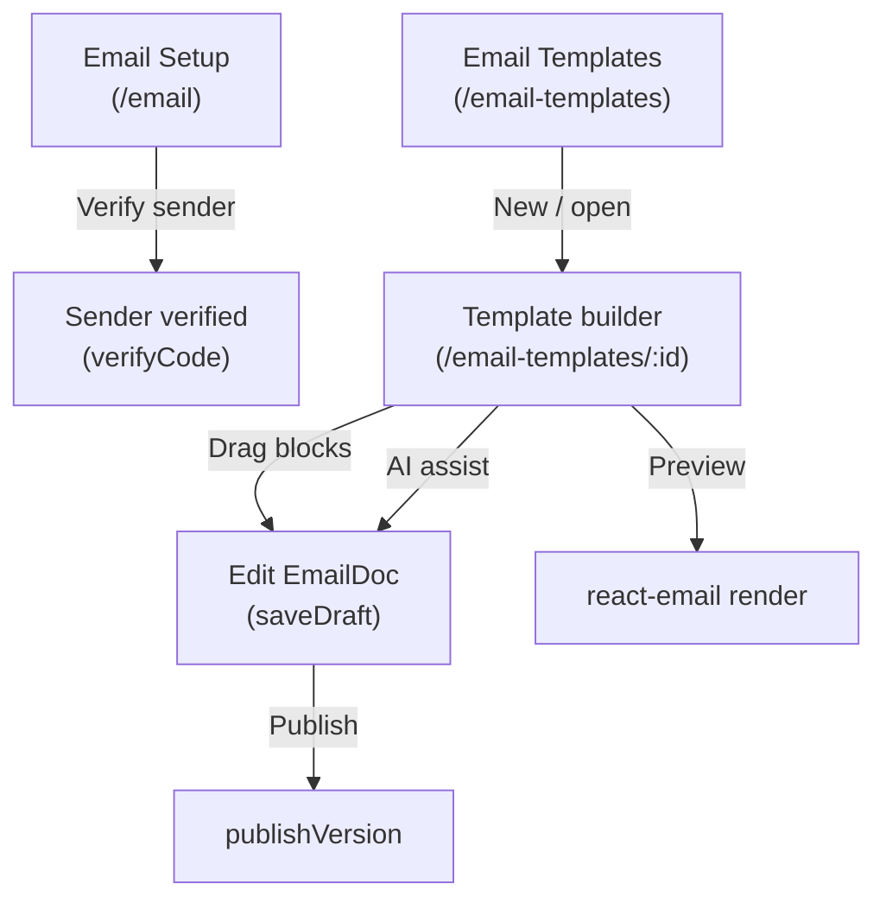
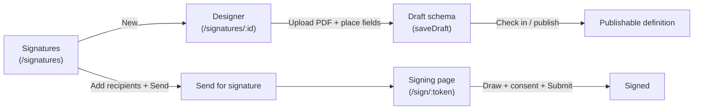
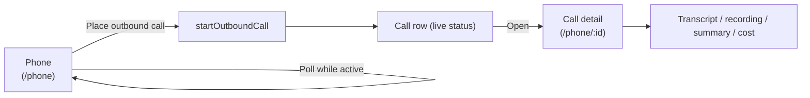
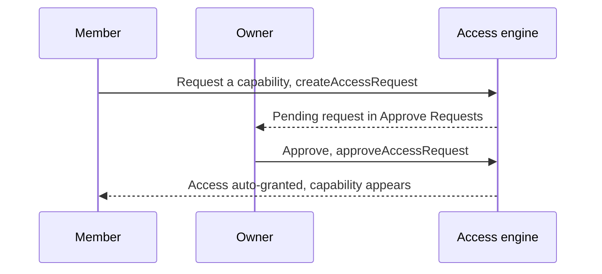
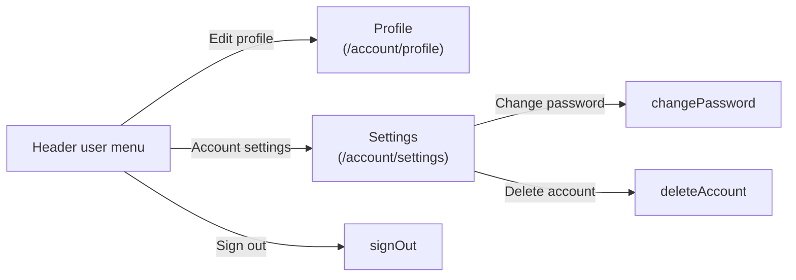

# Consumer UI — User Action Flows

This page traces the tenant-facing journeys — the actual click-paths a signed-in user takes through the app for each capability. The app itself is the [Consumer UI](/apps/consumer-ui); the server-side machinery behind each journey lives in the capability deep-dives. Everything below is taken from the real route table in `src/App.tsx`, the sidebar in `src/layout/AppSidebar.tsx`, and the page components under `src/pages/*`, as of July 2026.

## How the app is wired

Routing is React Router (`BrowserRouter`) declared entirely in `src/App.tsx`. Three guard components frame every journey:

- **`ProtectedRoute`** (`src/components/auth/ProtectedRoute.tsx`) — wraps the whole authenticated app; a missing session redirects to `/signin` (remembering the intended path).
- **`OnboardingGate`** (`src/components/auth/OnboardingGate.tsx`) — the landing route `/`; a provisioned user is sent to `/dashboard`, a brand-new user gets the `CreateOrganization` flow.
- **`CapabilityRoute`** (`src/components/auth/CapabilityRoute.tsx`) — gates each capability's routes on the caller's grant (read to view, write to edit). The same gate hides the matching sidebar item.

Authenticated pages render inside `AppLayout` (`src/layout/AppLayout.tsx`) — the sidebar (`AppSidebar.tsx`) + header (`AppHeader.tsx`) shell. A handful of pages are deliberately **outside** the shell: the public `/embed/:token`, `/respond/:token`, `/sign/:token`, and the standalone `/forms/:id/preview`.

## Navigation map

The sidebar shows **Dashboard**, **Forms** (Forms / Form Inbox), **Email** (Email Setup / Email Templates), **Signatures**, **Phone**, and **Workflow** (hidden by default — see below), plus an always-present **Access** entry for every signed-in member. Each capability group is filtered by `canRead(session, …)`, so users only see the sections they are granted.

## Sign in

WorkOS-backed authentication via the `luke-auth` engine. `SignInForm` (`src/components/auth/SignInForm.tsx`) offers email + password **and** social buttons ("Sign in with Google" / Microsoft). Social sign-in bounces through the provider and returns to `/sso-callback` (`SsoCallback`), which restores the session and routes onward.

1. Any protected route with no session → `ProtectedRoute` redirects to `/signin` (`SignInForm`).
2. Sign in with email/password (`signIn`) or a social provider (`social("google")` / Microsoft).
3. Social flow returns to `/sso-callback` (`SsoCallback`), which calls `completeFromToken()` and navigates to `/` on success or back to `/signin` on failure.
4. `/` is `OnboardingGate`: provisioned users go to `/dashboard` (`Home`); new users get `CreateOrganization`.
5. Signed-out users visiting `/signin` or `/signup` are handled by `GuestRoute`.

## Build & publish a form

The single live designer is `FormBuilderPage` (`src/pages/Forms/FormBuilderPage.tsx`, route `/forms/:id`), backed by `@lukeflow/form-builder`. It follows the **checkout → edit → check-in → sign-off → publish** lifecycle: the builder is view-only until you check out; check-in snapshots a version; publishing is gated on a signed-off version, and blocking Problems block both.

1. Start from **Forms** (`/forms`, `FormsList`) and click **Create** — a new form opens the designer at `/forms/:id` (`FormBuilderPage`).
2. Click **Check out** to acquire the edit lock (`checkout`); the builder becomes editable. A held lock can be taken over.
3. Edit fields; edits autosave the working draft (`saveDraft`) and mark it dirty since the last check-in.
4. **Preview** opens the standalone full-page `/forms/:id/preview` (`FormPreview`, outside the shell) in a new tab.
5. **Test the form** runs positive/negative validation and records a **sign-off** on the checked-in version (`signOffTest`).
6. **Check in** snapshots a version (`checkIn`); a plain check-in creates an *unsigned* version, "Check in & sign off" marks it signed.
7. **Publish** (`publishVersion`) promotes the signed-off version to live — disabled while there are blocking problems or no signed-off version. **Check out** again to make further changes (a new draft re-gates publish).

## Fill a form & view responses

Two internal fill/response routes plus the operator's task/instance views.

1. From `/forms` (`FormsList`), click **Fill** on a published form → `/forms/:code/fill` (`FormFill`). Complete the fields and **Submit**; this creates a runtime process instance (drafts can be saved).
2. Click **Responses** on a form → `/forms/:code/responses` (`FormResponses`) to browse that form's submissions.
3. **Form Inbox** (`/forms/inbox`, `FormInbox`, in the sidebar) lists open "Review Submission" user tasks for the tenant.
4. **Instances** (`/forms/instances`, `FormInstancesList`) shows every submission plus the end-to-end process trace.
5. Outbound forms are filled by an external recipient through the public `/respond/:token` page (`FormRespond`) — no login; the instance token plus an emailed OTP are the auth.

## Embed a form

Inbound (embeddable) forms expose an embed panel — `FormEmbedPanel` (`src/pages/Forms/FormEmbedPanel.tsx`), reached via the **Embed** action in the designer. You set the allowed origins, then copy the snippet.

1. In the designer, open **Embed** (the panel loads the form's embed token and current `allowedEmbedOrigins`).
2. Enter the sites permitted to frame the form and click to save — this PUTs `updateMeta(tenant, formId, { allowedEmbedOrigins })`, which becomes the embed page's per-tenant `frame-ancestors` policy.
3. **Copy snippet** copies a `
` + `<script src=".../embed.js">` block; the embed page is served by the engine (gateway origin) at `/embed/:token` and mounted cross-origin.
4. Paste the snippet into the host site. The public `/embed/:token` route (`FormEmbed`) renders it with no login — the signed token is the auth.

See the [Embed a Form guide](/guides/embed-a-form) for the full host-site walkthrough.

## Create & manage an email template

Two Email sidebar entries, both behind the EMAIL gate: **Email Setup** (`/email`, `Email`) for sender verification, and **Email Templates** (`/email-templates`, `EmailTemplatesList`).

1. **Email Setup** (`/email`, `Email`) — enter a work email, receive a code, and **verify** it (`emailApi.verifyCode`) to provision the tenant's sender.
2. **Email Templates** (`/email-templates`, `EmailTemplatesList`) — create or open a template → `/email-templates/:id` (`EmailTemplateBuilderPage`).
3. The builder uses `@lukeflow/email-builder` (palette / canvas / settings) with an AI assist panel (`EmailAiAssistPanel`) as an aside; edits autosave the `EmailDoc` (`saveDraft`).
4. **Preview** lazy-loads the `@lukeflow/email-react` renderer to show the compiled email; **Publish** (`publishVersion`) promotes a version.

## Signatures

Design a signing layout in the builder, send it to recipients, and each recipient completes the signing ceremony on a public page. Routes: `/signatures` (`SignaturesList`), `/signatures/:id` (`SignatureBuilderPage`), and the public `/sign/:token` (`SignPage`).

1. From **Signatures** (`/signatures`, `SignaturesList`) click **New** to create a definition → `/signatures/:id` (`SignatureBuilderPage`).
2. Upload the document (`uploadDocument`) and place signature/recipient fields; the schema autosaves (`saveDraft`). **Check in** snapshots the definition (same lifecycle idiom as forms — Save / Check in / publish).
3. Back on the list, add recipients (the **Users** action) and **Send** for signature — each recipient gets a unique sign link.
4. The recipient opens the public `/sign/:token` page (`SignPage`, `@lukeflow/sign-react`), reviews the document, **draws** a signature on the pad, ticks the **consent** checkbox, and **Submits** (`canSubmit = signature && consent`). Completed documents can be **Downloaded** from the list.

## Phone

Inbound/outbound AI voice calls via Vapi, behind the PHONE gate. Routes: `/phone` (`Phone`) and `/phone/:id` (`CallDetail`).

1. **Phone** (`/phone`, `Phone`) lists calls (`listCalls`) and lets you place an outbound call (`startOutboundCall`). While any call is active (queued/ringing/in-progress) the list polls so statuses, transcripts, and costs fill in live.
2. Open a call → `/phone/:id` (`CallDetail`), which shows status, cost, the recording (audio player), transcript, and summary — polling while the call is still live.

## Request & approve access

`/access` (`AccessManagement`) is visible to every signed-in member. It has an in-page sub-nav (`SECTIONS`): **Manage My Access** (all members) plus owner-only **Approve Requests**, **Members**, and **Invitations**.

1. A member opens `/access` → **Manage My Access**, sees their current capabilities (read-only from the session), and requests one they lack (`createAccessRequest`, choosing read or read-write). Their request history shows with status chips; pending ones can be cancelled.
2. An **owner** (tenant-admin) opens the owner-only **Approve Requests** section and **approves** (`approveAccessRequest`, which auto-grants) or **denies** with a note.
3. Owners also manage roles under **Members** (`AuthorizationTab`) and invites under **Invitations** (`AuthenticationTab`). Non-owners never see these sections.

## Account & settings

Reached from the header user dropdown (`src/components/header/UserDropdown.tsx`), not the sidebar.

1. Open the header avatar menu → **Edit profile** (`/account/profile`, `Profile`) or **Account settings** (`/account/settings`, `Settings`).
2. Settings manages email and password (**Change password** → `changePassword`, min 10 chars) and a danger-zone **Delete account** (`deleteAccount`).
3. **Sign out** in the same menu calls `signOut`.

## Workflow (hidden by default)

The **Workflow** routes exist (`/workflow` → `WorkflowsList`, `/workflow/connections` → `ConnectionsPage`, `/workflow/:id` → `WorkflowBuilderPage`, behind `CapabilityRoute code={WORKFLOW}`), but the WORKFLOW capability is **force-hidden across the entire UI** until launch. `HIDDEN_CAPABILITIES` in `src/lib/capabilities.ts` reports level `none` for it — hiding the sidebar item, blocking the routes, and filtering it out of the access catalog — unless `VITE_WORKFLOW_ENABLED=true`. When enabled, its journey mirrors Forms/Signatures: a list → a `react-flow` builder → publish, plus a Connections page for integrations.

## Where the flow continues server-side

Each front-end journey hands off to a capability engine and the shared auth layer:

- **Sign in / access** → [Authentication & Authorization](/concepts/auth) — WorkOS session, capability grants, and route/nav gating.
- **Forms** (build, fill, inbox, instances, embed) → [Forms](/capabilities/forms); the embed round-trip is detailed in [Embed a Form guide](/guides/embed-a-form).
- **Email** (sender verification, templates) → [Email](/capabilities/email).
- **Signatures** (definition, send, signing ceremony) → [Signatures](/capabilities/signatures).
- **Phone** (outbound calls, transcripts) → [Phone](/capabilities/phone).
- **Request & approve access** → [Access](/capabilities/access) and [Authentication & Authorization](/concepts/auth).
