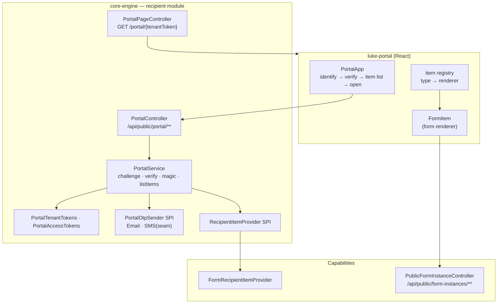

# Recipient Portal

The **Recipient Portal** (`luke-portal`) is the **recipient persona's** capability-agnostic hub. An
external recipient — a customer or client, **not** a tenant member — authenticates **once** and sees
and acts on every item assigned to them within a tenant. Forms is the first item type; signatures,
documents, and others plug in without changing the portal core.

<span class="pill partial">Partial · built green, not yet deployed</span>

> **Repository:** `luke-portal` · **Type:** Application (standalone bundle, served by core-engine) ·
> **Stack:** React 19 / Vite 6 / TypeScript / Tailwind v4 · **Backend module:** core-engine
> `com.luke.engine.recipient`

## Why it's separate

The recipient is a first-class persona that spans capabilities, so the portal is **not** a forms
sub-feature. It owns recipient **identity**; each capability contributes **items** through a provider
SPI. That split lets new capabilities appear in the portal by implementing one interface + one
renderer — no portal rewrite.

- **Front end** — `luke-portal`, a standalone app that builds to a single self-contained
  `portal.js`/`portal.css`, **vendored into core-engine** and served on its public origin (same model
  as the `/embed` and `/respond` surfaces), so it calls its APIs same-origin.
- **Back end** — core-engine module `com.luke.engine.recipient` (kept in the monolith per the
  capability→core merge decision), which owns the account-less identity flow and aggregates items.

## Architecture



## Identity flow (account-less, per-tenant)

The portal is reached at engine-served **`/portal/{tenantToken}`** (`PortalPageController`,
`frame-ancestors 'none'`), where `tenantToken` is a signed per-tenant handle (`PortalTenantTokens`,
mirroring embed tokens — a raw tenant id never appears). A recipient proves control of their email
via **one of three channels**, then a short-lived, **email-scoped session** (`PortalAccessTokens`,
binds `tenant + email + expiry`) is minted:

| Channel | How | Status |
| --- | --- | --- |
| **Email OTP** | 6-digit code mailed to the sender-asserted email; salted-hashed, expiring, attempt-capped, single-use | Live |
| **Magic link** | single-use, high-entropy link (SHA-256 at rest, atomic consume), 15-min TTL | Live |
| **SMS OTP** | same OTP over the `PortalOtpSender` SMS seam | **Seam** — refused until an SMS gateway is configured (`luke.forms.sms.enabled` + a real `SmsPortalOtpSender`) |

**Privacy invariant:** the challenge/magic-link/verify responses are **identical** in shape, status,
and latency whether or not the email has any items — no distinguishable `429`, and delivery is
dispatched off-thread — so a holder of the (shareable) tenant handle can't enumerate recipients. The
session then authorises each capability's own action surface, which validates it against the item's
tenant + recipient email (cross-tenant / cross-email access is impossible).

## Item providers — onboarding a capability

Each capability implements `RecipientItemProvider` (core-engine `com.luke.engine.recipient`):

```java
public interface RecipientItemProvider {
    String type();                                              // "form", "signature", …
    List<RecipientItem> itemsFor(String tenantId, String email); // open items, newest first
    default Optional<String> phoneFor(String tenantId, String email) { return Optional.empty(); }
}
```

`PortalService.listItems` aggregates across all providers. **Forms is the first provider**
(`FormRecipientItemProvider` → open `FormInstance`s become `"form"` items). To add a capability:

1. Implement `RecipientItemProvider` in that capability's package (backend).
2. Ensure its public action surface accepts the portal session (like
   `PublicFormInstanceService.authorize()` does).
3. Add one renderer to `src/items/registry.tsx` in `luke-portal` for the new item `type`.

## Endpoints

| Method | Path | Purpose | Auth |
| --- | --- | --- | --- |
| GET | `/portal/{tenantToken}` | Engine-hosted portal page shell | Public (origin-gated) |
| POST | `/api/public/portal/{tenantToken}/challenge` | Email/SMS OTP challenge | Public (tenant handle) |
| POST | `/api/public/portal/{tenantToken}/magic-link` · `/magic/consume` | Request / consume magic link | Public (tenant handle) |
| POST | `/api/public/portal/{tenantToken}/verify` | Verify OTP → session | Public (tenant handle) |
| GET | `/api/public/portal/items` | List assigned open items across capabilities | Public (portal session token) |

Per-item actions run on the capability's own public surface — e.g. a form item is filled via
`/api/public/form-instances/{token}` with the portal session as the Bearer.

## Status & gaps

Built green (backend module + tests, standalone front end) but **not yet deployed** — ship path is
`npm run vendor` in `luke-portal` (build + copy `portal.{js,css}` into core-engine) then deploy
core-engine, plus the portal secrets (`FORMS_PORTAL_TENANT_SECRET`, `FORMS_PORTAL_HMAC_SECRET`) and
`FORMS_PUBLIC_BASE_URL`. SMS is inert until a gateway is wired.

- Cross-links: [Forms capability](/capabilities/forms) · [Core Engine](/services/core-engine)
