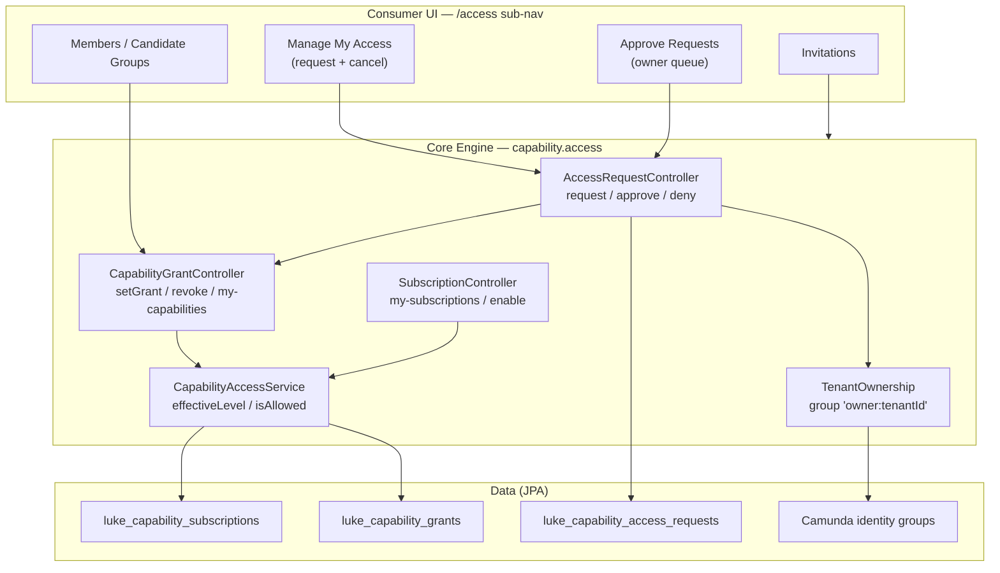
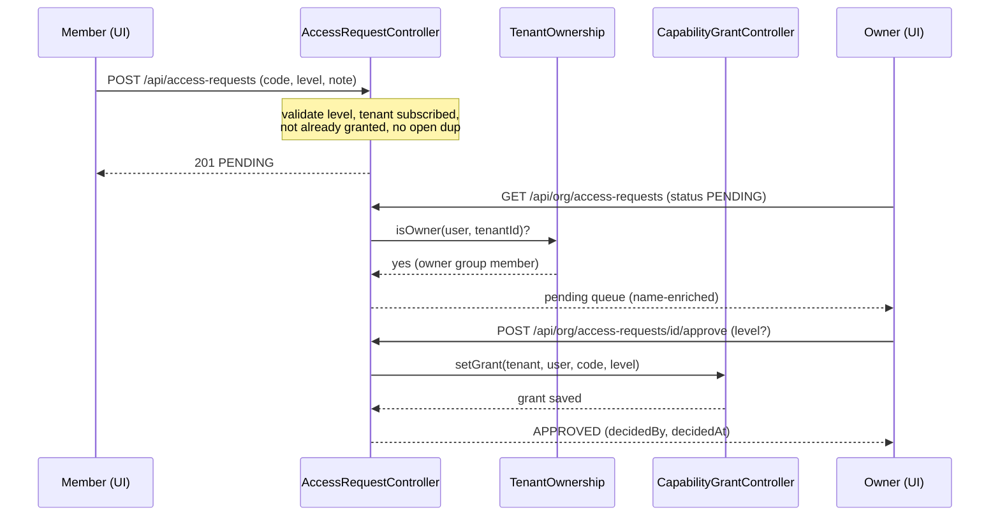

# Access Management

Production-ready

Access Management is the authorization backbone every other Lukeflow capability
sits on. It answers one question per request — **"may this user do this thing in
this org?"** — with a strict **two-layer, deny-by-default** model:

1. the **tenant** must hold an `ACTIVE` **subscription** to the capability, *and*
2. the **user** must hold a per-capability **grant** (`read` or `read-write`).

Missing either layer means no access. On top of that sits a self-service
**request → approve → grant** workflow (members ask, org owners decide) and a
tenant-scoped **ownership** model (`owner:<tenantId>`) that decides who is allowed
to approve. The engine surface lives in `luke-core-engine` under
`com.luke.engine.capability.access` / `…capability.capability`; the UI is the
`/access` section of `luke-consumer-ui`.

---

## Components at a glance

---

## Model

Access resolves against three persisted entities plus the Camunda identity store
that records ownership. The core rule (`CapabilityAccessService`): a user's
**effective level** on a capability is their grant level *only if* the tenant's
subscription for that capability is `ACTIVE` — otherwise `null` (no access).

| Entity | Table | Key fields | Purpose |
| --- | --- | --- | --- |
| `Capability` | `luke_capabilities` | `code` (unique), `name`, `route`, `icon`, `status` (`ACTIVE`/`BETA`/`RETIRED`), `tier` (`FREE`/`STANDARD`/`PREMIUM`) | Global platform catalog of features. Addressed by stable business `code` (e.g. `FORMS`), not UUID. |
| `CapabilitySubscription` | `luke_capability_subscriptions` | `tenantId`, `capabilityCode`, `status` (`ACTIVE`/`SUSPENDED`) | **Layer 1** — the per-tenant on/off switch. Unique on `(tenantId, capabilityCode)`. |
| `CapabilityGrant` | `luke_capability_grants` | `tenantId`, `userId`, `capabilityCode`, `level` (`read`/`read-write`), `grantedBy` | **Layer 2** — the per-user grant within a tenant. Unique on `(tenantId, userId, capabilityCode)`. |
| `AccessRequest` | `luke_capability_access_requests` | `tenantId`, `userId`, `capabilityCode`, `requestedLevel`, `status`, `note`, `decidedBy`, `decisionNote` | A member's pending ask + its approval lifecycle. |

**Access levels** (`CapabilityLevel`): `read` (look only) and `read-write`
(look + change). `satisfies(level, needWrite)` is the single check — a write
requires `read-write`; a read is met by either.

### Ownership model — `owner:<tenantId>`

"Who may approve access / administer this org" is **not** the global
`tenant-admin` role group. Because Camunda role groups are *global*, checking
"is this user a `tenant-admin`?" answers "…of *any* org" — a cross-tenant
escalation. Instead, `TenantOwnership` binds ownership to a dedicated per-tenant
group whose id is `owner:<tenantId>` and whose type is `OWNERSHIP` (deliberately
neither `ROLE` nor `ORGANIZATIONAL`, so it never leaks into role roll-ups).

- **Owner = admin of this tenant.** A tenant may have several co-owners.
- **The creator is seeded** as the first owner.
- **Transferable** by granting/revoking that group membership. Promoting a member
  to `tenant-admin` via `OrgAdminController` keeps the scoped `owner:<tenantId>`
  binding in sync; a **last-owner guard** refuses to remove the only remaining owner.
- Membership is checked via `GroupQuery.groupId(g).groupMember(u)` — the inverse
  `UserQuery` form is broken in the identity backend and silently bypassed the
  check, so this shape is used everywhere.

---

## Request → approve → grant flow

A member without access (or with a lower level than they need) submits a request;
an **owner** sees it in the Approve queue and approves — which reuses the exact
same grant path an owner would call directly — or denies with a note.

| Step | Endpoint / method | Guard | Notes |
| --- | --- | --- | --- |
| Submit | `POST /api/access-requests` → `AccessRequestController.create` | active tenant + caller | 422 if capability unknown / tenant not subscribed; 409 if already granted at that level or an open request exists. One open request per `(tenant, user, capability)`. |
| My requests | `GET /api/my-access-requests` → `myRequests` | caller | Caller's own requests, any status, newest first. |
| Cancel | `POST /api/access-requests/{id}/cancel` → `cancel` | requester owns it | Only a `PENDING` request; 403 if not yours, 409 otherwise. |
| Owner queue | `GET /api/org/access-requests?status=` → `orgRequests` | `requireAdmin` (owner) | Defaults to `PENDING`; names/capability labels resolved at read time. |
| Approve | `POST /api/org/access-requests/{id}/approve` → `approve` | `requireAdmin` (owner) | Marks `APPROVED` **and** calls `CapabilityGrantController.setGrant` at the requested level (optional body `level` override). |
| Deny | `POST /api/org/access-requests/{id}/deny` → `deny` | `requireAdmin` (owner) | Marks `DENIED` with an optional `decisionNote`; no grant made. |

`requireAdmin` accepts a **platform operator** (`camunda-admin` group or
membership of the parent cluster) *or* an owner of *this* tenant
(`TenantOwnership.isOwner`) — never a bare global `tenant-admin`.

---

## Tier gating

Granting a user access is only possible when the tenant already holds an `ACTIVE`
subscription: `CapabilityGrantController.setGrant` returns **409 Conflict** if
`tenantHasCapability` is false ("subscribe it before granting users"), and
`AccessRequestController.create` rejects a request for an unsubscribed capability
with **422**. Enabling a subscription is a separate call
(`PUT /api/tenants/{tenantId}/capabilities/{code}` → `SubscriptionController.enable`),
which today creates/activates a subscription for **any** non-retired capability.

Each `Capability` carries a `tier` field (`FREE` / `STANDARD` / `PREMIUM`), but
**tier is not yet enforced** at subscribe or grant time — no billing gate checks
it. Enforcing tier before `PREMIUM` capabilities ship is a **known follow-up**
(see the auto-subscribe / tier-gating deferral). Until then, tier is descriptive
metadata the UI renders as a badge.

---

## Component reference

| Component | Type | Responsibility | Key methods |
| --- | --- | --- | --- |
| `CapabilityAccessService` | Engine service | The authorization resolver — combines both layers. | `tenantHasCapability`, `effectiveLevel`, `isAllowed`, `effectiveCapabilities` |
| `CapabilityGrantController` | REST `/api` | Per-user grants + the per-session read. | `myCapabilities`, `listGrants`, `setGrant`, `revoke` |
| `SubscriptionController` | REST `/api` | Per-tenant enablement (layer 1). | `mySubscriptions`, `listForTenant`, `enable`, `disable` |
| `CapabilityController` | REST `/api/capabilities` | Global capability catalog CRUD (upsert, soft-retire). | `list`, `get`, `create`, `upsert`, `delete` |
| `AccessRequestController` | REST `/api` | Request/approve/deny workflow; enriches names at read time. | `create`, `myRequests`, `cancel`, `orgRequests`, `approve`, `deny`, `requireAdmin` |
| `CapabilityLevel` | Value helper | `read` / `read-write` semantics. | `isValid`, `canRead`, `canWrite`, `satisfies` |
| `TenantOwnership` | Static helper | Scoped `owner:<tenantId>` ownership binding. | `isOwner`, `ownerCount`, `grant`, `revoke`, `groupId` |
| `CapabilityGrantRepository` / `…SubscriptionRepository` / `AccessRequestRepository` | JPA repos | Tenant-scoped lookups (never cross-tenant). | `findByTenantId…`, `existsByTenantIdAndUserIdAndCapabilityCodeAndStatus` |
| `AccessManagement.tsx` | UI page | The `/access` page + left sub-nav router. | `SECTIONS`, owner-only filtering |
| `ManageMyAccessSection` | UI (all members) | Shows current access; request/cancel. | `submit`, `cancel` |
| `ApproveRequestsSection` | UI (owners) | The pending-request queue. | `approve`, `deny` |
| `AuthorizationTab` (Members) / `CandidateGroupsTab` / `AuthenticationTab` (Invitations) | UI (owners) | Add members, manage groups + group owners, invite teammates. | `addMember`, `createGroup`, `addSelectedOwners`, `send`, `revoke` |
| `accessRequestsApi.ts` | UI client | Tenant-scoped fetch wrapper for the workflow. | `createAccessRequest`, `listMyAccessRequests`, `cancelAccessRequest`, `listOrgAccessRequests`, `approveAccessRequest`, `denyAccessRequest` |

The `/access` sub-nav (`SECTIONS`): **Manage My Access** (every member) then, for
owners only, **Approve Requests**, **Members**, **Candidate Groups**, and
**Invitations**. A non-owner who lands on an owner-only section snaps back to
Manage My Access.

---

## Endpoints

The browser **never** sends `X-User-Id`; the auth gateway asserts the caller from
the verified session and injects it. `X-Tenant-Id` scopes every call.

| Method + path | Handler | Auth |
| --- | --- | --- |
| `GET /api/my-subscriptions` | `SubscriptionController.mySubscriptions` | Any member of the tenant |
| `GET /api/tenants/{t}/capabilities` | `listForTenant` | Owner / admin view |
| `PUT /api/tenants/{t}/capabilities/{code}` | `enable` | Owner / operator |
| `DELETE /api/tenants/{t}/capabilities/{code}?hard=` | `disable` (SUSPEND, or hard-remove) | Owner / operator |
| `GET /api/my-capabilities` | `CapabilityGrantController.myCapabilities` | Caller (per-session `{code: level}`) |
| `GET /api/tenants/{t}/users/{u}/capabilities` | `listGrants` | Owner / admin view |
| `PUT /api/tenants/{t}/users/{u}/capabilities/{code}` | `setGrant` | Owner (409 if tenant unsubscribed) |
| `DELETE /api/tenants/{t}/users/{u}/capabilities/{code}` | `revoke` | Owner |
| `POST /api/access-requests` | `AccessRequestController.create` | Caller (member) |
| `GET /api/my-access-requests` | `myRequests` | Caller |
| `POST /api/access-requests/{id}/cancel` | `cancel` | Requester |
| `GET /api/org/access-requests?status=` | `orgRequests` | Owner (`requireAdmin`) |
| `POST /api/org/access-requests/{id}/approve` | `approve` | Owner |
| `POST /api/org/access-requests/{id}/deny` | `deny` | Owner |

---

## Status & gaps

Access Management is production-ready and deployed: the two-layer model,
scoped-ownership authorization (`owner:<tenantId>`, with the last-owner guard and
the identity-query fix), and the full request/approve/deny workflow all ship and
are exercised by the `/access` UI.

**Known gaps / follow-ups**

- **Tier is not enforced.** `FREE`/`STANDARD`/`PREMIUM` is stored and displayed
  but no billing gate checks it before subscribe or grant — deferred until
  `PREMIUM` capabilities ship.
- **No notifications.** A pending request does not yet email/notify owners; they
  discover it in the Approve queue.

See the [Completeness Scorecard](/reference/completeness) for the fleet-wide
status view.

**Related concepts:** [Capabilities](/concepts/capabilities) ·
[Authentication & Authorization](/concepts/auth) · [Multi-Tenancy](/concepts/tenancy)
