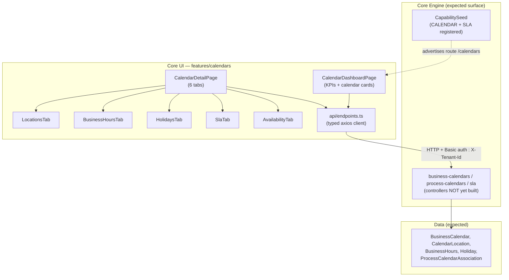
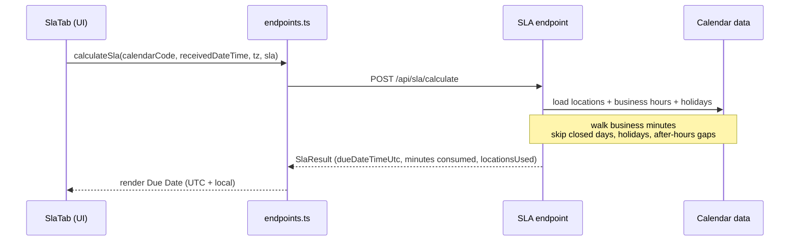

# Calendars & SLA Partial

Business **calendars** model where and when an organization actually works — named
locations, their timezones, weekly business hours, and holidays — so that downstream
work can be scheduled against real availability rather than raw wall-clock time. The
companion **SLA** engine walks those business hours (skipping closed days, holidays and
after-hours gaps across one or more locations) to turn a *received* timestamp plus an SLA
budget (business days / business minutes) into a concrete **due date**.

Two capabilities are seeded for this surface in the engine registry
(`CapabilitySeed.java`):

- `CALENDAR` — *Business Calendars* — icon `CalendarDays`, route `/calendars`, tier `STANDARD`, status `ACTIVE`.
- `SLA` — *SLA Management* — icon `Timer`, route `/sla`, tier `PREMIUM`, status `ACTIVE`.

::: warning Partial status
The **Core UI** feature is fully built — a dashboard, a six-tab detail workbench, a
complete typed API client, and reference data for timezones / countries / regions /
cities. The **Core Engine** side, however, only *registers* the two capabilities in
`CapabilitySeed`; a search of `luke-core-engine/src/main/java` finds **no** calendar,
location, business-hours, holiday, SLA or availability controller/service/entity. Every
REST call the UI makes (`/api/business-calendars/**`, `/api/process-calendars`,
`/api/sla/calculate`) is therefore against a backend that is **not yet implemented**.
The endpoints below document the contract the UI expects, not code that ships today.
:::

## Components at a glance

## Data model

Shapes are declared as TypeScript interfaces in
`luke-core-ui/src/features/calendars/api/endpoints.ts`. They describe the JSON the UI
sends and expects; the matching engine tables are not yet defined.

| Entity | Key fields | Notes |
| --- | --- | --- |
| `BusinessCalendar` | `id`, `calendarCode`, `name`, `description`, `active`, `createdAt`, `updatedAt` | Top-level named calendar, addressed everywhere by `calendarCode`. |
| `CalendarLocation` | `id`, `calendarId`, `locationCode`, `name`, `timezone`, `country`, `region`, `city`, `enabled`, `sortOrder` | A working site within a calendar; owns its own hours + holidays. `timezone` drives all conversions. |
| `BusinessHours` | `id`, `locationId`, `dayOfWeek` (1=Mon…7=Sun), `startTime`, `endTime`, `label`, `partial`, `capacityPercent`, `partialReason`, `active`, `effectiveFrom`, `effectiveUntil` | Weekly recurring open window per location; `partial` + `capacityPercent` model reduced-capacity shifts. |
| `Holiday` | `id`, `locationId`, `date`, `name`, `type`, `openFrom`, `openUntil`, `closed`, `description`, `recurring` | Per-location date override; `closed=true` blocks the whole day, otherwise `openFrom`/`openUntil` narrow it. |
| `ProcessCalendarAssociation` | `id`, `processDefinitionKey`, `calendarCode`, `slaBusinessDays`, `slaBusinessMinutes`, `priority`, `active` | Binds a Camunda process definition to a calendar + default SLA budget + priority (`LOW`/`MEDIUM`/`HIGH`/`CRITICAL`). |
| `SlaResult` (response) | `receivedDateTimeUtc`, `dueDateTimeUtc`, `dueDateTimeLocal`, `totalBusinessMinutesConsumed`, `calendarCode`, `locationsUsed` | Output of `/sla/calculate`. |
| `AvailabilityWindow` (response) | `start`, `end`, `durationMinutes`, `activeLocations` | Contiguous open interval produced by `/availability`. |

## SLA calculation flow

The `SlaTab` collects a received datetime, its timezone, and an SLA budget, then calls
`calculateSla(...)`. The engine is expected to normalize the received time to UTC, then
consume the budget by stepping through each location's business hours while skipping
closed days, holidays and after-hours gaps, until the budget reaches zero — that landing
point is the due date.

| Concern | Function / endpoint | Where |
| --- | --- | --- |
| Build the request | `slaMut` → `calculateSla({ calendarCode, receivedDateTime, receivedTimezone, sla: { businessDays, businessMinutes } })` | `CalendarDetailPage.tsx` |
| Default the received timezone | `useEffect` seeds `slaForm.receivedTimezone` from the first location's `timezone` | `CalendarDetailPage.tsx` |
| Transport | `POST /api/sla/calculate` | `endpoints.ts` |
| Show the result | `SlaTab` renders `receivedDateTimeUtc`, `dueDateTimeUtc`, `dueDateTimeLocal`, `totalBusinessMinutesConsumed`, `locationsUsed` | `CalendarDetailPage.tsx` |
| Bind a process default | `createProcessAssociation({ processDefinitionKey, calendarCode, slaBusinessDays, slaBusinessMinutes, priority })` | `endpoints.ts` |

## Availability & isOpen

Two lighter-weight reads complement the full SLA walk:

- **Availability windows** — `getAvailability(calCode, from, to)` → `GET /business-calendars/{code}/availability?from&to`
  returns an ordered list of `AvailabilityWindow`s (each `start`/`end`/`durationMinutes`
  plus the `activeLocations` open during it) for a date range. The `AvailabilityTab`
  defaults the range to the current Mon–Fri (`getMonday`/`getFriday`) and renders each
  window as a row; the query only fires while the Availability tab is active.
- **Currently open** — `isCalendarOpen(calCode)` → `GET /business-calendars/{code}/is-open`
  returns `{ open, openLocations }`. `CalendarDetailPage` runs this on an
  `openQuery` with `refetchInterval: pollWithBackoff(60_000)` and paints a live
  "Currently Open / Currently Closed" status bar, listing the open location codes.

## Component reference

| Component | Type | Responsibility | Key methods / hooks |
| --- | --- | --- | --- |
| `CalendarDashboardPage` | Page | Landing grid: KPI cards + per-calendar cards, create/delete calendars | `getCalendars`, `createCalendar`, `deleteCalendar`, `KpiCard`, `CalendarCard` |
| `CalendarDetailPage` | Page | Orchestrates the six-tab workbench, all queries + mutations, breadcrumb, detail panel, live status bar | `calendarQuery`, `locationsQuery`, `openQuery`, `hoursQuery`, `holidaysQuery`, `availabilityQuery`, `processQuery`; `handleTabChange`, `autoSelectFirst` |
| `LocationsTab` | Sub-component | List/add/delete locations; select the "active" location that drives hours + holidays | `createLocationMut`, `deleteLocationMut`; country→city cascade via `CITIES[form.country]` |
| `BusinessHoursTab` | Sub-component | Per-location weekly hours; add/delete; partial-day + capacity | `createHoursMut`, `deleteHoursMut`; `DAY_NAMES` mapping |
| `HolidaysTab` | Sub-component | Per-location holidays; search, add, delete, auto-import by year | `deleteHolidayMut`, `autoImportMut`; `filteredHolidays` memo |
| `SlaTab` | Sub-component | SLA calculator form + result panel | `slaMut` → `calculateSla` |
| `AvailabilityTab` | Sub-component | Date-range availability windows table | `availabilityQuery`, `getMonday`/`getFriday` |
| Processes tab (inline) | Inline block | Associate/unassociate process definitions with SLA defaults + priority | `createProcessMut`, `deleteProcessMut`; filters `getProcessAssociations` by `calendarCode` |
| `endpoints.ts` | API client | Typed axios client; injects Basic auth + `X-Tenant-Id`; all CRUD + SLA/availability calls | `calApi` instance + request interceptor |
| `data/locations.ts` | Reference data | `TIMEZONES`, `COUNTRIES`, `REGIONS`, `CITIES` option lists for the location form | — |
| `CapabilitySeed` | Engine seed | Registers the `CALENDAR` (STANDARD) and `SLA` (PREMIUM) capabilities | `seed(new Capability(...))` |

## Endpoints

All calls carry HTTP **Basic auth** (username/password from `authStore`) and an
**`X-Tenant-Id`** header from `tenantStore`, injected by the `calApi` request
interceptor. Base URL is `${VITE_API_BASE_URL}/api` (or `/api`).

| Area | Method + path | Client function |
| --- | --- | --- |
| Calendars | `GET /business-calendars` · `GET/POST/PUT/DELETE /business-calendars/{code}` | `getCalendars`, `getCalendar`, `createCalendar`, `updateCalendar`, `deleteCalendar` |
| Locations | `GET/POST /business-calendars/{cal}/locations` · `PUT/DELETE …/locations/{loc}` | `getLocations`, `createLocation`, `updateLocation`, `deleteLocation` |
| Business hours | `GET/POST …/locations/{loc}/business-hours` · `DELETE …/business-hours/{id}` | `getBusinessHours`, `createBusinessHours`, `deleteBusinessHoursById` |
| Holidays | `GET/POST …/locations/{loc}/holidays` · `POST …/holidays/auto-import?year=` · `GET …/holidays/preview?countryCode=&year=` · `GET …/holidays/available-countries` · `DELETE …/holidays/{id}` | `getHolidays`, `createHoliday`, `autoImportHolidays`, `previewHolidays`, `getAvailableCountries`, `deleteHolidayById` |
| Process associations | `GET/POST /process-calendars` · `DELETE /process-calendars/{key}` | `getProcessAssociations`, `createProcessAssociation`, `deleteProcessAssociation` |
| SLA | `POST /sla/calculate` | `calculateSla` |
| Availability | `GET /business-calendars/{code}/availability?from&to` | `getAvailability` |
| Is-open | `GET /business-calendars/{code}/is-open` | `isCalendarOpen` |

## Status & gaps

- **UI:** complete and typed — dashboard, six-tab detail workbench, full API client, reference data.
- **Engine:** only capability registration exists. No calendar/location/business-hours/holiday/SLA/availability controller, service, entity, or migration is present in `luke-core-engine`. Until those ship, the UI's reads and writes have nothing to talk to.
- **Add-holiday form:** the manual "Create" button in `HolidaysTab` has no `onClick` wired to `createHoliday`, so only auto-import currently persists holidays.

See the [Completeness Scorecard](/reference/completeness) for where this sits against the
rest of the fleet, and the related [Core UI](/apps/core-ui),
[Core Engine](/services/core-engine) and [Capabilities](/concepts/capabilities) pages.
