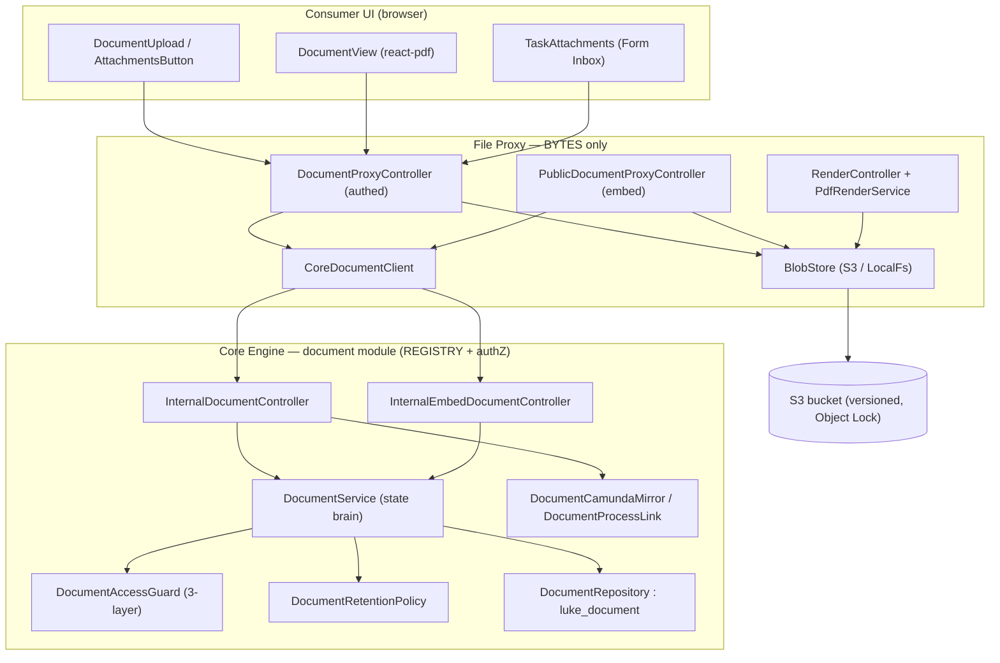
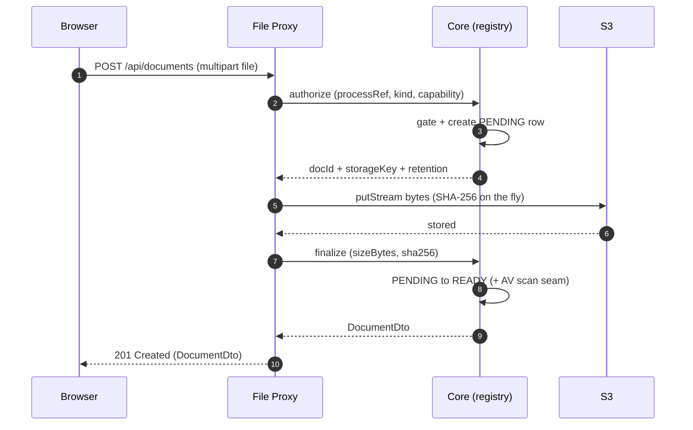
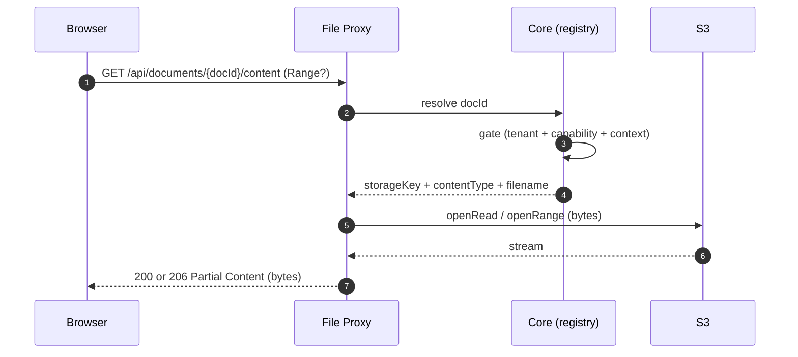

# Documents Partial

The **Documents** capability is Lukeflow's shared attachment / object-storage layer. It gives every
capability (FORMS, SIGNATURES, EMAIL, …) one tenant-isolated place to store a file, index it, gate
access to it, retain it, and mirror it into a Camunda case file — without any of them touching S3
directly.

The design splits cleanly across two services:

- **Core Engine owns the REGISTRY + authZ + state.** The `luke_document` table is the system of
  record: a stable `docId`, its tenant, its process/task linkage, its storage key, integrity hash,
  lifecycle status, and retention horizon. Core decides *whether* an upload/download is allowed and
  *where* the bytes live (the storage key) — but **bytes never reach core**.
- **File Proxy moves the BYTES.** luke-file-proxy is the only tier holding S3 credentials. It streams
  an upload to S3 (computing SHA-256 on the fly), streams a download back (Range-capable), applies
  S3 Object Lock, and hard-deletes versions — always after asking core to authorize and resolve.

So a browser only ever talks to `/api/documents` (the proxy). The proxy calls core's
`/api/internal/documents/**` for the small structured handshake, then does the byte I/O itself. Core
never sees a byte; the client never sees a storage key or an S3 URL.

> This page is grounded in the real code in `luke-core-engine/.../engine/document/**` and
> `luke-file-proxy/.../fileproxy/{document,storage,render}/**`.

## Components at a glance

## Data model

One entity, `Document` (table `luke_document`), is the whole registry. Bytes live in S3; this row is
the durable, queryable, tenant-isolated index + authZ source + status machine. Under the postgres
profile Hibernate `ddl-auto` is `none`, so `V7__document_table.sql` is the schema source of truth and
must stay faithful to the entity.

| Column | Type | Meaning |
| --- | --- | --- |
| `id` | String (UUID) PK | The stable, app-owned `docId` handed to clients. Assigned at authorize-time so the storage key can be built from it. |
| `version` | Long `@Version` | Optimistic lock — concurrent authorize/finalize/delete on the same row 409s instead of clobbering. |
| `tenantId` | String, not null | Explicit tenant column (mirrors `SignatureRequest`); every repository finder is tenant-scoped. |
| `processRef` | String, not null | Process business key = the case-file folder + S3 key prefix. Always set. |
| `processInstanceId` | String, nullable | Camunda instance id. Null until the process starts; backfilled (Flow-A, DOC-9). |
| `taskId` | String, nullable | Null = process/case-level attachment; set = task attachment (also process-scoped). |
| `kind` | String, not null | `FORM_ATTACHMENT` \| `SIGNATURE_ATTACHMENT` \| `FORM_SUBMISSION_PDF` \| `GENERIC`. |
| `capability` | String, not null | Owning capability (`FORMS` \| `SIGNATURES` \| `EMAIL`) — drives the authZ layer. |
| `ownerEntityId` | String, nullable | Owning entity within the capability (formInstanceId / signatureRequestId). |
| `storageKey` | String, not null | The S3 object key. **SERVER-ONLY** — never serialized to a client. Tenant-relative; BlobStore prepends `{tenantId}/`. |
| `filename` | String, not null | Original filename. |
| `contentType` | String, not null | MIME type. |
| `sizeBytes` | Long, nullable | Null until finalize (the proxy streams, then reports the real size). |
| `sha256` | String(64), nullable | SHA-256 hex; null until finalize (computed server-side as bytes stream through the proxy). |
| `status` | String, not null | `PENDING` → `READY` \| `QUARANTINED` \| `DELETED`. Defaults `PENDING`. |
| `retainUntil` | LocalDateTime, nullable | Object-Lock retention horizon (DOC-5). Null = no retention. |
| `createdBy` / `createdByName` | String, nullable | Uploader identity (null for anonymous embed respondents). |
| `createdAt` | LocalDateTime, not null | Set on `@PrePersist`. |
| `deletedAt` | LocalDateTime, nullable | Soft-delete timestamp. |

Physical S3 key = `{tenantId}/{processRef}/{docId}-{slug(filename)}`. The tenant prefix is
defense-in-depth (core's authZ is the real gate); `StorageKeys.validate` rejects traversal so a
crafted key can never escape its tenant prefix.

## Upload flow

The browser posts a file to the proxy. The proxy asks core to **authorize** (which creates a
`PENDING` row and returns a `docId` + tenant-relative storage key), streams the bytes to S3 while
computing SHA-256, then asks core to **finalize** (which flips the row to `READY`).

| Step | Where | Function / endpoint |
| --- | --- | --- |
| Client upload | Proxy | `DocumentProxyController.upload` — `POST /api/documents` (multipart) |
| Authorize | Proxy → Core | `CoreDocumentClient.authorize` → `InternalDocumentController.authorize` → `DocumentService.authorize` |
| Gate | Core | `DocumentAccessGuard.requireUpload` (capability write + task/process context) |
| Retention decision | Core | `DocumentRetentionPolicy.resolveRetainUntil` / `lockMode` |
| Byte write | Proxy → S3 | `BlobStore.putStream` (S3 `putObject`, optional SSE-KMS + Object Lock) |
| Finalize | Proxy → Core | `CoreDocumentClient.finalizeUpload` → `InternalDocumentController.finalizeUpload` → `DocumentService.finalizeUpload` |
| AV / integrity seam | Core | `DocumentScanner.scan` (`NoOpDocumentScanner` in V1; infected → `QUARANTINED`) |
| Camunda mirror | Core | `DocumentCamundaMirror.mirrorTaskAttachment` (best-effort, task-scoped only) |

The proxy enforces a size cap (`luke.docstore.max-bytes`, default 25 MiB → `413`) before authorizing.
Uploading is idempotent-safe on the row via the `@Version` optimistic lock.

## Retrieve flow

Download is symmetric: the proxy asks core to **resolve** the `docId` (gated, returns just the
storage key + content type + filename), then streams the bytes back from S3. Range requests are
honored so react-pdf and media players can seek.

| Step | Where | Function / endpoint |
| --- | --- | --- |
| Client fetch | Proxy | `DocumentProxyController.content` — `GET /api/documents/{docId}/content` |
| Resolve | Proxy → Core | `CoreDocumentClient.resolve` → `InternalDocumentController.resolve` → `DocumentService.resolveForDownload` |
| Gate | Core | `DocumentAccessGuard.requireRead` (`QUARANTINED` → 423, not-`READY` → 409) |
| Byte read | Proxy → S3 | `BlobStore.openRead` / `openRange` (single HTTP Range parsed by `DocumentProxyController.parseRange`) |
| Metadata | Proxy → Core | `GET /api/documents/{docId}` → `DocumentService.metadata` |
| List case file | Proxy → Core | `GET /api/documents?processRef=…` → `DocumentService.list` (filtered by `mayRead`) |

**Tenancy is token-/session-derived, never client-supplied.** On the authenticated path the tenant
arrives as the gateway-asserted `X-Tenant-Id` header (the browser deliberately never sends
`X-User-Id`); on the public embed path the tenant is resolved from a verified embed token inside core
and returned to the proxy. The proxy never trusts a client-supplied tenant. Every core finder is
tenant-scoped, and a tenant mismatch returns `404` (no existence leak), not `403`.

### Public embed path

Embedded (unauthenticated) forms use a parallel broker: `PublicDocumentProxyController`
(`/api/public/documents`) → `InternalEmbedDocumentController` (`/api/internal/documents/public`) →
`EmbedDocumentService`. Here the **embed token is the only authorization** — no identity header. The
browser mints a high-entropy `processRef` (Flow-A), uploads under it, and on submit calls `/link` to
bind those uploads to the created form instance (`DocumentService.linkToInstance`). An abuse cap
(`countActiveAnonymous`) limits attachments per session.

## Submission-PDF attachment

"Save submission as Attachment" produces a pixel-faithful PDF of a completed form submission — a
distinct `kind = FORM_SUBMISSION_PDF` document (a server render, not a user upload).

- Core drives the Document handshake in-process (authorize → get a storage key → later finalize/mirror)
  and calls the proxy's internal render endpoint `POST /internal/render/form-pdf`
  (`RenderController`), gated by the shared internal key (fail-closed on a blank secret).
- `PdfRenderService.renderFormPdf` launches **headless Chromium via Playwright** (lazily, reused,
  renders serialised behind a single lock with a bounded `Semaphore` for back-pressure → `503` when
  flooded). It loads the vendored render harness (`render-assets/render.{js,css}`, built from the
  real read-only `@lukeflow/form-react` renderer), injects the submission as `window.__LUKE_RENDER__`,
  waits for `window.__LUKE_RENDER_READY__`, then `page.pdf()`s an A4 document.
- The proxy stores the PDF bytes via `BlobStore.putStream` at core's pre-authorized key and returns
  `{ sizeBytes, sha256 }` so core can finalize the registry row. The PDF then surfaces in the Form
  Inbox and Camunda Tasklist like any other attachment.

## Component reference

| Component | Type | Responsibility | Key methods |
| --- | --- | --- | --- |
| `Document` | JPA entity (core) | System-of-record row; status machine; process/task linkage | status/kind constants, `@PrePersist onCreate` |
| `DocumentRepository` | Spring Data (core) | Tenant-scoped finders — no non-tenant entry point | `findByIdAndTenantId`, `findByTenantIdAndProcessRefOrderByCreatedAtDesc`, `findByTenantIdAndStorageKey`, `findByRetainUntilBeforeAndStatusNot` |
| `DocumentService` | Service (core) | The state + authZ brain; all upload/download/delete/list state | `authorize`, `finalizeUpload`, `resolveForDownload`, `list`, `delete`, `registerStored`, `linkProcessInstance`, `attachmentAudit`, `authorizeAnonymous`, `linkToInstance` |
| `DocumentAccessGuard` | Component (core) | 3-layer gate: tenant → capability → task/process context (FORMS carve-out) | `requireUpload`, `requireRead`, `requireWrite`, `mayRead` |
| `DocumentRetentionPolicy` | Component (core) | Per-capability retention horizon + Object-Lock mode | `resolveRetainUntil`, `lockMode` (COMPLIANCE for SIGNATURES, else GOVERNANCE) |
| `DocumentRetentionPurgeJob` | Scheduled (core) | Logically purge (status=DELETED) rows past `retainUntil`; no S3 delete (lifecycle rules reclaim bytes) | `purge` (disabled by default; dry-run first) |
| `DocumentScanner` / `NoOpDocumentScanner` | Component (core) | AV/integrity seam at finalize; infected → `QUARANTINED` | `scan` |
| `DocumentCamundaMirror` | Component (core) | Mirror READY docs into Camunda as native URL-mode attachments | `mirrorFormProcess`, `mirrorTaskAttachment` |
| `DocumentProcessLink` | Component (core) | Attach a document *reference* (URL, never bytes) to a process/task | `attach`, `contentRef` |
| `InternalDocumentController` | REST (core) | Server-to-server documents API behind the internal-secret filter | `authorize`, `finalizeUpload`, `resolve`, `metadata`, `list`, `delete`, `processStarted` |
| `InternalEmbedDocumentController` / `EmbedDocumentService` | REST + service (core) | Public embed-token document flow (no identity header) | `authorize`, `finalizeUpload`, `list`, `delete`, `link` |
| `DocumentProxyController` | REST (proxy) | Browser-facing bytes API; stream to/from S3, SHA-256, Range | `upload`, `content`, `metadata`, `list`, `delete`, `parseRange` |
| `PublicDocumentProxyController` | REST (proxy) | Public embed byte broker (token-scoped) | `upload`, `list`, `delete`, `link` |
| `CoreDocumentClient` | Component (proxy) | The proxy's only contact with core: small JSON handshake | `authorize`, `finalizeUpload`, `resolve`, `metadata`, `list`, `delete`, `public*` |
| `BlobStore` (`S3BlobStore` / `LocalFsBlobStore`) | Interface (proxy) | Pluggable object storage; stream bytes, never buffer whole | `putStream`, `openRead`, `openRange`, `size`, `exists`, `delete`, `purge` |
| `StorageKeys` | Util (proxy) | Path-segment validation + `{tenantId}/{key}` composition | `validate`, `objectKey` |
| `Retention` | Record (proxy) | Object-Lock mode + retain-until relayed from core | `isLocked` |
| `RenderController` / `PdfRenderService` | REST + service (proxy) | Headless-Chromium submission-PDF render → BlobStore | `formPdf`, `renderFormPdf` |
| `DocumentUpload` / `DocumentView` / `AttachmentsButton` / `TaskAttachments` | React (consumer-ui) | Upload, inline view (react-pdf/img), case-file panel, Form Inbox attachments | via `lib/documentsApi` — talks only to `/api/documents` |

## Endpoints

Browser-facing endpoints are on **File Proxy**; the internal handshake endpoints are on **Core
Engine** behind the shared-secret `InternalAuthFilter` (never routed by the gateway).

| Method + path | Service | Auth | Purpose |
| --- | --- | --- | --- |
| `POST /api/documents` | Proxy | Gateway session (`X-Tenant-Id`) | Upload a file (multipart) → 201 DocumentDto |
| `GET /api/documents/{docId}/content` | Proxy | Gateway session | Stream bytes (Range → 206) |
| `GET /api/documents/{docId}` | Proxy | Gateway session | Metadata (pass-through, gated) |
| `GET /api/documents?processRef\|taskId\|capability+ownerEntityId` | Proxy | Gateway session | List a case file / task / owner (filtered) |
| `DELETE /api/documents/{docId}` | Proxy | Gateway session | Soft-delete in core → proxy drops the object (purge if never-retained) |
| `POST /api/documents/process-started` | Proxy | Gateway session | Flow-A backfill: stamp processInstanceId |
| `POST /api/public/documents` | Proxy | Embed token | Anonymous embed upload |
| `GET /api/public/documents` | Proxy | Embed token | List this session's attachments |
| `DELETE /api/public/documents/{docId}` | Proxy | Embed token | Remove one attachment before submit |
| `POST /api/public/documents/link` | Proxy | Embed token | Bind session uploads to the created instance |
| `POST /internal/render/form-pdf` | Proxy | `X-Internal-Key` | Render submission → PDF → store; returns size + sha256 |
| `POST /api/internal/documents/authorize` | Core | `X-Internal-Key` + `X-Tenant-Id` | Create PENDING row → docId + storageKey |
| `POST /api/internal/documents/{docId}/finalize` | Core | Internal | Flip PENDING → READY (size + sha256) |
| `POST /api/internal/documents/{docId}/resolve` | Core | Internal | Resolve for download (gated) |
| `GET /api/internal/documents/{docId}` | Core | Internal | Metadata (gated) |
| `GET /api/internal/documents` | Core | Internal | List (filtered by `mayRead`) |
| `DELETE /api/internal/documents/{docId}` | Core | Internal | Soft-delete → storageKey + hardDelete signal |
| `POST /api/internal/documents/process-started` | Core | Internal | Backfill processInstanceId (DOC-9) |
| `POST /api/internal/documents/public/**` | Core | Internal (token in body) | Embed authorize / finalize / list / delete / link |

## Status & gaps

The core registry, brokered byte plane, retention/Object-Lock, embed flow, Camunda mirroring, and the
submission-PDF render are all built. Marked **Partial** because some seams are placeholders and some
operational pieces are provisioned rather than automated:

- **AV scanning is a no-op in V1** — `DocumentScanner` has the quarantine seam wired
  (`NoOpDocumentScanner`), but no real scanner is plugged in.
- **Byte reclamation is lifecycle-driven, not job-driven** — `DocumentRetentionPurgeJob` only marks
  rows `DELETED` (core holds no S3 creds by design); the bucket's provisioned lifecycle rules expire
  noncurrent versions. The purge job is disabled by default (dry-run first).
- **S3 Object Lock + versioning must be provisioned on the bucket** for COMPLIANCE retention
  (SIGNATURES) to be enforceable; the proxy sets the lock but cannot create the bucket policy.
- **No standalone "Documents" navigation surface** yet — documents appear embedded in FORMS
  (Attachments panel, Form Inbox) and SIGNATURES, not as a top-level document manager.

See the [Completeness Scorecard](/reference/completeness) for the fleet-wide status view.

**Related:** [File Proxy](/services/file-proxy) · [Core Engine](/services/core-engine) ·
[Multi-Tenancy](/concepts/tenancy)
