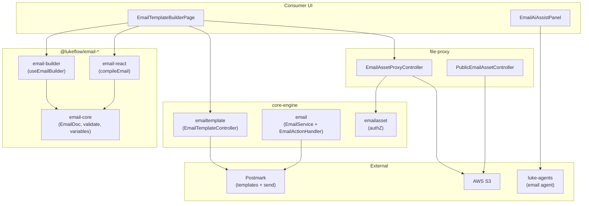
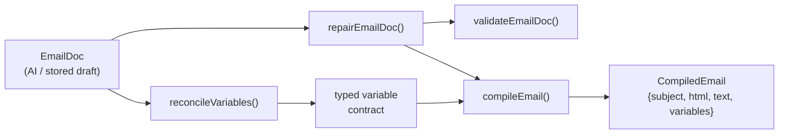
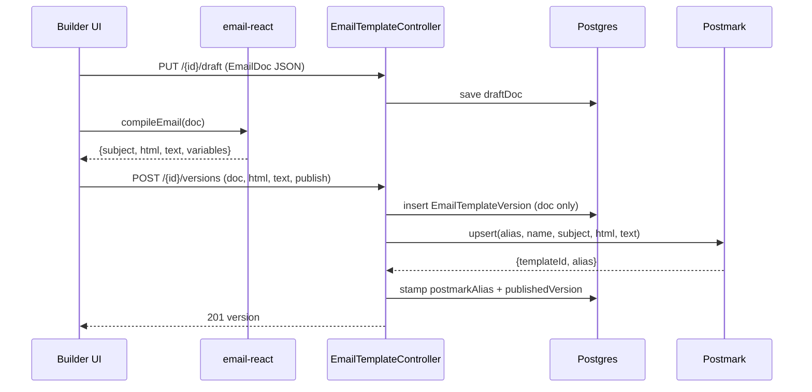
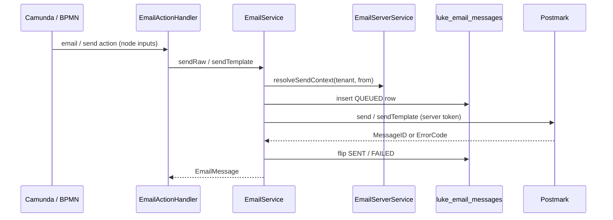

# Email

Partial

The **Email capability** is Lukeflow's transactional-email stack. Its defining split:
**template _management_** is a headless TypeScript library plus a thin engine data layer,
while the **actual send** (and any future inbound) is an engine concern driven by Camunda
workflow actions. Nothing renders HTML on the send path and nothing merges variables in Java —
the browser compiles the artifact, **Postmark** owns the rendered HTML and does the
`{{variable}}` merge at delivery time.

Three moving parts make this work:

- **`@lukeflow/email-*`** — the headless `EmailDoc` block model, validation/repair, the typed
  variable contract, and the react-email renderer that compiles `{subject, html, text, variables}`.
- **luke-core-engine** — two modules: `capability/emailtemplate` (template CRUD + versioning +
  publish-to-Postmark) and `capability/email` (the send orchestrator, the audit rows, Postmark
  clients, and the Camunda `EmailActionHandler`). Plus `emailasset` for image storage authZ.
- **luke-file-proxy** — streams email image bytes to S3 and serves them from a durable public URL.
- **luke-agents** — the `email` AI agent that drafts an `EmailDoc` from a natural-language brief.

See also the [Email library](/libraries/email) reference, [Core Engine](/services/core-engine),
[File Proxy](/services/file-proxy), and [Agents](/services/agents).

## Components at a glance

The UI edits an `EmailDoc` through `useEmailBuilder`, compiles it with `compileEmail`, and hands
the compiled `html`/`text` to the engine on check-in. The engine forwards them to Postmark and
stores only the lightweight JSON — never the rendered HTML.

## The EmailDoc model & compile pipeline

`EmailDoc` (`email-core/src/emailDoc.ts`) is a small, **bounded** document: a global `Theme`
plus an ordered list (max 50) of blocks from a **closed vocabulary** —
`heading | text | button | image | divider | spacer | footer`. Every string may carry
`{{identifier}}` placeholders; those are the merge contract and are preserved **literally**
through every path.

| Function | Module | What it does |
|---|---|---|
| `validateEmailDoc(doc)` | email-core | Full integrity check → flat `Problem[]` (errors gate check-in, warnings advisory). Checks required props, https image sources, http(s)-or-`{{var}}` button hrefs, block/field length caps, safe CSS colors. Never throws. |
| `repairEmailDoc(doc)` | email-core | Returns a structurally-sound **copy**: fills theme defaults, clamps `contentWidth` to 480–700, drops unknown block types/props, caps at `MAX_BLOCKS`. Reports what was `removed`. Pure. |
| `extractVariables(doc)` | email-core | Distinct `{{var}}` names (first-seen order) across subject, preheader, block text/label/href/src, and `footer.unsubscribeUrl`. |
| `reconcileVariables(doc, declared)` | email-core | The canonical typed contract: every used `{{var}}` enriched with its declaration (undeclared → `{type:"string", required:true}`), plus declared-but-unused appended. Deterministic. |
| `validateVariables(template)` | email-core | Flags invalid names, duplicates, unknown types, default/type mismatches, unused and undeclared variables. |
| `buildTemplateModel(template, values)` | email-core | Builds the Postmark `TemplateModel` skeleton — one key per reconciled variable, seeded `values → default → type-zero`. This is what the send task fills. |
| `mergePreview(html, values)` / `previewValues(template)` | email-core | **Preview-only** merge — substitutes `{{name}}` with HTML-escaped values so the operator sees rendered content. The published artifact keeps `{{vars}}` literal. |
| `isValidColor` / `coerceColor` | email-core | Bounded CSS-color grammar (hex, `rgb()/hsl()`, named colors) — blocks `url()`/`expression()` injection into inlined `style=""`. |
| `compileEmail(input)` | email-react | Renders the doc through react-email's `render()` twice → inlined, DOCTYPE'd, table-based `html` + plain-text `text`; returns `{subject, html, text, variables}`. Self-repairing, deterministic, never sends. |
| `useEmailBuilder()` | email-builder | Headless controller: owns doc + selection + undo/redo; every edit re-derives `problems` and the reconciled `variables`. |

The variable contract is the seam between library and engine: `variables[]` is emitted as JSON
alongside the compiled artifact so a send-time task can validate a `TemplateModel` **before**
calling Postmark, while `{{vars}}` stay literal in `html`/`text` for Postmark's Mustachio merge.

## Template lifecycle flow

Authoring is tenant-scoped (`X-Tenant-Id`, actor `X-User-Id`) and mirrors the Forms
definition/version model. The engine stores only `EmailDoc` JSON; the browser compiles the HTML
and the engine forwards it to Postmark, which owns the rendered template.

| Endpoint / method | Purpose |
|---|---|
| `create` — `POST /api/email-templates` | New `EmailTemplate` (`status=DRAFT`, unique `code` `ET-XXXX-DDMMMYY`). |
| `saveDraft` — `PUT /{id}/draft` | Autosave the working `draftDoc` (+ cached subject). Not pushed to Postmark. |
| `checkIn` — `POST /{id}/versions` | Snapshot the draft as an immutable `EmailTemplateVersion` (**doc only, no HTML column**). First check-in auto-publishes; `publish=true` republishes. `pushToPostmark()` upserts the compiled bodies under a stable alias. |
| `publish` — `POST /{id}/versions/{v}/publish` | Re-push an existing version and make it the published one. |
| `retire` / `unretire` — `POST /{id}/retire`, `/unretire` | Toggle `RETIRED` ↔ `PUBLISHED`/`DRAFT`. |
| `clone` — `POST /{id}/clone` | Duplicate as a fresh DRAFT ("Copy of …"); no versions or alias carried over. |
| `softDelete` / `restore` / `purge` — `DELETE /{id}`, `POST /{id}/restore`, `DELETE /{id}/purge` | Trash lifecycle; `purge` also deletes versions + audit. |
| `sendTest` — `POST /{id}/send-test` | Reuses `EmailService.sendTemplate` with the template's `postmarkAlias` + a supplied `model`. Requires a published version. |
| `auditTrail` — `GET /{id}/audit` | Immutable `EmailTemplateAuditEvent` feed with resolved actor names. |
| `pushToPostmark()` (private) | Resolves the tenant's server token via `EmailServerService.resolveServerToken`, calls `PostmarkTemplateClient.upsert`, stamps `postmarkAlias`/`postmarkTemplateId`. |

**Persistence.** `luke_email_templates` holds the editable `draftDoc`, cached `subject`,
`status`, `publishedVersion`, and `postmarkAlias`. `luke_email_template_versions` holds each
immutable `doc` snapshot plus its `postmarkAlias`/`postmarkTemplateId` — deliberately **no HTML
column**, because Postmark owns the rendered HTML.

## Send flow

Sending is fully implemented and drives Postmark. There are three entry points, all funnelling
through `EmailService`, which records **every** attempt as a `luke_email_messages` audit row —
`QUEUED` on accept, then flipped to `SENT` (with `postmarkMessageId`) or `FAILED` (with
`errorCode`/`errorMessage`). A delivery failure is recorded, not thrown.

| Component | Role |
|---|---|
| `EmailActionHandler.execute()` | The **outbound-rail** Camunda handler (`capability() == "email"`). Maps a workflow node's inputs (`to/from/cc/bcc/replyTo/subject/htmlBody/textBody` for raw; `template`/`templateId`/`templateModel` for template sends) — string inputs resolve `{{placeholders}}` against process variables via `Placeholders.resolve` — then calls `sendTemplate` (if alias/id present) or `sendRaw`. Returns `{emailId}`. |
| `EmailService.sendRaw()` | Validates recipient/subject/body, resolves the send context, persists the row, submits `HtmlBody`/`TextBody` to Postmark. |
| `EmailService.sendTemplate()` | Validates `templateId`/`templateAlias`, always includes a (possibly empty) `TemplateModel` — Postmark does the merge. |
| `EmailServerService.resolveSendContext()` | Resolves which Postmark **Server token** to use + the verified company sender; enforces that a tenant may only send from its own verified domain. |
| `PostmarkClient` | Low-level `POST /email` and `/email/withTemplate` client; returns `SendResult{ok, messageId, errorCode, message}`. |
| `EmailController` (`/api/emails`) | Tenant-facing raw + template send and a paged, size-capped message history. |
| `InternalEmailController` (`/api/internal/emails`) | The server-to-server (process-triggered) twin of the send endpoints, behind the internal-key filter. |

There is **no dedicated outbox table for email** — the send is invoked synchronously from the
Camunda action handler, and the `EmailMessage` row is the durable audit record. Inbound email is
**not built**: there is no inbound controller, parser, or webhook receiver in the codebase today.

## Email assets

Inline images can't be data-URI'd into email at scale, so they get a durable public URL:

1. **Upload** — `EmailAssetProxyController` (`POST /api/email-assets`, file-proxy) accepts a
   multipart image (≤5 MiB, `image/*` only), asks core's `emailasset` module to `authorize`
   (`{assetId, storageKey}`), streams the bytes to S3 while computing SHA-256, then `finalize`s.
2. **Serve** — `PublicEmailAssetController` (`GET /api/public/email-assets/{assetId}`) is
   unauthenticated: the high-entropy `assetId` is the **sole authorization**. Core resolves it
   (READY assets only) to `{tenantId, storageKey}` and the bytes stream from S3 with a
   one-year immutable cache header — exactly what a recipient's `` needs.

The engine side (`emailasset/InternalEmailAssetController`, `EmailAssetService`) holds the authZ
and state; bytes only ever flow through the file-proxy.

## AI drafting

`EmailAiAssistPanel` (consumer-ui) talks to the `email` agent in luke-agents
(`POST /agents/email/chat`, `POST /agents/email/testdata`). The LLM returns the **full `EmailDoc`**
each turn; Python `repair_doc` clamps it to the same bounded contract the library enforces, so the
UI always receives a valid document. `{{variables}}` are preserved literally — the model never
fills them. `/testdata` generates realistic sample merge values for preview and test-send.

## Component reference

| Component | Type | Responsibility | Key methods |
|---|---|---|---|
| `EmailDoc` / `Theme` / `EmailBlock` | TS model | Bounded block document (7 block types, one global theme) | — |
| `emailDoc.ts` | email-core | Model, validation, repair, variable extraction, color safety | `validateEmailDoc`, `repairEmailDoc`, `extractVariables`, `parseEmailDoc`, `isValidColor` |
| `variables.ts` | email-core | Typed variable / merge contract | `reconcileVariables`, `validateVariables`, `buildTemplateModel`, `previewValues`, `mergePreview` |
| `EmailRenderer` | email-react | react-email renderer + browser/Node compiler | `compileEmail`, `Email`, `EmailRenderer` |
| `useEmailBuilder` | email-builder | Headless builder state (doc/selection/undo-redo) | `addBlock`, `moveBlock`, `updateBlock`, `updateTheme` |
| `EmailBuilder` | email-builder | Palette · canvas · settings · Problems · preview slot | — |
| `EmailTemplateBuilderPage` | consumer-ui | Live template designer wiring builder + renderer + AI + engine API | — |
| `EmailTemplateController` | engine | Template CRUD, versioning, publish, send-test, audit | `create`, `saveDraft`, `checkIn`, `publish`, `sendTest`, `pushToPostmark` |
| `EmailTemplate` / `EmailTemplateVersion` | JPA entity | `luke_email_templates` / `luke_email_template_versions` | — |
| `EmailService` | engine | Send orchestrator; QUEUED→SENT/FAILED audit | `sendRaw`, `sendTemplate`, `submit` |
| `EmailActionHandler` | engine | Camunda outbound-rail `email/send` action | `execute`, `capability` |
| `EmailMessage` / `EmailStatus` | JPA entity | `luke_email_messages` audit row + lifecycle constants | — |
| `EmailServerService` | engine | Per-tenant Postmark server token + verified sender | `resolveSendContext`, `resolveServerToken`, `provision` |
| `PostmarkClient` / `PostmarkTemplateClient` | engine | Postmark send + template-upsert clients | `send`, `sendTemplate`, `upsert`, `createIfAbsent` |
| `EmailAssetProxyController` / `PublicEmailAssetController` | file-proxy | Image upload to S3 + public serve | `upload`, `serve` |
| `EmailAssetService` / `InternalEmailAssetController` | engine | Email-asset authZ + resolve | `authorize`, `finalizeUpload`, `publicResolve` |
| `EmailAgent` | luke-agents | AI `EmailDoc` drafting + test data | `/chat`, `/testdata` |

## Endpoints

| Method | Path | Purpose | Auth |
|---|---|---|---|
| POST | `/api/email-templates` | Create a template | Tenant + EMAIL (write) |
| GET | `/api/email-templates` | List (status/deleted filters) | Tenant + EMAIL (read) |
| GET | `/api/email-templates/{id}` | Get one | Tenant + EMAIL (read) |
| PATCH | `/api/email-templates/{id}` | Edit name/description | Tenant + EMAIL (write) |
| PUT | `/api/email-templates/{id}/draft` | Autosave draft doc | Tenant + EMAIL (write) |
| POST | `/api/email-templates/{id}/versions` | Check in + publish | Tenant + EMAIL (write) |
| GET | `/api/email-templates/{id}/versions` | List versions | Tenant + EMAIL (read) |
| POST | `/api/email-templates/{id}/versions/{v}/publish` | Re-publish a version | Tenant + EMAIL (write) |
| POST | `/api/email-templates/{id}/retire` · `/unretire` | Retire / restore status | Tenant + EMAIL (write) |
| POST | `/api/email-templates/{id}/clone` | Duplicate as draft | Tenant + EMAIL (write) |
| DELETE | `/api/email-templates/{id}` · `POST …/restore` · `DELETE …/purge` | Trash lifecycle | Tenant + EMAIL (write) |
| POST | `/api/email-templates/{id}/send-test` | Send a Postmark test | Tenant + EMAIL (write) |
| GET | `/api/email-templates/{id}/audit` | Activity feed | Tenant + EMAIL (read) |
| POST | `/api/emails` · `/api/emails/template` | Send raw / template email | Tenant + EMAIL (write) |
| GET | `/api/emails` · `/api/emails/{id}` | Paged history / one message | Tenant + EMAIL (read) |
| POST | `/api/internal/emails` · `/template` | Process-triggered send | Internal key |
| POST | `/api/email-servers` · GET | Provision / read tenant Postmark server | Tenant + EMAIL |
| POST | `/api/email-assets` (file-proxy) | Upload inline image | Gateway identity |
| GET | `/api/public/email-assets/{assetId}` (file-proxy) | Serve image (public) | assetId is bearer |
| POST | `/api/internal/email-assets/authorize` · `/{id}/finalize` · `/public/{id}/resolve` | Asset authZ (engine) | Internal key |
| POST | `/agents/email/chat` · `/agents/email/testdata` | AI draft / test data | Agents gateway |

## Status & gaps

Template management, versioning, publish-to-Postmark, transactional send (tenant, internal, and
Camunda-driven), the audit trail, inline-image assets, and AI drafting are all implemented and
green. What remains:

- **Inbound email is not built** — no receiver/parser/webhook exists; inbound is a documented
  future Camunda task, not code.
- **No async outbox for email** — sends are synchronous from the action handler; the
  `EmailMessage` row is the durable record (Postmark webhooks for delivery/bounce status are not
  yet consumed).

See the [Completeness Scorecard](/reference/completeness) for the current rating, and the
[Email library](/libraries/email) page for the headless package details. Related services:
[Core Engine](/services/core-engine) · [File Proxy](/services/file-proxy) · [Agents](/services/agents).
