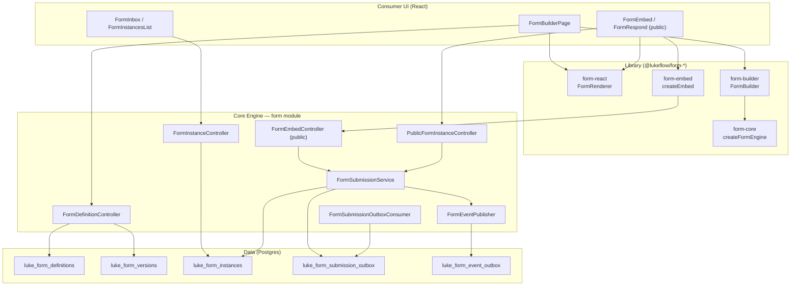
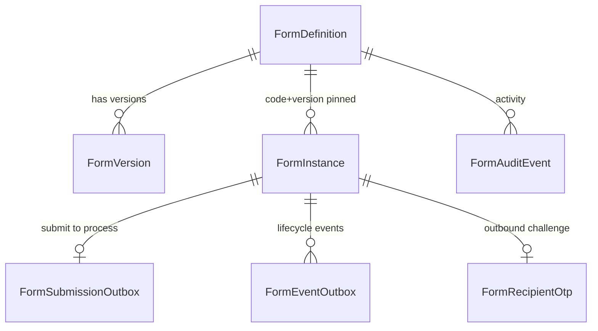
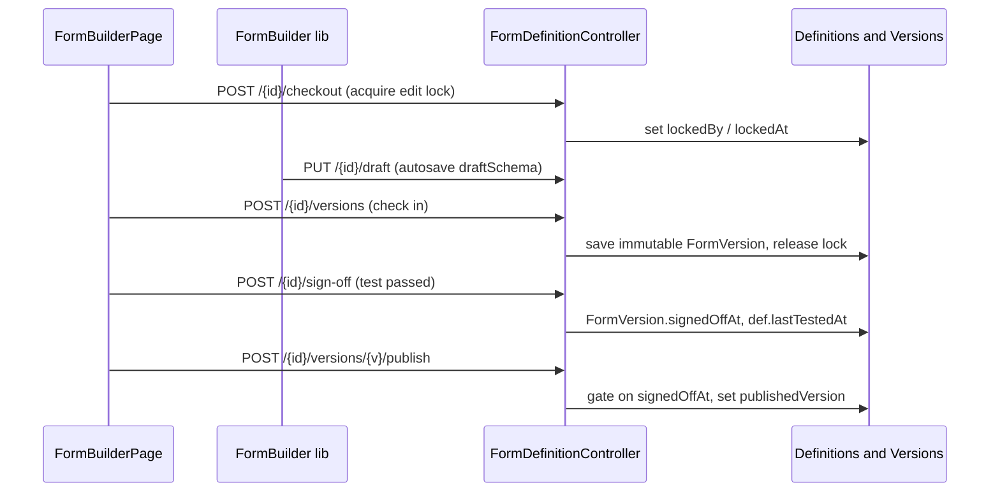
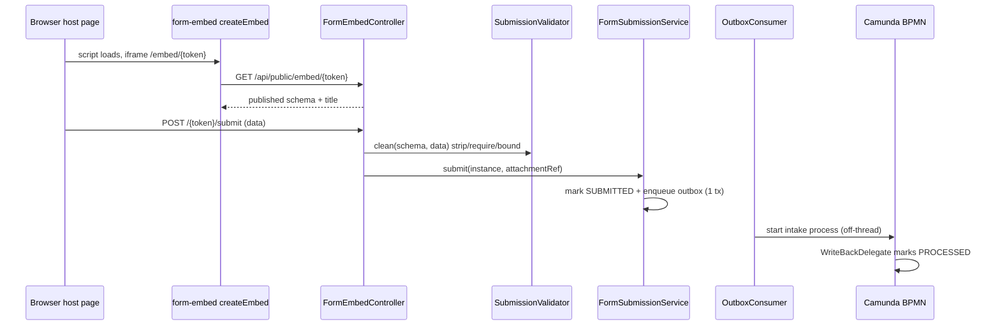

# Forms

Production-ready

The **Forms capability** is Lukeflow's end-to-end form platform: a headless design/render/validate library (`@lukeflow/form-*`), a versioned form-management data layer inside the core engine, and public embed/respond surfaces that turn a browser submission into a running BPMN process. It spans authoring (draft → check-in → sign-off → publish), inbound collection (embed → submit → durable process start), and outbound delivery (prefill → send → OTP-gated respond), all tenant-scoped and driven by transactional outboxes so no submission or process-start intent is ever lost.

## Components at a glance

## Data model

All tables live in the core engine's capability schema (`com.luke.engine.capability.form`), tenant-scoped by `tenantId`.

| Entity (table) | Key fields | Purpose |
| --- | --- | --- |
| `FormDefinition` (`luke_form_definitions`) | `id`, `@Version version`, `code` (FM-XXXX-DDMMMYY, unique per tenant), `name`, `kind` (INBOUND/OUTBOUND), `submissionHandling`, `outboundRolesJson`, `status` (DRAFT/PUBLISHED/RETIRED), `publishedVersion`, `draftSchema`, `allowedEmbedOrigins`, `embedKeyVersion`, `showBranding`, `embedVersionMode`/`embedVersion`, `lockedBy`/`lockedAt`, `deletedAt`, `lastTestedAt` | The versioned, tenant-scoped form template. Editable working draft in `draftSchema`; `publishedVersion` is what consumers resolve. JPA `@Version` gives optimistic locking (concurrent draft saves → 409). |
| `FormVersion` (`luke_form_versions`) | `id`, `formId`, `version` (unique per form), `schema` (immutable), `checkedInBy`/`checkedInAt`, `signedOffAt`/`signedOffBy` | An immutable checked-in snapshot — the artifact a renderer/process resolves and never changes underneath them. Publish is gated on `signedOffAt` being set. |
| `FormInstance` (`luke_form_instances`) | `id`, `token` (unique, opaque URL handle), `definitionCode` + `version` (pinned), `state`, `prefill`/`data`/`recipient`/`context` (JSON maps), `recipientEmail`/`recipientPhone` (denormalised + indexed, kept in sync by `setRecipient`), `expiresAt`, `submittedAt`, `submittedIp`/`submittedUserAgent`/`submittedVia` | A concrete runtime occurrence: hosted submission, prefilled invitation, or task-bound fill. `context` links back to `processInstanceId`/`taskId`/`businessKey`. The denormalised `recipientEmail` powers the portal's "forms assigned to me" query. |
| `FormSubmissionOutbox` (`luke_form_submission_outbox`) | `id`, `businessKey` (= instance id, unique/idempotent), `formInstanceId`, `processBusinessKey` (SM-…), `formDataJson`, `formMetaJson`, `status` (QUEUED/PUBLISHED/FAILED), `processInstanceId`, `retryCount` | Transactional outbox for submit → Camunda process start. Written in the same tx as the SUBMITTED state; drained off-thread. |
| `FormEventOutbox` (`luke_form_event_outbox`) | `id`, `eventType` (lower-cased state, e.g. `submitted`), `formCode`, `instanceId`, `payloadJson`, `state` (QUEUED/SENT/SKIPPED/FAILED), `retryCount` | Transactional outbox for the forms → workflow event rail. A lifecycle change enqueues a QUEUED row; the correlator starts subscribed workflows / advances waiting message catches. |
| `FormAuditEvent` (`luke_form_audit`) | `id`, `formId`, `action` (created/checked_in/tested/published/archived/…), `detail`, `actor`, `at` | Immutable activity feed for a definition's lifecycle. |
| `FormRecipientOtp` (`luke_form_recipient_otp`) | `id`, `instanceId` (unique), `codeHash`, `codeSalt`, `attempts`, `expiresAt` | One salted-SHA-256 OTP challenge for an outbound recipient; attempt-capped, expiring, never stored in the clear. |
| `FormEmbedSite` (`luke_form_embed_sites`) | `id`, `tenantId`+`formCode`+`origin` (unique), `firstSeenAt`, `lastSeenAt`, `renderCount` | Websites **observed** framing a form, from the embed page's `Referer`. Bounded per form and sampled — intelligence for the author, never a permission (see below). |

## Design-time flow

| Function / endpoint | What it does |
| --- | --- |
| `FormDefinitionController.create` (`POST /api/form-definitions`) | Mints a new definition with a generated `code` and `kind` (INBOUND/OUTBOUND), status DRAFT. |
| `FormDefinitionController.checkout` (`POST /{id}/checkout`) | Acquires the advisory edit lock (`lockedBy`/`lockedAt`); stale locks can be taken over. |
| `FormDefinitionController.saveDraft` (`PUT /{id}/draft`) | Persists the editable `draftSchema` (coltorapps-style JSON). `@Version` guards concurrent saves. |
| `FormDefinitionController.checkIn` (`POST /{id}/versions`) | Snapshots the draft into a new immutable `FormVersion` (`version = max+1`), releases the lock; status untouched. |
| `FormDefinitionController.signOff` (`POST /{id}/sign-off`) | Marks the latest version `signedOffAt`/`signedOffBy` and mirrors `lastTestedAt` for the "Tested" badge. |
| `FormDefinitionController.publish` (`POST /{id}/versions/{v}/publish`) | Promotes a version to live — **gated**: rejects with 409 unless the version is signed off; sets `publishedVersion` + status PUBLISHED. |
| `FormDefinitionController.restoreVersion` / `retire` / `unretire` / `clone` | Restore an old version to draft, retire/unretire the definition, or clone it. |
| `FormDefinitionController.release` / `discard` | Release the lock, or discard draft changes back to the last checked-in version. |

## Runtime flow (inbound embed → submit → task complete)

| Function / endpoint | What it does |
| --- | --- |
| `createEmbed` (form-embed) | Injects a sandboxed iframe pointed at `/embed/{token}`, wires `postMessage` auto-resize (`connectEmbedFrame`), nonce-guards the channel; `autoEmbed()` scans embed script tags. |
| `EmbedPageController.page` (`GET /embed/{token}`) | Serves the engine-hosted embed HTML shell with per-form `frame-ancestors` CSP (from `allowedEmbedOrigins`, sanitized via `FrameAncestors`). |
| `FormEmbedController.render` (`GET /api/public/embed/{token}`) | Resolves the token (`EmbedFormResolver`) to the published `FormVersion.schema` + title; the signed embed token carries `embedKeyVersion` for revocation. |
| `FormEmbedController.submit` (`POST /api/public/embed/{token}/submit`) | Per-IP + per-token rate limits, `Honeypot.tripped` bot trap, `SubmissionValidator.clean` server backstop, then creates a SUBMITTED `FormInstance` and calls `FormSubmissionService.submit`. |
| `SubmissionValidator.clean` | Strips unknown fields against the schema, enforces required, bounds payload size (413), removes C0/C1 control chars — the public endpoint cannot trust the client. |
| `FormSubmissionService.submit` | In ONE transaction: sets state SUBMITTED, merges data, writes a QUEUED `FormSubmissionOutbox` row (business key = instance id → idempotent), marks `processStartStatus=QUEUED` on context. |
| `FormSubmissionOutboxConsumer.drain` | `@Scheduled` poller (`luke.forms.outbox-poll-ms`, default 2s) starts the Camunda intake process via `InternalProcessService.start`, mirrors attachments, flips the row PUBLISHED/FAILED with retry. |
| `FormEventPublisher.emit` | Enqueues a `FormEventOutbox` row (lower-cased state as `eventType`) so subscribed workflows start / waiting message catches advance. |
| `FormInstanceWriteBackDelegate.execute` | BPMN `JavaDelegate` at the intake process's write-back task — marks the originating instance PROCESSED and records `processInstanceId`; failures are logged, never rethrown. |

## Outbound forms

Outbound definitions (`kind = OUTBOUND`) are never embeddable — a preparer prefills fields and sends the form to a named recipient. Per-field roles live in `FormDefinition.outboundRolesJson` (a `{ fieldKey → role }` map where role ∈ `PREPARER | RECIPIENT | EITHER`), configured via `PUT /{id}/outbound-config`.

- `OutboundSendController.send` (`POST /api/form-definitions/{id}/send`) → `OutboundSendService.send`: creates a prefilled `FormInstance` with `recipient` identity, returns the opaque token + recipient link, and best-effort emails the recipient ("Please complete: …") — the send never fails on email.
- Recipient access is OTP-gated: `PublicFormInstanceService.requestOtp` mails a `FormRecipientOtp` code; `verify` marks the instance OPENED and mints a short-lived access token (`RecipientAccessTokens`); `render`/`save`/`submit` require it. The public API (`PublicFormInstanceController` at `/api/public/form-instances/**`) never leaks whether a token exists.

### Recipient portal (forms is the first provider)

Beyond the single-link `/respond/{token}` flow, a recipient can visit a **per-tenant portal** and see *every* open item assigned to their email — forms today, other capabilities next. The portal is a **separate, capability-agnostic surface** (core-engine module `com.luke.engine.recipient`, front-end app **[luke-portal](/apps/portal)**); it owns recipient identity, and each capability contributes items through the `RecipientItemProvider` SPI. **Forms is the first provider.**

- `FormRecipientItemProvider` maps every open outbound `FormInstance` for `(tenant, email)` into a `"form"` portal item (querying the denormalised `recipientEmail`), and supplies the recipient phone for the SMS channel. That is the only forms-specific piece.
- The portal session (`PortalAccessTokens`, email-scoped) authorises the existing forms fill surface unchanged: `PublicFormInstanceService.authorize()` accepts *either* a per-instance `RecipientAccessToken` *or* a portal session whose tenant + recipient email match — so `render`/`save`/`submit` are reused, and a session for tenant A / email X can never reach another tenant's or another email's forms.
- Outbound sends include the portal link (`/portal/{tenantToken}`) alongside the direct `/respond` link.

See **[Recipient Portal](/apps/portal)** for the identity flow (email/SMS OTP + magic link), the SPI, and the standalone app.

## Component reference

| Component | Type | Responsibility | Key methods |
| --- | --- | --- | --- |
| `FormDefinitionController` | controller | Design-time CRUD + lifecycle over definitions/versions | `create`, `saveDraft`, `checkIn`, `signOff`, `publish`, `checkout`, `clone`, `auditTrail` |
| `FormInstanceController` | controller | Authenticated instance management (internal) | `create`, `list`, `submit`, `retryProcess`, `setState`, `send`, `cancel`, `processed` |
| `FormEmbedController` | controller (public) | Inbound embed render + submit with abuse guards | `render`, `submit`, `rateLimit` |
| `PublicFormInstanceController` | controller (public) | OTP-gated recipient respond flow | `otp`, `verify`, GET/PATCH `{token}`, `submit` |
| `FormRecipientItemProvider` | provider | Forms as the first recipient-portal `RecipientItemProvider` — open instances → `"form"` items | `itemsFor`, `phoneFor` |
| `OutboundSendController` | controller | Send an outbound form to a recipient (incl. the portal link) | `send` |
| `EmbedPageController` / `RespondPageController` | controller | Serve engine-hosted `/embed` and `/respond` HTML shells with per-form CSP | `page` |
| `FormSubmissionService` | service | Durable submit → process-start bridge (outbox) | `submit`, `reEnqueue`, `enqueue` |
| `FormSubmissionOutboxConsumer` | service | Drains submission outbox, starts Camunda process | `drain`, `process` |
| `PublicFormInstanceService` | service | Recipient OTP/verify/render/save/submit | `requestOtp`, `verify`, `render`, `save`, `submit` |
| `OutboundSendService` | service | Create prefilled instance + email link | `send` |
| `SubmissionValidator` | util | Server-side validate/clean of untrusted submissions | `clean` |
| `FormEventPublisher` | service | Emit lifecycle events onto the workflow rail | `emit` |
| `EmbedFormResolver` / `EmbedTokens` / `FrameAncestors` / `Honeypot` | support | Token resolution, embed-key revocation, CSP sanitization, bot trap | `resolve`, `tripped` |
| `FormInstanceExpirySweeper` | scheduler | Sweep expired open instances to EXPIRED | `@Scheduled` sweep |
| `createFormEngine` | lib fn (form-core) | Headless form engine: dependency graph, visibility/required, validation, defaults, grids | `init`, `update`, `validate`, `getState`, `serialize` |
| `FormRenderer` / `useFormEngine` | react comp (form-react) | Renders a schema against the engine; controls, i18n, theme, sanitized HTML | render controls, `MinionProvider` |
| `FormBuilder` / `useFormBuilder` | react comp (form-builder) | Drag-drop authoring: palette, canvas, settings, problems, preview | `FormBuilderHandle`, `SettingsPanel` |
| `createEmbed` / `connectEmbedFrame` | lib fn (form-embed) | Host-page iframe embed SDK + auto-resize bridge | `createEmbed`, `autoEmbed` |
| `FormBuilderPage` / `FormInbox` / `FormInstancesList` | react page (consumer-ui) | Authoring UI + inbox/instance management | lifecycle actions, trace panel |

## Submission provenance (what makes a submission enforceable)

Every submission records **who submitted, from where, and when** — the evidence a completed form needs
to be relied on. It is captured at the request edge (`SubmissionSource.from(request, via)`) and written
by `FormSubmissionService.submit`, the single choke point **all three doors** funnel through, so a
submit path added later inherits it and cannot silently skip it.

| Field | Meaning |
| --- | --- |
| `submittedAt` | When the instance flipped to SUBMITTED (already existed). |
| `submittedIp` | The observed client IP. Prefers the gateway-stamped `X-Real-Client-IP` (spoof-resistant, since the gateway strips any client-supplied one) over the forgeable `X-Forwarded-For` / `X-Real-IP`, then the socket address. |
| `submittedUserAgent` | The browser's User-Agent, truncated to 512 chars. |
| `submittedVia` | `EMBED` (public iframe) · `RESPOND` (emailed link + OTP, incl. the portal) · `APP` (signed-in user in Lukeflow). |

It is **written once** — a retry or re-submit never overwrites the original record — and it lands in
three places so they can be reconciled:

1. the `FormInstance` row (shown as "Submission record" in the instance detail),
2. the immutable `formMetaData` snapshot the process instance carries (survives instance retention),
3. the **submission PDF**, as a printed "Submission record" block (`provenance` → the render harness).

::: warning What an IP does and doesn't prove
Record it as *"the address we observed"*, not as proof of identity: IPs are shared, proxied and
reassigned. The strongest attribution in the platform is the outbound flow's **email OTP** — the
recipient proved control of an address — with the IP as corroboration. Note also that an IP is
**personal data** under GDPR/CCPA; it inherits the instance's retention, so purging an instance purges
its provenance.
:::

## Embed version control ("Update embeds")

The embed snippet points at an opaque **token** (tenant + form code + embed-key version) — never a
version number. The server resolves the version per request, which means **nothing on a customer's
website ever has to change**: there is no form source out there to rewrite.

What *is* configurable is which version that resolution returns:

| `embedVersionMode` | Behaviour |
| --- | --- |
| `AUTO` (default) | Serves `publishedVersion`. Publishing reaches every live embed immediately. |
| `PINNED` | Serves `embedVersion`. Publishing does **not** change what fillers see until someone explicitly updates the embed — which is what makes a legally-significant form safe to iterate on. |

`EmbedVersions.resolve` is the single home for that rule, and **both** the public render and the public
submit call it. That matters: if they resolved differently, a pinned embed would render v3 and validate
answers against v5 — silently dropping fields the filler was actually shown. A pin that is null, or
points at a deleted version, falls back to `publishedVersion`: a stale pin must degrade to "serves the
current form", never to a blank iframe on someone else's site.

`GET /api/form-definitions/{id}/embed-version` reports `mode`, `pinnedVersion`, `publishedVersion`,
`servingVersion` and `updateAvailable` (true when fillers are behind), which drives the Embed panel's
"Update embeds to v*N*" button.

## "Embedded on" — where a form is live

`luke_form_embed_sites` records the origins observed framing a form, learned from the `Referer` of the
iframe's request for `/embed/{token}` — the one request that can see it (the XHRs the bundle makes
afterwards carry the iframe's own URL). Browsers send origin-only for a cross-origin iframe under the
default `strict-origin-when-cross-origin` policy, which is exactly the datum wanted and nothing more.

Three deliberate limits, because the recorder runs on a public, unauthenticated page:

- **Never breaks the page** — every failure is swallowed, and it runs in its own `REQUIRES_NEW`
  transaction so a failed insert can't poison the caller's.
- **Bounded** — at most `luke.embed.sites.max-per-form` (50) origins per form, since a forged `Referer`
  could otherwise write unbounded rows.
- **Sampled** — an already-seen origin is only re-written once its `lastSeenAt` is older than
  `luke.embed.sites.throttle-minutes` (5), so `renderCount` is "roughly how busy", not an analytics figure.

::: warning Observation, not permission
A host page can suppress the header (`Referrer-Policy: no-referrer`) and never appear in this list, and
the header is client-supplied so a caller could name an origin that isn't really embedding the form.
The authoritative "who may frame this form" remains `allowedEmbedOrigins`, enforced by the browser as
CSP `frame-ancestors`. The list annotates each origin with `allowed` so an author can spot a site the
policy is blocking — but it must never become the gate.
:::

## Form font

A form's typeface is a **font-catalog id** stored in its versioned schema settings (`settings.font`),
resolved to a CSS stack and applied as the renderer's `--lf-font` design token. Because that happens in
the one adapter every surface goes through (`LukeFormRenderer`), the choice shows up in the builder
preview, the in-app fill, the public embed, the outbound respond page, the recipient portal **and** the
submission PDF with no per-surface wiring.

The catalog (`luke-consumer-ui/src/lib/formFonts.ts`, mirrored in `luke-portal`) mixes **system stacks**
that need no network at all with a few **Google-hosted** families fetched on demand only when selected.
A form stores an *id*, never a family name or URL — an unknown id falls back to the default, so a
hand-edited schema cannot inject CSS into the token or a stylesheet URL into the page. Authors choosing
a Google-hosted font are told in the UI that the filler's browser will contact Google, with the system
stacks offered as the no-third-party alternative.

## "Developed at Lukeflow" badge

Every PUBLIC form surface — the embed iframe, the outbound `/respond/{token}` page and the recipient
portal — renders a small attribution pill under the form card. It is the product's own marketing on
work our customers publish, so the rule is deliberately asymmetric:

| Tenant plan | Per-form option | What a filler sees |
| --- | --- | --- |
| **FREE** (no `luke_tenant_plan` row) | Locked ON, shown with a "Paid plan" hint | Badge always |
| **PAID** | Author's choice, **defaults to ON** | Badge unless they switched it off |

- **Where the flag lives.** `FormDefinition.showBranding` — form *metadata*, not versioned schema, so
  toggling it takes effect on the live embed with **no re-publish** (same class of setting as
  `allowedEmbedOrigins`).
- **Who decides.** `com.luke.engine.branding.BrandingPolicy` is the single home for the rule. Both
  public payloads (`GET /api/public/embed/{token}` and `GET /api/public/form-instances/{token}`) carry
  the already-**effective** `showBranding` boolean, so a browser never re-derives visibility. The
  authoring `PATCH /api/form-definitions/{id}` independently returns **402 Payment Required** if a free
  tenant tries to hide it — the UI's lock is an affordance, not the boundary. Reads carry a transient
  `brandingLocked` so the builder can render the option as locked; it defaults to *locked* so any
  response that skips the enrichment fails closed.
- **Plan source of truth.** `luke_tenant_plan` (`id` = tenantId, `plan` = FREE|PAID) — the **absence**
  of a row is the free tier, so there is one representation of "not paying" and a deleted row can never
  silently upgrade anyone. Written only by the operator-authenticated `PUT /api/tenants/{id}/plan`
  (audited via `AdminAuditService`), which is the seam a real billing integration will write to. A
  downgrade never rewrites the author's stored preference: the badge reappears while they are free and
  their original choice returns if they upgrade again.
- **Fail-safe.** An unreachable plan table keeps the badge visible rather than failing the render.

## Endpoints

| Method | Path | Purpose | Auth model |
| --- | --- | --- | --- |
| POST | `/api/form-definitions` | Create a definition | Tenant (`X-Tenant-Id`) |
| PATCH | `/api/form-definitions/{id}` | Edit metadata: name, description, embed origins, `showBranding` (402 if a free plan tries to hide the badge) | Tenant + user |
| GET | `/api/form-definitions` · `/{id}` · `/by-code/{code}` | List / fetch definitions | Tenant |
| PUT | `/api/form-definitions/{id}/draft` | Autosave working draft | Tenant + `X-User-Id` |
| POST | `/api/form-definitions/{id}/versions` | Check in an immutable version | Tenant + user |
| POST | `/api/form-definitions/{id}/sign-off` | Sign off latest version (tested) | Tenant + user |
| POST | `/api/form-definitions/{id}/versions/{v}/publish` | Publish (gated on sign-off) | Tenant + user |
| POST | `/api/form-definitions/{id}/checkout` · `/release` · `/discard` | Edit-lock lifecycle | Tenant + user |
| PUT | `/api/form-definitions/{id}/outbound-config` | Set per-field preparer/recipient roles | Tenant |
| POST | `/api/form-definitions/{id}/send` | Send an outbound form to a recipient | Tenant |
| GET | `/api/form-definitions/{id}/embed-token` · POST `/embed-token/rotate` | Fetch / revoke embed token | Tenant |
| GET/PUT | `/api/form-definitions/{id}/embed-version` | Read / set which version embeds serve (AUTO \| PINNED) | Tenant |
| GET | `/api/form-definitions/{id}/embed-sites` | Websites observed embedding this form | Tenant |
| POST | `/api/form-instances` · GET `/` · PATCH `/{id}` · `/{id}/submit` | Internal instance management | Tenant |
| GET | `/embed/{token}` | Engine-hosted embed page (per-form CSP) | Public (origin-gated) |
| GET | `/api/public/embed/{token}` | Public render of published schema | Public (token) |
| POST | `/api/public/embed/{token}/submit` | Inbound submission → process start | Public (token, rate-limited) |
| GET | `/respond/{token}` | Engine-hosted respond page | Public |
| POST | `/api/public/form-instances/{token}/otp` · `/verify` | Recipient OTP challenge / verify | Public (token) |
| GET/PATCH/POST | `/api/public/form-instances/{token}` · `/submit` | Recipient render / autosave / submit | Public (token + access token) |
| GET | `/portal/{tenantToken}` | Engine-hosted recipient portal page | Public (origin-gated) |
| — | `/api/public/portal/**` · `/portal/{tenantToken}` | Recipient portal identity + item listing (capability-agnostic) | See [Recipient Portal](/apps/portal) |
| GET/PUT | `/api/tenants/{tenantId}/plan` | Read / set a tenant's plan (FREE\|PAID) — gates hiding the Lukeflow badge | Operator credential |

## Status & gaps

Production-ready across authoring, inbound embed, outbound respond, and the recipient portal, all backed by transactional outboxes and per-tenant isolation. The portal's **SMS OTP** channel is wired behind a seam but inert until an SMS gateway is configured (`luke.forms.sms.enabled` + a real `SmsPortalOtpSender`); email OTP and magic link are live. See the [Completeness Scorecard](/reference/completeness) for the fleet-wide status view.

- Cross-links: [Forms library](/libraries/forms) · [Core Engine](/services/core-engine) · [Consumer UI](/apps/consumer-ui) · [Recipient Portal](/apps/portal)
