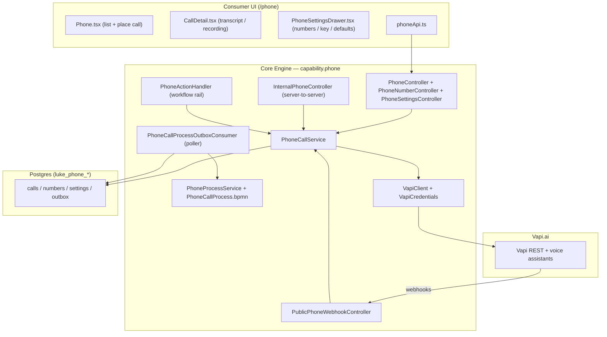
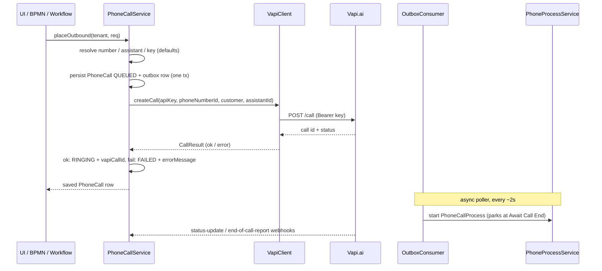
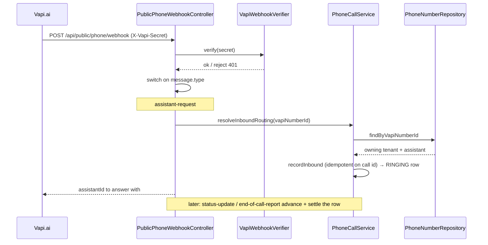

# Phone (Voice) Partial

The **Phone** capability gives a tenant AI voice calls in both directions — inbound calls
answered by a Vapi assistant, and outbound calls placed by a person, a BPMN process, or a
workflow action. It is implemented entirely inside **luke-core-engine** under
`com.luke.engine.capability.phone`, backed by [Vapi.ai](https://vapi.ai) as the telephony +
voice-AI provider. Core owns only the *audit + orchestration* layer: every call is recorded
as a `luke_phone_calls` row, wrapped in a per-tenant Camunda `PhoneCallProcess`, and settled
from Vapi's webhooks. The live media (dialing, speech, the assistant) all runs in Vapi.

The capability is seeded as `PHONE` — *"Phone / Voice — Inbound & outbound voice calls via
Vapi."* — tier `STANDARD`, route `/phone` (see `CapabilitySeed`).

> This page is written against the real code in `luke-core-engine` and the `/phone` section of
> `luke-consumer-ui`. Where a piece of the runtime is data-layer-only, it says so explicitly.

## Components at a glance

## Data model

Four tables (Flyway `V8__phone_tables.sql`), all in core's `currentSchema` (Strategy A), each
tenant-isolated by an explicit `tenant_id` column plus tenant-scoped repository finders.

| Entity / Table | Purpose | Notable columns |
| --- | --- | --- |
| `PhoneCall` — `luke_phone_calls` | One audit row per call (inbound or outbound) and the record the Camunda process wraps | `direction` (INBOUND/OUTBOUND), `status`, `vapiCallId` (unique — the webhook join key), `phoneNumberId`, `assistantId`, `customerNumber` (E.164), `endedReason`, `transcript` (text), `recordingUrl`, `summary` (text), `cost` (double), `analysis` (JSON map), `metadata` (JSON map), `errorMessage`, plus Camunda binding `businessKey` / `processInstanceId` / `processStatus`, `@Version` optimistic lock, and `createdAt`/`startedAt`/`endedAt` |
| `PhoneNumber` — `luke_phone_numbers` | A number the tenant owns in Vapi (Vapi-provided, or BYO Twilio/Telnyx/Vonage imported into Vapi) | `vapiNumberId` (unique — used as `phoneNumberId` on outbound calls), `number` (E.164), `provider` (`vapi`\|`twilio`\|`telnyx`\|`vonage`), `name`, `assistantId` (answers inbound on this number) |
| `PhoneSettings` — `luke_phone_settings` | One row per tenant (`id` == tenantId): the defaults used when a call omits them | `hasApiKey` (flag only), `defaultAssistantId`, `defaultPhoneNumberId` |
| `PhoneCallProcessOutbox` — `luke_phone_call_outbox` | Transactional outbox that drives the Camunda process; one row per call | `businessKey` (unique, == call id), `callId`, `direction`, `state` (QUEUED → STARTED → CLOSED / FAILED), `processInstanceId`, `retryCount` |

**Secret handling:** the Vapi *private API key* is never stored on any of these rows. It lives
encrypted in the shared `SecretStore` under key `vapi.api-key`, resolved per-tenant by
`VapiCredentials` (with a global `luke.phone.vapi.api-key` fallback for dev / single-account
mode). `PhoneSettings.hasApiKey` is only a boolean marker; the key is write-only over HTTP.

`PhoneCallStatus` values: `QUEUED`, `RINGING`, `IN_PROGRESS`, `ENDED`, `FAILED`. `ENDED` and
`FAILED` are terminal. `PhoneCallStatus.fromVapi(...)` maps Vapi's `call.status`
(`scheduled`/`queued` → QUEUED, `ringing` → RINGING, `in-progress`/`forwarding` → IN_PROGRESS,
`ended` → ENDED); unknown values leave the status unchanged.

## Outbound call flow

A call can be placed from three entrypoints — all of which converge on
`PhoneCallService.placeOutbound(...)`:

- **Tenant UI** → `POST /api/phone-calls` (`PhoneController.call`), capability-guarded.
- **BPMN / server-to-server** → `POST /api/internal/phone-calls` (`InternalPhoneController`),
  behind the shared-secret `InternalAuthFilter` on `/api/internal/**`; actor defaults to `system`.
- **Workflow action** → `PhoneActionHandler` (`capability() == "phone"`), the outbound rail of
  the WORKFLOW engine; a `phone / call` node resolves `{{placeholders}}` in the number.

Key point: `placeOutbound` **never throws on a Vapi failure** — the call row is always saved,
and a provider error is recorded as `status = FAILED` + `errorMessage` (caller-input mistakes,
by contrast, throw 4xx). The Camunda process is started separately by the outbox poller, not
inline, so the HTTP response returns immediately.

| Function / endpoint | Where | Responsibility |
| --- | --- | --- |
| `PhoneController.call` | `POST /api/phone-calls` | Tenant-facing placement; requires `X-Tenant-Id`, records `X-User-Id` as initiator |
| `InternalPhoneController.call` | `POST /api/internal/phone-calls` | Same, for processes; actor `system` unless `X-User-Id` given |
| `PhoneActionHandler.execute` | Workflow rail | Maps a `phone/call` node's input → `OutboundCallRequest`, resolves placeholders |
| `PhoneCallService.placeOutbound` | Service | Resolve defaults + key, persist QUEUED row + outbox, place via Vapi, flip to RINGING/FAILED |
| `VapiClient.createCall` | Vapi client | `POST {base}/call` with `phoneNumberId`, `customer.number`, `assistantId`, `assistantOverrides.variableValues`, `metadata`; returns `CallResult` |
| `PhoneCallService.persistNewCall` | Service (private) | Saves the call and its outbox row together so the process is started exactly once |
| `PhoneProcessService.start` | Camunda | Idempotent (on businessKey) start of `PhoneCallProcess`, tenant-scoped |

## Inbound call flow

Inbound calls are never placed by us — they are *observed* from Vapi's webhook. When a caller
dials a tenant's number, Vapi sends an `assistant-request`, and the engine answers with which
assistant should pick up.

| Message type | Handler | Effect |
| --- | --- | --- |
| `assistant-request` (sync) | `handleAssistantRequest` → `resolveInboundRouting` + `recordInbound` | Resolve tenant + assistant from the dialed number, record an INBOUND/RINGING call, return `{assistantId}`. Unknown number → declines to route |
| `tool-calls` (sync) | `handleToolCalls` → `resolveTenant` + `VapiToolHandler.handle` | Dispatch each mid-call tool by tool-call id within Vapi's ~7.5s window; returns a `results[]` entry each |
| `status-update` (async) | `handleStatusUpdate` → `applyStatus` | Advance the call's lifecycle (no-op if untracked or already terminal) |
| `end-of-call-report` (async) | `handleEndReport` → `applyEndReport` | Stamp `endedReason` / `transcript` / `recordingUrl` / `summary` / `cost` / `analysis`, mark ENDED or FAILED |

The webhook **never returns 500 on our own bug** — every handler is wrapped so an internal
error is logged and acknowledged with 200, keeping Vapi from hammering retries. Handlers are
idempotent (`recordInbound` and `applyEndReport` both short-circuit on an existing/terminal
row) because Vapi may redeliver.

Correlation back into a process: once a call is terminal, the outbox poller's second phase
(`maybeClose`) correlates the `PhoneCallEnded` message into the parked `PhoneCallProcess`,
which runs `PhoneCallWriteBackDelegate` (`${phoneCallWriteBackDelegate}`) to stamp
`processStatus = CLOSED`.

## Component reference

| Component | Type | Responsibility | Key methods |
| --- | --- | --- | --- |
| `PhoneController` | REST controller | Tenant call API, capability-guarded | `call`, `list` (paged, capped 200), `get` |
| `InternalPhoneController` | REST controller | Server-to-server outbound for BPMN, behind `InternalAuthFilter` | `call` |
| `PhoneNumberController` | REST controller | Provision / list a tenant's Vapi numbers | `provision`, `list`, `get` |
| `PhoneSettingsController` | REST controller | Read/update defaults; connect/disconnect Vapi key (write-only) | `current`, `updateDefaults`, `connectApiKey`, `disconnectApiKey` |
| `PublicPhoneWebhookController` | REST controller | The one unauthenticated path — Vapi webhooks, shared-secret verified | `webhook`, `handleAssistantRequest`, `handleToolCalls`, `handleStatusUpdate`, `handleEndReport` |
| `PhoneActionHandler` | Capability action handler | WORKFLOW outbound rail for `phone/call` | `capability`, `execute` |
| `PhoneCallService` | Service | Full call lifecycle both directions; every call recorded | `placeOutbound`, `recordInbound`, `resolveInboundRouting`, `resolveTenant`, `applyStatus`, `applyEndReport` |
| `PhoneNumberService` | Service | Provision Vapi / import carrier numbers (hard error on failure) | `provision`, `list`, `get` |
| `PhoneSettingsService` | Service | Defaults + key connect/disconnect (delegates key to `VapiCredentials`) | `get`, `updateDefaults`, `connectApiKey`, `disconnectApiKey` |
| `VapiClient` | HTTP client | Thin Vapi REST client (Bearer per-call key), never throws on provider failure | `createCall`, `buyVapiNumber`, `importNumber`, `listNumbers` |
| `VapiCredentials` | Service | Resolve per-tenant Vapi key from `SecretStore` (+ global fallback) | `resolveApiKey`, `putApiKey`, `clearApiKey`, `hasTenantKey` |
| `VapiWebhookVerifier` | Component | Constant-time compare of `X-Vapi-Secret`; default-lenient in dev, pin in prod | `verify` |
| `VapiToolHandler` / `DefaultVapiToolHandler` | Interface + default bean | Extension point for mid-call tools; default returns "not configured" | `handle` |
| `PhoneCallProcessOutboxConsumer` | Scheduled poller | QUEUED→STARTED (start process) then STARTED→CLOSED (correlate ended) | `drain`, `start`, `maybeClose` |
| `PhoneProcessService` | Camunda facade | Start / correlate the per-tenant BPMN, in-process | `start`, `correlateEnded` |
| `PhoneProcessDeployer` | Startup deployer | Deploy `PhoneCallProcess.bpmn` per tenant, idempotent | `deployFor`, `backfillExistingTenants` |
| `PhoneCallWriteBackDelegate` | JavaDelegate | Best-effort stamp `processStatus = CLOSED` on the call | `execute` |

## Endpoints

| Method + path | Auth | Purpose |
| --- | --- | --- |
| `POST /api/phone-calls` | Gateway auth + `PHONE` write | Place an outbound call |
| `GET /api/phone-calls` | Gateway auth + `PHONE` read | List calls (paged, `status`/`direction` filters, newest first) |
| `GET /api/phone-calls/{id}` | Gateway auth + `PHONE` read | One call (transcript / recording / summary / cost) |
| `POST /api/phone-numbers` | Gateway auth + `PHONE` write | Provision a Vapi number or import a carrier number |
| `GET /api/phone-numbers` · `GET /api/phone-numbers/{id}` | Gateway auth + `PHONE` read | List / get numbers |
| `GET /api/phone-settings` | Gateway auth + `PHONE` read | Defaults + `hasApiKey` flag |
| `PUT /api/phone-settings` | Gateway auth + `PHONE` write | Update default assistant / number |
| `POST /api/phone-settings/api-key` · `DELETE /api/phone-settings/api-key` | Gateway auth + `PHONE` write | Connect / disconnect the tenant Vapi key (write-only) |
| `POST /api/internal/phone-calls` | Shared secret (`InternalAuthFilter`) | Server-to-server outbound for BPMN processes |
| `POST /api/public/phone/webhook` | **`X-Vapi-Secret` shared secret** (`VapiWebhookVerifier`) | Vapi server webhooks — the only unauthenticated route; not capability-guarded by design |

The `PHONE` capability interception is wired in `AccessWebConfig` over
`/api/phone-calls/**`, `/api/phone-numbers/**`, `/api/phone-settings/**`. The public webhook
(`/api/public/phone/**`) and the internal endpoint are intentionally *not* listed there.

**Webhook auth config:** `luke.phone.vapi.webhook-secret` holds the expected secret; when
unset the verifier is default-lenient (allows + warns) so dev/qa work without setup. In
production set the secret **and** `luke.phone.vapi.webhook-require-secret=true` (the `prod`
profile should pin this) so an unsigned/mismatched call is rejected 401.

## Status & gaps

The capability is marked **Partial** — the data + orchestration layer is complete and green,
but a few edges are deliberately stubbed or provider-dependent:

- **Runtime is real, but the process is a thin wrapper.** `PhoneCallProcess.bpmn` currently
  does exactly two things: park at an *"Await Call End"* receive task, then run *"Record Call
  Outcome"* (`PhoneCallWriteBackDelegate`). There is no branching on outcome, no retry/redial,
  and no post-call routing yet — the business value is the recorded audit row + the
  correlation hook a larger process can build on.
- **Mid-call tools are unimplemented by default.** `VapiToolHandler` is an extension point;
  the shipped `DefaultVapiToolHandler` answers every tool call with *"not configured"*. A
  tenant must supply their own `VapiToolHandler` bean to give the assistant real functions.
- **No native assistant management.** The engine references Vapi `assistantId`s but does not
  create or edit assistants — those are managed in Vapi directly. The UI only picks defaults.
- **Number model is 1:1 in the UI.** `phoneApi.getMyNumber` treats a workspace as owning at
  most one number, even though the backend (`PhoneNumberRepository`) supports many.
- **Single-poller requirement for HA.** With more than one engine node, the outbox poller must
  run on exactly one (`luke.phone.outbox-enabled=false` on the others); the unique businessKey
  is only a backstop.
- **Provider lock-in.** Everything terminal (dialing, speech, transcript, recording, cost)
  comes from Vapi; there is no fallback provider.

See the [Completeness Scorecard](/reference/completeness) for how this rates against the other
capabilities. Related: [Core Engine](/services/core-engine) (host of the phone module) and
[Consumer UI](/apps/consumer-ui) (the `/phone` section — `Phone.tsx`, `CallDetail.tsx`,
`PhoneSettingsDrawer.tsx`, `phoneApi.ts`).
