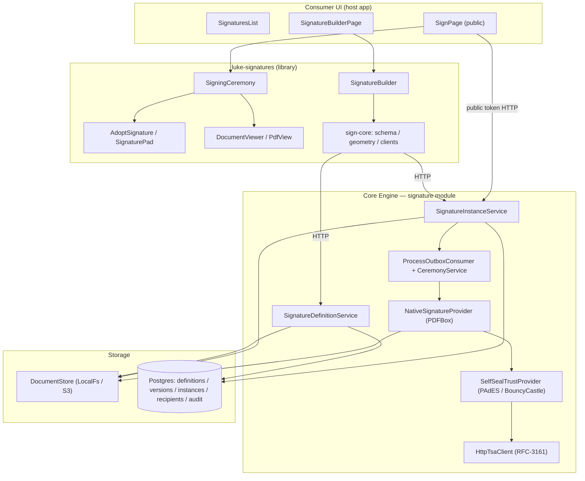
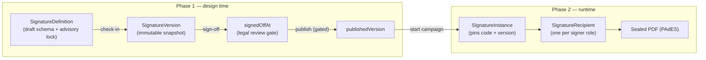
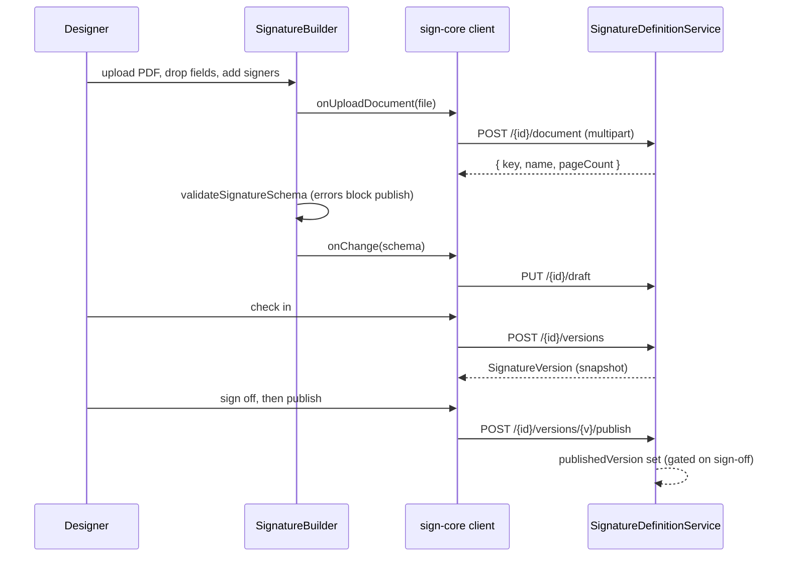
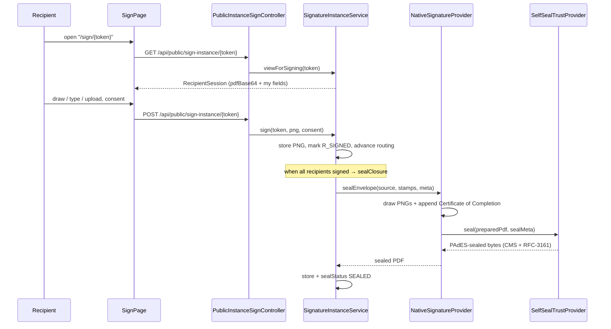

# Signatures

The **Signatures** capability is Lukeflow's native e-signature stack: place signing fields on a PDF, send a per-recipient signing link, capture a drawn/typed mark in a guided ceremony, then produce a cryptographically **PAdES-sealed** PDF with an embedded audit trail. Partial

It has a deliberately clean split of responsibilities:

- **The frontend contract + the ceremony UI live in the library** ([`luke-signatures`](/libraries/signatures) — `@lukeflow/sign-core` + `@lukeflow/sign-react`). Types, schema validation, PDF geometry, transport-agnostic clients, and the React designer/ceremony components. This layer stamps *intent* onto a PDF; it performs **no cryptography**.
- **The cryptographic PAdES signing is ENGINE-side** ([Core Engine](/services/core-engine), package `com.luke.engine.capability.signature`). The engine flips coordinates, draws the signature PNG with **Apache PDFBox**, appends a Certificate of Completion, and applies a detached **CAdES/PAdES** CMS seal with an RFC-3161 timestamp using **BouncyCastle**.

The two halves meet at an HTTP contract: `sign-core`'s clients call the engine's `/api/signature-definitions`, `/api/signature-instances`, and `/api/public/sign-instance` routes.

## Components at a glance

## Two-phase model

Signatures mirror the Forms lifecycle 1:1 (`FormDefinition → FormVersion → FormInstance`). A **`SignatureDefinition`** is the editable, versioned, legally-signed-off template; a **`SignatureInstance`** is one signing event that pins a published version so the document can never shift mid-ceremony.

### The design-time schema (`SignatureSchema`)

Defined in `sign-core/schema.ts`, validated by `validateSignatureSchema`, and coerced by `repairSignatureSchema` so a malformed stored draft never crashes the builder. The engine reads it back through the tolerant `SignatureSchemaModel.parse`.

| Element | Shape | Meaning |
| --- | --- | --- |
| `document` | `{ key?, name, pageCount? }` | Source PDF referenced by an **opaque DocumentStore key** — bytes never live in the schema or DB |
| `signers` | `SignerRole[]` — `{ id, label, order, verify?, color? }` | Signing parties; equal `order` sign in parallel, ascending `order` sign sequentially |
| `fields` | `SchemaField[]` — `{ id, signerId, type, page, x, y, w, h }` | Placed fields, one `signerId` each. Types: `SIGNATURE`, `INITIALS`, `DATE`, `NAME`, `TEXT` |
| `variables` | `SchemaVariable[]` — `{ key, label, required? }` | Declared `{{key}}` merge attributes the campaign supplies at start |
| `routing` | `"sequential" \| "parallel"` | Whether recipients are armed one-at-a-time or all at once |

### Geometry (`sign-core/geometry.ts`)

All field coordinates are **PDF points with a TOP-LEFT origin**; the engine flips Y to PDF bottom-left at stamp time. The library and engine agree on this convention exactly.

| Helper | Responsibility |
| --- | --- |
| `cssToPdf(g, cssX, cssY)` | Map a click in rendered CSS pixels to PDF points |
| `placeField(g, cssX, cssY, size, page)` | Center a fixed-size field on a click, clamped to the page |
| `fieldToCssRect(g, field)` | Project a PDF-point field rect back to a CSS overlay rect |
| `isRotated(g)` | `g.rotate % 360 !== 0` — **a rotated page is refused** on both sides |

The engine enforces the same guard in `NativeSignatureProvider.pageFor`: a page with `/Rotate ≠ 0` throws `"Rotated pages are not supported"` because it stamps into the un-rotated mediabox, and `field.page` out of range is rejected.

## Design flow (place fields)

The designer runs entirely in the browser on `SignatureBuilder`, which renders the PDF via `DocumentViewer` and lets the user drop fields per signer. The host debounces `onChange` into `saveDraft`, then checks in a snapshot, gets legal sign-off, and publishes.

| Function / method | Where | Responsibility |
| --- | --- | --- |
| `SignatureBuilder` | sign-react | Uncontrolled designer: per-type field sizing, signer palette, click-to-place, live validation; exposes `getSchema` / `setSchema` via ref |
| `validateSignatureSchema` | sign-core | Produces `SchemaProblem[]`; `error`-level findings gate sign-off & publish |
| `repairSignatureSchema` / `parseSignatureSchema` | sign-core | Coerce unknown/partial JSON into a valid schema, dropping fields that reference missing signers |
| `SignatureDefinitionService.saveDraft` | engine | Persist the draft schema on the definition |
| `.checkIn` | engine | Snapshot the draft into an immutable `SignatureVersion` |
| `.signOff` | engine | Record `signedOffAt` — the legal review gate (no separate Java validator; sign-off carries it) |
| `.publish` | engine | Set `publishedVersion`; blocked unless the version is signed off |
| `.uploadDocument` / `.fetchDocument` | engine | Store/serve the source PDF bytes through the `DocumentStore` |

The design-time lock model (checkout / release / discard / retire) matches Forms exactly — see [Forms design-time lifecycle](/libraries/forms).

## Signing ceremony → signed PDF

Starting a campaign binds a published definition to recipients (one per signer role) and the supplied `{{key}}` values, mints per-recipient signing tokens, and writes a transactional **outbox** row that drives the Camunda ceremony process. Each recipient opens their unguessable token link, adopts a signature, and consents; when the last recipient signs, the engine **seals the finished PDF**.

| Function / endpoint | Where | Responsibility |
| --- | --- | --- |
| `startCampaign` | `SignatureInstanceService` | Validate roles + required variables, mint tokens, arm first (sequential) or all (parallel) recipients, write outbox row |
| `SignatureProcessOutboxConsumer.drain` | engine | `QUEUED→STARTED` launches the ceremony process; `STARTED→CLOSED` correlates closure on terminal state |
| `SignatureCeremonyService.start` / `.correlateClosure` | engine | In-process Camunda start (idempotent on businessKey) + `SignatureClosure` message correlation |
| `viewForSigning(token)` | `SignatureInstanceService` | Return the recipient's session (PDF base64 + *their* fields + merged values); marks `R_OPENED` / `OPENED` |
| `sign(token, png, consent)` | `SignatureInstanceService` | Store the PNG in the `DocumentStore` (never the DB), mark `R_SIGNED`, advance routing, seal on last signer |
| `PublicInstanceSignController.sign` | engine | Public route; decodes a bounded (≤512 KB), magic-byte-checked base64 PNG |
| `sealClosure` | `SignatureInstanceService` | Build stamps from the pinned schema and call the provider; sets `sealStatus SEALED\|FAILED` — never throws (retryable via `reseal`) |
| `NativeSignatureProvider.sealEnvelope` | engine | Draw each recipient's PNG / `DATE` / `NAME` at its field, append the multi-signer Certificate of Completion |
| `SelfSealTrustProvider.seal` | engine | Apply the detached **PAdES** CMS signature + embed the RFC-3161 timestamp; `saveIncremental` |

### The PAdES seal (engine-side cryptography)

`SelfSealTrustProvider` (selected unless `LUKE_SIGN_TRUST_MODE=qtsp`) is the legally-binding layer:

- Adds a `PDSignature` with filter `Adobe.PPKLite` / subfilter `ETSI.CAdES.detached` (PAdES) and reserves 64 KB for the CMS.
- The inner `CadesSigner` builds a **BouncyCastle `CMSSignedData`** over the PDF byte range: `SHA256withRSA` content signer, the org PKCS#12 chain (`KeystoreSigningKeyProvider` — loaded lazily from `LUKE_SIGN_KEYSTORE_BASE64`), and the CAdES-BES `signing-certificate-v2` signed attribute.
- `HttpTsaClient` fetches an **RFC-3161** trusted timestamp (`LUKE_SIGN_TSA_URL`, default DigiCert), embedded as the `signature-time-stamp` unsigned attribute.

This yields a US ESIGN/UETA-binding signature at ≈ $0/signature. The Adobe "green check" additionally needs an AATL-member CA cert; EU eIDAS QES is a config swap to `QtspTrustProvider` (`TRUST_MODE=qtsp`), built post-V1. `NativeSignatureProvider` also appends a **Certificate of Completion** page rendering the IP-stamped audit trail (`AuditService` stamps each event with client IP, user-agent, `IpRisk`, and geo) plus the SHA-256 of the source.

## Component reference

| Component | Type | Responsibility | Key methods / props |
| --- | --- | --- | --- |
| `SignatureBuilder` | sign-react | Design-time PDF field designer | `initialSchema`, `onUploadDocument`, `getSchema`/`setSchema` (ref) |
| `SigningCeremony` | sign-react | Guided review → adopt → confirm ceremony | `session`, `onSubmit`, `adoptMethods` |
| `AdoptSignature` | sign-react | Draw / type / upload tabs, per-method value retention | `onChange(pngDataUrl)`, `methods` |
| `SignaturePad` | sign-react | Self-contained draw-to-sign canvas (mouse + touch) | `onChange`, `penColor` |
| `DocumentViewer` | sign-react | Multi-page PDF viewer + zoom + click-capture + overlay slot | `onClick`, `renderOverlay`, `onGeometry` |
| `PdfView` | sign-react | Single-page renderer reporting `PdfGeometry` | `onGeometry`, `onClick`, `overlay` |
| `createSignatureDefinitionsClient` | sign-core | Design-time HTTP client | `saveDraft`, `checkIn`, `publish`, `signOff` |
| `createSignatureInstancesClient` | sign-core | Runtime campaign client | `startCampaign`, `getRecipientSession`, `submit` |
| `SignatureDefinitionService` | engine | Design-time lifecycle + versions + document store | `checkIn`, `signOff`, `publish`, `uploadDocument` |
| `SignatureInstanceService` | engine | Campaign start, per-recipient signing, closure sealing | `startCampaign`, `sign`, `sealClosure`, `reseal` |
| `NativeSignatureProvider` | engine | Draw marks + Certificate of Completion (PDFBox) | `stampAndSign`, `sealEnvelope` |
| `SelfSealTrustProvider` | engine | Detached PAdES CMS seal + RFC-3161 (BouncyCastle) | `seal` |
| `DocumentStore` | engine | Pluggable PDF/PNG object storage; bytes never hit Postgres | `put`, `get`, `delete` (LocalFs / S3 impls) |

## Endpoints

**Design-time — `/api/signature-definitions`** (authenticated, `X-Tenant-Id`):

| Method · Path | Purpose |
| --- | --- |
| `GET /` · `POST /` | List / create a definition |
| `GET·PATCH·DELETE /{id}` | Get / rename / soft-delete |
| `PUT /{id}/draft` | Save the working schema draft |
| `POST /{id}/versions` | Check in an immutable version snapshot |
| `GET /{id}/versions` · `GET /{id}/versions/{v}` | List / fetch versions |
| `POST /{id}/versions/{v}/publish` · `/restore` | Publish (gated on sign-off) / restore a version |
| `POST /{id}/sign-off` | Legal review gate |
| `POST /{id}/checkout` · `/release` · `/discard` · `/retire` · `/unretire` · `/restore` | Advisory-lock lifecycle |
| `POST /{id}/document` · `GET /{id}/document/{key}` | Upload / fetch the source PDF |
| `GET /{id}/audit` · `DELETE /{id}/purge` | Audit trail / hard purge |

**Runtime — `/api/signature-instances`** (authenticated):

| Method · Path | Purpose |
| --- | --- |
| `POST /` | Start a campaign from a published definition |
| `GET /` · `GET /{id}` | List / detail (recipients + tokens for delivery) |
| `POST /{id}/cancel` | Cancel a non-terminal instance |
| `GET /{id}/signed.pdf` | Stream the sealed PDF (409 until `SEALED`) |
| `POST /{id}/seal` | Re-seal a completed instance whose seal failed |
| `POST /{id}/recipients/{signerId}/remind` | (Delivery lands with SIG-9) |

**Public signing — `/api/public/sign-instance/{token}`** (token-authenticated, **no tenant header**):

| Method · Path | Purpose |
| --- | --- |
| `GET /{token}` | Load the recipient's signing session |
| `POST /{token}` | Submit the drawn PNG + consent |

A single-request legacy path also exists (`/api/signatures` + public `/api/public/sign/{token}`) for one-signer requests, backed by `SignatureController` / `PublicSignatureController` and `NativeSignatureProvider.stampAndSign`.

## Status & gaps

Signatures are **Partial**: the two-phase model, designer, ceremony, PAdES sealing, IP-stamped audit, and multi-recipient routing are built and green, but email delivery of signing links (SIG-9, Postmark), EU eIDAS QES (`QtspTrustProvider`), and identity verification methods (`EMAIL_OTP` / `SMS_OTP` / `IDV`) beyond `NONE` are not yet wired. The engine module is folded into core but production rollout of the signing keystore/TSA is deferred.

See the [Completeness Scorecard](/reference/completeness) for the live status.

**Related pages:** [Signatures library](/libraries/signatures) · [Core Engine](/services/core-engine) · [File Proxy](/services/file-proxy)
