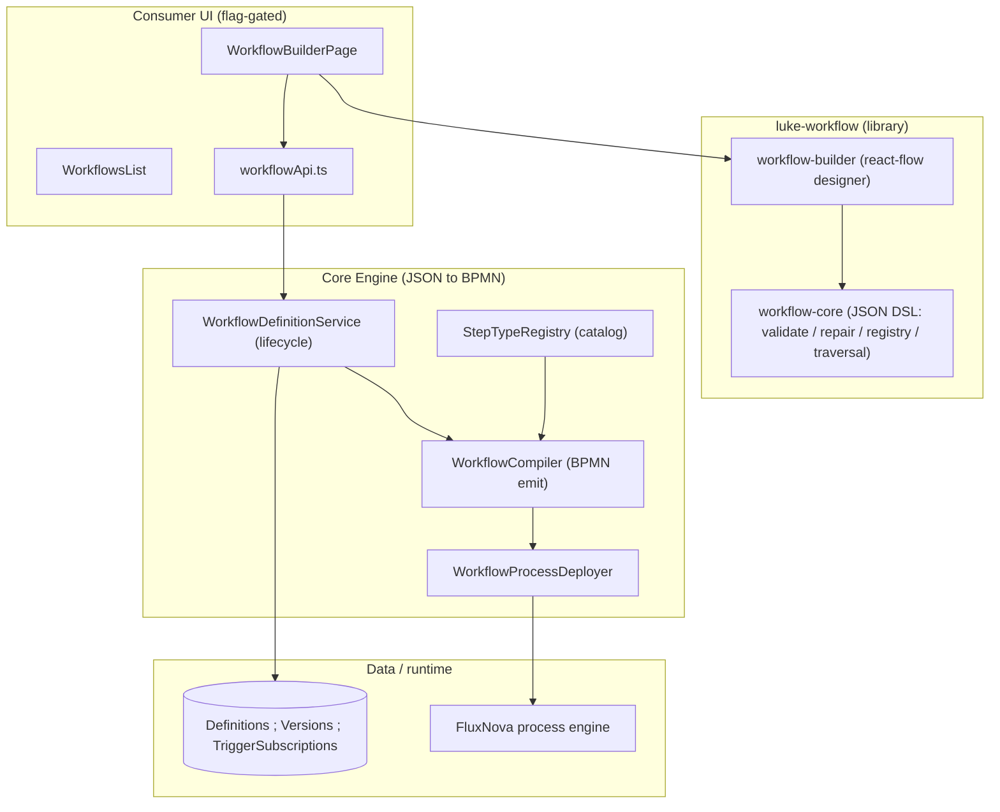
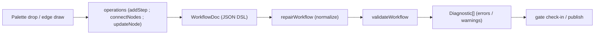
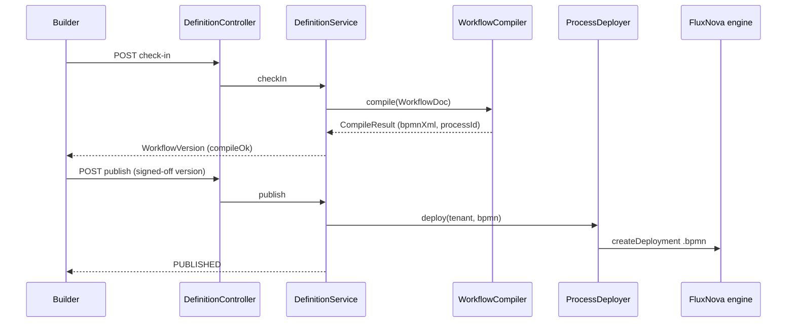

# Workflow

Lukeflow's composing capability: a **workflow** stitches every other capability (Forms, Email, Phone, Signatures, Documents, Integrations) into one orchestrated process. The tenant *authors* a workflow as a friendly JSON graph in the visual builder; the [Core Engine](/services/core-engine) *compiles* that JSON to BPMN 2.0 server-side and deploys it to the Camunda/CIBSeven-lineage FluxNova process engine. The library never executes anything — execution is the engine's job. <span class="pill exp">Pre-launch · flag-gated</span>

> **Library:** `luke-workflow` (`@lukeflow/workflow-core`, `@lukeflow/workflow-builder`) · **Engine:** `luke-core-engine` `com.luke.engine.workflow` · **UI:** `luke-consumer-ui` `pages/Workflow/*` · **Flag:** `VITE_WORKFLOW_ENABLED` (default off)

::: warning Pre-launch and flag-gated — not yet live
The WORKFLOW capability is **hidden from all Consumer UI** behind the `VITE_WORKFLOW_ENABLED` build flag (default **off**): `HIDDEN_CAPABILITIES` in `src/lib/capabilities.ts` suppresses its nav, routes, and access lists until launch. The library is at `0.1.0-alpha.0`, is **not published to npm**, and its planned third package `@lukeflow/workflow-react` is **unbuilt** (only `workflow-core` + `workflow-builder` exist). The `luke-workflow` monorepo has **no CI workflows**. The *engine* side, by contrast, is substantially built — JSON→BPMN compile, deploy, the design-time lifecycle, trigger subscriptions, and a test-run API are all present. Treat everything here as pre-1.0.
:::

## Components at a glance



## The workflow DSL

A workflow is a `WorkflowDoc` — a React-free, DOM-free description of a **graph of nodes**. It carries a single `trigger`, a list of `nodes`, an optional explicit `start` (defaults to `nodes[0]`), and optional builder-only `layout` (canvas positions the compiler ignores). Each node carries a `kind` and, for `action`/`task`, a `capability`. The `"end"` sentinel (`END_NODE`) — like `null` or an absent target — terminates a path.

```jsonc
{
  "id": "wf_onboard",
  "version": 3,
  "trigger": { "capability": "forms", "type": "form.submitted", "config": { "formCode": "…" } },
  "nodes": [
    { "id": "n1", "kind": "action", "capability": "email", "action": "send", "next": "n2" },
    { "id": "n2", "kind": "task",   "capability": "forms", "task": "review", "next": "n3" },
    { "id": "n3", "kind": "branch", "conditions": [{ "expr": "amount > 10000", "next": "n4" }], "else": "end" }
  ]
}
```

The unifying idea: every capability is **dual** — an inbound Trigger and an outbound Action, plus an optional human Task. The seven graph roles:

| Kind | Purpose | Key fields | Compiles to (BPMN) |
| --- | --- | --- | --- |
| `trigger` | Workflow-level start; a capability's inbound event (not a node) | `capability`, `type`, `config` | Message start event |
| `action` | Outbound effect via a capability | `capability`, `action`, `provider`, `connection`, `input`, `output`, `onError`, `next` | Service task |
| `task` | Human / async assignment; waits for completion | `capability`, `task`, `assignee`, `input`, `onError`, `next` | User task |
| `branch` | Exclusive choice — first truthy `expr` wins | `conditions[]` (`expr` + `next`), `else` | Exclusive gateway |
| `parallel` | Fork/join — run `branches` concurrently | `branches[]`, `join` | Parallel gateway (join is a V1 limitation) |
| `wait` | Pause on a timer or a correlated inbound event | `mode` (`timer`/`event`), `duration`, `event`, `next` | Intermediate catch (timer or message) |
| `end` | Reserved terminal target (`"end"`/`null`/absent) | — | The single end event |

Note the TypeScript `NodeKind` union is the five **executable** kinds (`action | task | branch | parallel | wait`); `trigger` is a workflow-level field (`WorkflowTrigger`) and `end` is the terminal sentinel, not array members. Actions/tasks can carry an `ErrorPolicy` (`retry` with `maxAttempts`/`backoff`/`initialDelay`, plus `fallback` node and `deadLetter`). Expressions are a safe arithmetic/boolean grammar evaluated by the engine sandbox — **not** JavaScript `eval`; V1 only checks non-emptiness.

## Authoring pipeline

The builder is a controlled, headless-by-injection react-flow canvas: it renders whatever `value` (`WorkflowDoc`) + `stepTypes` (fetched catalog) the host passes and reports every edit through `onChange(nextDoc)`. Every mutation goes through the pure `operations` functions, so the canvas is a thin projection of the model.



`workflow-core` (the headless engine) exposes these pure functions:

| Function / module | What it does |
| --- | --- |
| `validateWorkflow(doc)` | Structural + referential integrity check. Returns a deterministically-ordered `Diagnostic[]`; **never throws** (a malformed doc yields `malformed-workflow`). Flags missing trigger, empty/duplicate/malformed nodes, unknown kinds, missing capability/action/task, dangling refs, unreachable nodes, empty branch expressions, and bad retry policies. |
| `repairWorkflow(input)` | Tolerant, **pure** normalizer (deep-clones via `structuredClone`). Drops duplicate-id nodes (keeps first), rewrites dangling `next`/`else`/`fallback`/`join` to `"end"`, prunes branch conditions / parallel branches whose targets vanished. Returns `{ doc, removed, rewired }`. Never fabricates a trigger. |
| `createStepTypeRegistry(seed)` / `missingStepTypes(doc, registry)` | Pure in-memory index of `StepTypeDescriptor`s (the capability step vocabulary). `resolve(capability, kind)` backs a node; `missingStepTypes` emits `unknown-step-type` for action/task nodes with no registered step type. Structural kinds (branch/parallel/wait) are native control flow, not backed by capabilities. |
| Graph primitives — `isTerminal`, `nodeRefs`, `reachableFrom`, `startNodeId` | The single definition of "what does a node point at" shared by validate, repair, and traversal so they never drift. `nodeRefs` returns role-tagged non-terminal edges; `reachableFrom` DFS from the start. |
| `createWorkflowEngine(doc, { repair })` | Thin, headless façade over one document (mirrors `createFormEngine`). Bundles `validate()` / `report()` / `startId()` / `nodeById()` / `successors()` / `reachable()` / `isTerminal()`, with an optional up-front repair pass. **Does not execute.** |
| `workflowJsonSchema` | Draft-07 JSON Schema for the stored doc — a portable structural contract for cross-language consumers and the server. Semantic checks still live in `validateWorkflow`. |

The **builder** (`workflow-builder`) adds the visual layer on top: `docToFlow` / `flowToDoc` map the doc to/from a positioned react-flow graph (synthetic start node for the trigger, one node per step, a shared end node; every reference becomes a role-tagged edge); `buildPalette` groups the catalog; `<WorkflowBuilder>` renders the canvas + palette sidebar + config panel with `computeAutoLayout` for tidy positioning.

## Compile & deploy flow

The engine is server-authoritative: the builder validates for UX, but only what `WorkflowCompiler` emits is ever executed. Compilation runs on **check-in** (best-effort, errors recorded not thrown) and deployment happens on **publish** (gated).



| Stage | Endpoint / method | Responsibility |
| --- | --- | --- |
| Check-in | `POST /api/workflow/definitions/{id}/check-in` → `checkIn()` | Snapshot the draft as an immutable `WorkflowVersion`; compile best-effort. A compile failure is stored (`compileOk=false`, `compileError`), never blocks the snapshot. |
| Compile | `WorkflowCompiler.compile(doc)` | Translate the JSON DSL to schema-valid BPMN 2.0 **directly against the FluxNova model API** (`org.finos.fluxnova.bpm.model.bpmn`), not the linear fluent builder, so arbitrary graphs (branches, parallel splits, boundary-error routing) map deterministically. Node ids become BPMN flow-element ids verbatim, so a runtime `activityId` resolves straight back to the authoring node. Returns `CompileResult(processId, bpmnXml, warnings)`. |
| Sign-off | `POST .../versions/{version}/sign-off` → `signOff()` | Mark a version tested; **requires a clean compile** or throws `WorkflowLifecycleException`. |
| Publish | `POST .../publish` → `publish()` | Gated on sign-off **and** a clean compile **and** every action/task capability resolving in the `StepTypeRegistry` (`assertCapabilitiesResolvable`). Deploys via `WorkflowProcessDeployer`, records the `WorkflowTriggerSubscription`, flips status to `PUBLISHED`. |
| Deploy | `WorkflowProcessDeployer.deploy(tenant, processId, bpmn)` | Tenant-scoped `repositoryService.createDeployment()` with duplicate filtering (re-publishing identical BPMN is a no-op). Unlike static form/phone processes, workflow BPMN is generated per definition from a compiled string. |
| Catalog | `GET /api/workflow/catalog` → `WorkflowCatalogController` | Serves the merged `StepTypeRegistry.all()` so the builder renders its palette; V1 seeds a reference set (forms/email/phone/signatures/integrations triggers + actions + `forms.review` task). |
| Test run | `POST /api/workflow/definitions/{id}/runs` → `WorkflowRunController` / `WorkflowRunService` | Start a test instance of the published version and inspect runs (Pillar 4). |

Contrary to a common assumption, the JSON→BPMN compile is **fully present** in `luke-core-engine`, not a stub: `WorkflowCompiler` maps `trigger→start event`, `action→service task`, `task→user task`, `branch→exclusive gateway`, `parallel→parallel gateway`, `wait→timer/message catch`, and `onError.fallback→error boundary event`. The one honest gap is the **parallel join** (a documented V1 limitation surfaced as a compile warning) and trigger **execution binding** (start-event wiring flagged as follow-up WF-11).

## Component reference

| Component | Type | Responsibility | Key methods / exports |
| --- | --- | --- | --- |
| `schema/types.ts` | TS model | Owns the `WorkflowDoc` shape + node union | `WorkflowDoc`, `WorkflowNode`, `ActionNode`, `TaskNode`, `BranchNode`, `ParallelNode`, `WaitNode`, `WorkflowTrigger`, `ErrorPolicy`, `END_NODE` |
| `schema/validate.ts` | Function | Static integrity diagnostics | `validateWorkflow`, `validateWorkflowReport` |
| `schema/repair.ts` | Function | Tolerant normalizer | `repairWorkflow` → `{ doc, removed, rewired }` |
| `schema/graph.ts` | Functions | Shared graph primitives | `isTerminal`, `nodeRefs`, `reachableFrom`, `startNodeId` |
| `schema/jsonSchema.ts` | Artifact | Draft-07 structural schema | `workflowJsonSchema` |
| `diagnostics.ts` | Types + helpers | Structured problem envelope (never thrown) | `Diagnostic`, `DiagnosticReport`, `diag`, `toReport` |
| `registry/registry.ts` | Function | In-memory step-type index + gate | `createStepTypeRegistry`, `missingStepTypes`, `StepTypeRegistry` |
| `engine/createWorkflowEngine.ts` | Façade | Headless read-only view over one doc | `createWorkflowEngine` → `validate` / `report` / `successors` / `reachable` |
| `workflow-builder/graph.ts` | Functions | Doc ↔ visual-graph mapping | `docToFlow`, `flowToDoc`, `START_ID`, `END_ID` |
| `workflow-builder/operations.ts` | Functions | Pure editing operations | `newNodeId`, `addStep`, `addStructural`, `updateNode`, `removeNode`, `connectNodes` |
| `workflow-builder/WorkflowBuilder.tsx` | React component | react-flow canvas + palette + config panel | `<WorkflowBuilder value onChange stepTypes />` |
| `WorkflowCompiler.java` | Engine | JSON DSL → BPMN 2.0 emit | `compile(WorkflowDoc)` → `CompileResult` |
| `WorkflowDefinitionService.java` | Engine service | Design-time lifecycle | `create`, `updateDraft`, `checkIn`, `signOff`, `publish` |
| `WorkflowProcessDeployer.java` | Engine | Deploy compiled BPMN to FluxNova | `deploy(tenant, processId, bpmn)` |
| `StepTypeRegistry.java` | Engine component | Aggregate + resolve step-type descriptors | `register`, `all`, `resolve(capability, kind)` |
| `WorkflowTriggerSubscription.java` | Engine entity | Start-on-event registry per definition | one row/definition; re-publish replaces |
| `WorkflowDefinitionController.java` | REST | Tenant design-time API | CRUD + `check-in`/`sign-off`/`publish` |
| `WorkflowCatalogController.java` / `WorkflowRunController.java` | REST | Catalog + test-run APIs | `GET /catalog`; `POST .../runs` |
| `pages/Workflow/WorkflowBuilderPage.tsx` | UI page | Hosts `<WorkflowBuilder>`, drives lifecycle | check-in / sign-off / publish / AI assist / runs |
| `lib/capabilities.ts` | UI | Flag gating | `HIDDEN_CAPABILITIES` via `VITE_WORKFLOW_ENABLED` |

## Status & gaps

- **Flag-gated & hidden.** `VITE_WORKFLOW_ENABLED` defaults off; the whole capability (nav, routes, access) is suppressed via `HIDDEN_CAPABILITIES`. Flip to `true` to reveal it.
- **Library is alpha.** `@lukeflow/workflow-core` and `@lukeflow/workflow-builder` are `0.1.0-alpha.0`, unpublished; the third advertised package `@lukeflow/workflow-react` is **planned but unbuilt**.
- **No CI.** The `luke-workflow` monorepo has no `.github/workflows`; tests exist (vitest per module) but nothing gates them.
- **Engine is ahead of the library.** Compile, deploy, lifecycle (check-in/sign-off/publish), trigger subscriptions, and a test-run API are all present in `luke-core-engine`. Known engine V1 limitations: parallel **join** (compile warning) and trigger **execution binding** (WF-11 follow-up).
- **Expression analysis is minimal.** V1 only checks branch expressions for non-emptiness; parse/unknown-identifier analysis is a later milestone.

See the [Completeness Scorecard](/reference/completeness) for fleet-wide status. Related: [Workflow library](/libraries/workflow) · [Core Engine](/services/core-engine) · [Consumer UI](/apps/consumer-ui).
