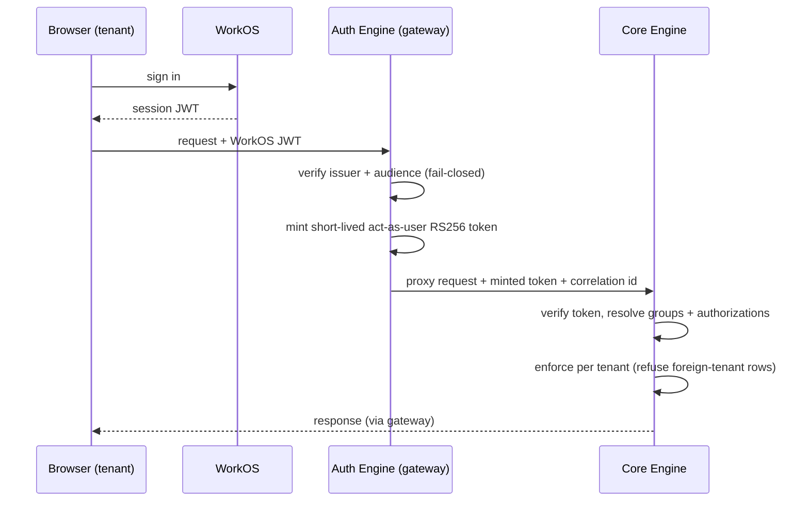

# Authentication & Authorization

Lukeflow separates **who you are** (authentication) from **what you may do** (authorization),
and puts them in different places on purpose.

- **Authentication** happens at the front door via **WorkOS** (migrated off Clerk).
- **Authorization** is enforced by the **[Core Engine](/services/core-engine)** using
  Camunda's native identity/authorization model plus per-tenant scoping.
- The **[Auth Engine](/services/auth-engine)** is a *stateless translator* between the two —
  it holds no database and makes no policy decisions.

## The chain

| Stage | Component | Responsibility |
| --- | --- | --- |
| Sign-in | WorkOS (hosted) | Federated / social / password login; issues a session JWT |
| Verify | [Auth Engine](/services/auth-engine) | Strict issuer + audience validation of the WorkOS JWT (**fail-closed**) |
| Translate | Auth Engine | Mint a short-lived **RS256 "act-as-user"** token the engine trusts |
| Proxy | Auth Engine | Forward the request to the engine with the minted token + correlation id |
| Enforce | [Core Engine](/services/core-engine) | Verify the token, resolve the user's groups/authorizations, **enforce** per tenant |

::: tip Why a stateless translator
Keeping the gateway stateless means there is exactly **one** place that decides access — the
engine. The gateway can't drift out of sync with policy because it holds none. It is a
JWT verifier + token minter + reverse proxy, nothing more (no Casbin, no DB).
:::

## The engine is the enforcer

Inside the engine, authorization uses Camunda-7's identity service (users, groups,
authorizations) extended with **per-tenant scoping**. Key points:

- Every capability query is **tenant-scoped**; a by-id read that returns a foreign-tenant
  row is refused (see [Multi-Tenancy](/concepts/tenancy)).
- A dedicated **`owner:<tenantId>` group** models tenant ownership and fixes cross-tenant
  org-admin escalation — ownership is transferable and seeded only where unambiguous.
- Access to capabilities is requested and approved through the **Access** capability;
  approval auto-grants.

## Operator vs tenant auth

The two applications authenticate differently:

- **[Consumer UI](/apps/consumer-ui)** (tenants) → WorkOS session → Auth Engine → engine.
- **[Core UI](/apps/core-ui)** (operators) → **HTTP Basic** directly against the engine's
  REST API. The cockpit is an operator tool and deliberately isolates tenants (it never
  lists all tenants, to avoid leaking other customers' org names).

## Public, unauthenticated surfaces

A few routes are intentionally public and token-bearer authenticated rather than
session-authenticated:

- **`/api/public/**`** and **`/embed*`** — the embeddable forms surface. Access is via an
  unguessable **HMAC token**, with per-tenant `frame-ancestors`, server-side validation,
  token revocation and anti-abuse. These use an **any-origin / no-credentials** CORS
  carve-out (module-script bundle loads send an `Origin` even same-origin).
- **Email assets** (`/api/public/email-assets/{id}`) — public-by-nature images served by an
  unguessable asset id acting as a bearer, brokered by the [File Proxy](/services/file-proxy).

## Hardening guards

Both the engine and the gateway **fail fast** at boot rather than run insecurely — for
example refusing to start in dev-mode without the dev profile, or with an insecure signing
key or default admin password in a production profile. See [Security](/operations/security).

## See also

- [Auth Engine](/services/auth-engine) — the gateway internals.
- [Multi-Tenancy](/concepts/tenancy) — how tenant isolation is enforced.
- [Security](/operations/security) — the fleet-wide security program.
