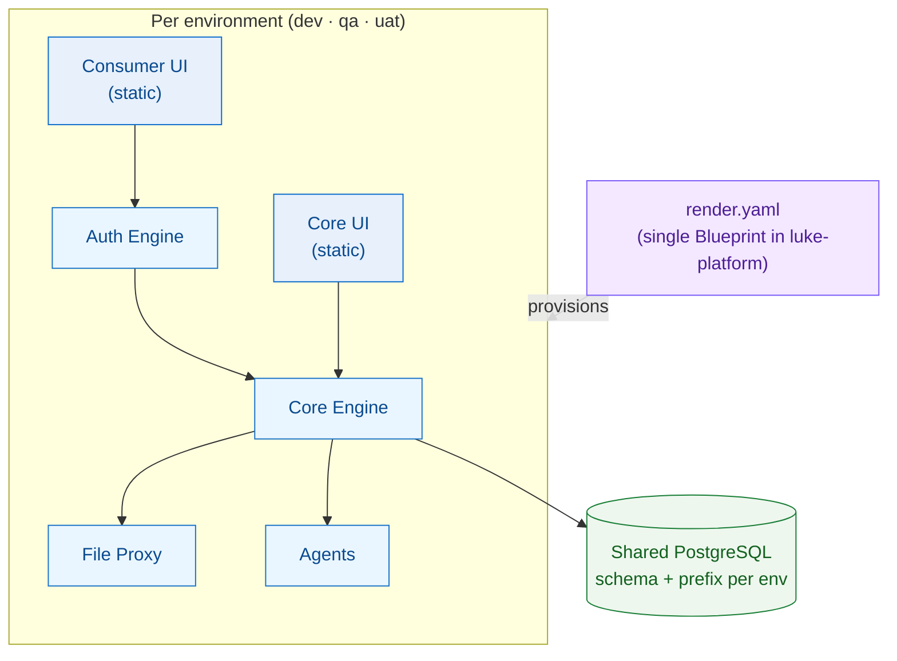

# Deployment Topology

The whole non-production fleet is described by a **single Render Blueprint** —
`render.yaml` in [`luke-platform`](/operations/platform) — that stands up every service
across three environments sharing one database instance.

## Topology

## Environments

| Environment | Purpose | Branch(es) |
| --- | --- | --- |
| **dev** | Integration / daily development | `develop` |
| **qa** | Test & verification | `qa` |
| **uat** | User-acceptance | (promoted) |
| **prod** | Production | Deliberately **excluded** from this blueprint (deferred) |

::: warning Deploy the right branch
Service repos deploy from **`develop`** (and `qa`), **not** `main`. A change merged to
`main` for a service repo does **not** ship. Open PRs against `develop` (or `qa`). The one
exception is the `luke-email` library, whose deploy branch is `main`.
:::

## Services per environment

Each environment runs the same six deployables plus shared Postgres:

| Service | Type | Notes |
| --- | --- | --- |
| [Core Engine](/services/core-engine) | Docker web service | The engine + capability layer; readiness probe; `postgres,prod` profile in prod |
| [Auth Engine](/services/auth-engine) | Docker web service | Stateless WorkOS↔engine gateway |
| [File Proxy](/services/file-proxy) | Docker web service | S3 byte-proxy + headless-Chromium PDF render |
| [Agents](/services/agents) | Render-native (Python) | FastAPI AI agents; no Dockerfile, Render buildpack |
| [Consumer UI](/apps/consumer-ui) | Static site | With security headers (DENY frame, HSTS, nosniff) |
| [Core UI](/apps/core-ui) | Static site | Operator cockpit; CSP currently report-only |

All environments share **one PostgreSQL instance** with per-environment
**schema-name + table-prefix isolation** (see [Multi-Tenancy](/concepts/tenancy)).

## The shared database rule

Because dev/qa/uat share one Postgres, each engine instance **must** set a distinct
`schema-name` + `table-prefix`. Without it, the second environment to boot crashes creating
`act_id_user`. This is the single most important deployment invariant.

## Static apps & vendored bundles

The UIs deploy as Render **static sites**. Two wrinkles:

- The public **`/embed`** page is a **standalone bundle copied into the engine**
  (`static/embed-assets`) — a [Consumer UI](/apps/consumer-ui) push does **not** update it;
  you must rebuild the embed bundle, copy it into the engine, and push the engine.
- The apps consume the [headless libraries](/libraries/forms) as **vendored built dist**, so
  a library change requires rebuilding the package, re-vendoring, and rebuilding the app.

## CORS & edge

The public surface (`/api/public/**`, `/embed*`) uses an **any-origin / no-credentials**
carve-out in both engine layers **and** the auth gateway, because module-script bundle loads
send an `Origin` header even same-origin. The `*.lukeflow.com` wildcard was intentionally
dropped in favor of these explicit carve-outs. See [Authentication & Authorization](/concepts/auth).

**Filter order matters as much as the policy.** The CORS filter must run *before* anything that
can reject a request — the security chain (Spring Boot orders it at `-100`) and the rate-limit
filter — or those rejections leave without `Access-Control-Allow-Origin`. The browser then blocks
the response, so `fetch()` rejects with a network/CORS `TypeError` instead of resolving with the
real status. A plain `Filter` bean is registered at `LOWEST_PRECEDENCE`, i.e. *after* the security
chain, which is the trap: the gateway's 401 for an aged-out access token became an unreadable
"CORS error", and the UI's refresh-on-401 retry (which must read the 401) never fired. Both
services now pin the order explicitly and test it.

## Operations tooling

`luke-platform` also carries the fleet runbooks (DR, rollback, incident triage,
scaling/HA), a k6 load-test harness, a ZAP DAST baseline, an S3/IAM provisioning kit, and
the merge master prompts. See [Platform & Deployment](/operations/platform).

## See also

- [Platform & Deployment](/operations/platform) — the blueprint and runbooks in detail.
- [Security](/operations/security) — headers, scans, and the security program.
- [Architecture](/guide/architecture) — how the deployed pieces talk.
