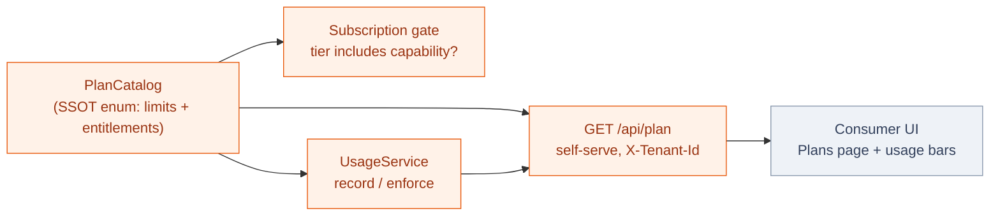
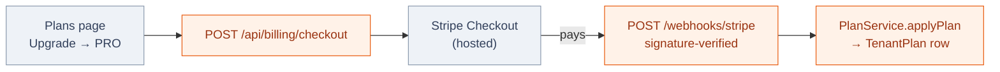

# Plans, Limits & Usage

Lukeflow's commercial model is **made real in the engine**, not just on a marketing page.
A tenant sits on exactly one **plan tier**; the tier carries its price, its monthly
**limits**, and its **entitlements** (which capabilities and paid features it unlocks). The
engine also **meters** what a tenant actually consumes each month, so both the customer and
the operator can see usage-vs-limit — and, when switched on, so the engine can **enforce** it.

## The tiers

Four tiers, ranked. Amounts are **per month**; a limit of *unlimited* is Enterprise's
negotiated/custom band. The numbers below are the single source of truth
(`PlanCatalog` in the [Core Engine](/services/core-engine)) — the same values feed the billing
gate, the operator admin, and the self-serve `GET /api/plan` the UI reads.

| Tier | Price/mo | Submissions | AI actions | Emails | Storage | Seats | Capabilities | Extras |
| --- | --: | --: | --: | --: | --: | --: | --- | --- |
| **Free** | $0 | 100 | 10 | 60 | 0.5 GB | 1 | Forms | — |
| **Pro** | $39 | 2,000 | 500 | 2,000 | 5 GB | 3 | + Email | Removable badge · attachments |
| **Business** | $149 | 15,000 | 2,000 | 15,000 | 25 GB | 10 | + Signatures, Calendar | + SSO |
| **Enterprise** | Custom | Unlimited | Unlimited | Unlimited | Unlimited | Unlimited | + Phone, Workflow, SLA | + Voice · self-host |

::: tip Free is deliberately ~50¢/mo to serve
The Free tier's limits (100 submissions, 60 emails, ½ GB) are tuned so a fully-active free
tenant costs the platform roughly **50 cents a month** to serve — cheap enough to be a genuine
funnel, bounded enough that it can't be farmed. Every paid tier is priced off the same
unit-economics model.
:::

## One catalog, no drift

`PlanCatalog` is an enum that mirrors the RBAC `RoleCatalog` pattern: **each tier carries its
limits and entitlements inline**, and every consumer derives from it, so a number can never
drift between the three places that read a plan.

**Resolution is fail-closed.** The stored value on a tenant is a tier id (`FREE / PRO /
BUSINESS / ENTERPRISE`). An **absent row, blank, or unknown value resolves to Free** — a bad
value can never silently *upgrade* a tenant. The legacy two-value model (`FREE / PAID`) maps
its historical `PAID` to **Pro** (the smallest paying tier), so existing rows keep exactly the
features they had.

## Metering: what a tenant actually used

The engine counts consumption into **`luke_usage_counter`**, one row per
`tenant | metric | YYYY-MM` — so history is retained month by month and the current month is a
single keyed upsert. Today it meters **submissions** (at `FormSubmissionService.submit`, the
one choke point every door funnels through) and **emails** (on successful delivery in the email
dispatcher).

Recording is **best-effort and off the critical path**: `UsageService.record` runs in its own
`REQUIRES_NEW` transaction and swallows every error, so a metering hiccup can **never** break a
submit or a send. `GET /api/usage` returns used-vs-limit per metric for the current billing
month.

**Storage is a gauge, not a counter.** Bytes stored aren't *accumulated* month by month — they're
*occupied* right now — so storage is read live rather than tallied: `UsageService` sums the tenant's
non-deleted `luke_document` bytes (signed PDFs register there too) through a `StorageUsageProvider`
SPI and folds a `storage` row (`used`/`limit` in **bytes**; limit = `tier.storageGb × 1e9`) into the
same `/api/usage` snapshot. It's resilient — a gauge failure reports 0 and never breaks the read.

**AI actions are metered in `luke-agents`, not here.** The agents fleet enforces a **per-tenant daily
token cap sized by tier** — `AGENTS_TOKEN_CAP_<TIER>` keyed off the `X-Tenant-Tier` header (the tier
core-engine already resolved), falling back to a flat cap. Same default-lenient rule: unset = no cap.
See [Agents → per-tenant token cap](/services/agents).

## Enforcement is opt-in (default-lenient)

Both gates are **off by default** and only bite when their flag is set — so dev/qa (and prod
until it's deliberately flipped) *count* without *blocking*:

| Flag | Default | When on |
| --- | --- | --- |
| `luke.plan.enforce-usage-limits` | `false` | A submit over the tier's monthly limit is refused with **402 Payment Required**. |
| `luke.plan.enforce-capability-tiers` | `false` | Subscribing a tenant to a capability its tier doesn't include is refused. |

::: warning This follows the fleet's default-lenient law
Enforcement is a business decision, not a boot dependency. Unconfigured means **count and
serve**, never fail. Flip the flags in the environment where you actually want the paywall to
bite; everywhere else keeps working unchanged. See [Deployment Topology](/concepts/deployment).
:::

## Who writes the plan

Two writers, one seam. An **operator** can set any tenant's tier by hand; **Stripe** writes the
same seam automatically once billing is wired. Neither requires a downstream consumer to change —
they both land in the one `TenantPlan` row that `GET /api/plan` reads.

| Endpoint | Auth | Purpose |
| --- | --- | --- |
| `GET /api/plan` | Tenant (`X-Tenant-Id`) | The caller's tier, limits, features, capabilities — what the Plans page reads. |
| `GET /api/usage` | Tenant (`X-Tenant-Id`) | Used-vs-limit per metric this month — what the usage bars read. |
| `GET /api/billing/config` | Tenant (`X-Tenant-Id`) | Whether checkout is wired + which tiers are buyable — the UI shows Upgrade only when this says so. |
| `POST /api/billing/checkout` | Tenant (`X-Tenant-Id`) | Start Stripe Checkout for a tier → a hosted URL to redirect to. |
| `POST /webhooks/stripe` | Stripe **signature** | The truth: applies the paid plan after Stripe confirms. |
| `GET /api/tenants/{tenantId}/plan` | Operator-Basic | One tenant's stored plan + badge rule. |
| `PUT /api/tenants/{tenantId}/plan` | Operator-Basic | Set a tenant's tier by hand. |

## Billing (Stripe)

Checkout is a config-gated Stripe integration (`billing` module). With `STRIPE_SECRET_KEY` unset
the whole module self-disables — checkout `404`s, the webhook no-ops — so dev/qa and any un-wired
environment never touch the network. When it's wired:

The **browser is never trusted to set a plan** — checkout only mints a session; the plan changes
only when the signature-verified webhook says Stripe was paid. `checkout.session.completed` upgrades,
`customer.subscription.updated` tracks a tier change, and `customer.subscription.deleted` (or a lapsed
status) downgrades to Free. The webhook is mounted **outside `/api/**`** (at `/webhooks/stripe`)
because Stripe carries no gateway or tenant credential — its authentication *is* the signature.

Price ids map a tier to a Stripe Price (`STRIPE_PRICE_PRO` / `STRIPE_PRICE_BUSINESS`); a tier with no
configured price simply isn't buyable self-serve, so `Free` (a downgrade) and `Enterprise` (a sales
motion) never are.

## In the product

The [Consumer UI](/apps/consumer-ui) **Plans** page renders the tier comparison, the tenant's
current plan, and a **"Usage this month"** section: per-metric bars of submissions, emails and
**storage** (bytes rendered as KB/MB/GB) against the plan's limits (the bar turns red and prompts an
upgrade at the cap; unlimited tiers show the running count only). It fails soft — a usage hiccup
never hides the plan. When
`GET /api/billing/config` reports billing is wired, each purchasable tier's **Upgrade** button opens
Stripe Checkout; otherwise it falls back to a sales-contact link.

## See also

- [Core Engine](/services/core-engine) — the `branding` (PlanCatalog), `usage` and `billing` modules.
- [Multi-Tenancy](/concepts/tenancy) — a plan is a per-tenant fact, resolved fail-closed.
- [Capabilities](/concepts/capabilities) — tiers gate which capabilities a tenant may subscribe to.
- [Endpoint reference](/reference/endpoints#plans-usage-billing) — the plan/usage/billing routes.
