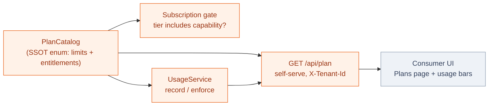

# Plans, Limits & Usage

Lukeflow's commercial model is **made real in the engine**, not just on a marketing page.
A tenant sits on exactly one **plan tier**; the tier carries its price, its monthly
**limits**, and its **entitlements** (which capabilities and paid features it unlocks). The
engine also **meters** what a tenant actually consumes each month, so both the customer and
the operator can see usage-vs-limit — and, when switched on, so the engine can **enforce** it.

## The tiers

Four tiers, ranked. Amounts are **per month**; a limit of *unlimited* is Enterprise's
negotiated/custom band. The numbers below are the single source of truth
(`PlanCatalog` in the [Core Engine](/services/core-engine)) — the same values feed the billing
gate, the operator admin, and the self-serve `GET /api/plan` the UI reads.

| Tier | Price/mo | Submissions | AI actions | Emails | Storage | Seats | Capabilities | Extras |
| --- | --: | --: | --: | --: | --: | --: | --- | --- |
| **Free** | $0 | 100 | 10 | 60 | 0.5 GB | 1 | Forms | — |
| **Pro** | $39 | 2,000 | 500 | 2,000 | 5 GB | 3 | + Email | Removable badge · attachments |
| **Business** | $149 | 15,000 | 2,000 | 15,000 | 25 GB | 10 | + Signatures, Calendar | + SSO |
| **Enterprise** | Custom | Unlimited | Unlimited | Unlimited | Unlimited | Unlimited | + Phone, Workflow, SLA | + Voice · self-host |

::: tip Free is deliberately ~50¢/mo to serve
The Free tier's limits (100 submissions, 60 emails, ½ GB) are tuned so a fully-active free
tenant costs the platform roughly **50 cents a month** to serve — cheap enough to be a genuine
funnel, bounded enough that it can't be farmed. Every paid tier is priced off the same
unit-economics model.
:::

## One catalog, no drift

`PlanCatalog` is an enum that mirrors the RBAC `RoleCatalog` pattern: **each tier carries its
limits and entitlements inline**, and every consumer derives from it, so a number can never
drift between the three places that read a plan.

**Resolution is fail-closed.** The stored value on a tenant is a tier id (`FREE / PRO /
BUSINESS / ENTERPRISE`). An **absent row, blank, or unknown value resolves to Free** — a bad
value can never silently *upgrade* a tenant. The legacy two-value model (`FREE / PAID`) maps
its historical `PAID` to **Pro** (the smallest paying tier), so existing rows keep exactly the
features they had.

## Metering: what a tenant actually used

The engine counts consumption into **`luke_usage_counter`**, one row per
`tenant | metric | YYYY-MM` — so history is retained month by month and the current month is a
single keyed upsert. Today it meters **submissions** (at `FormSubmissionService.submit`, the
one choke point every door funnels through) and **emails** (on successful delivery in the email
dispatcher).

Recording is **best-effort and off the critical path**: `UsageService.record` runs in its own
`REQUIRES_NEW` transaction and swallows every error, so a metering hiccup can **never** break a
submit or a send. `GET /api/usage` returns used-vs-limit per metric for the current billing
month.

## Enforcement is opt-in (default-lenient)

Both gates are **off by default** and only bite when their flag is set — so dev/qa (and prod
until it's deliberately flipped) *count* without *blocking*:

| Flag | Default | When on |
| --- | --- | --- |
| `luke.plan.enforce-usage-limits` | `false` | A submit over the tier's monthly limit is refused with **402 Payment Required**. |
| `luke.plan.enforce-capability-tiers` | `false` | Subscribing a tenant to a capability its tier doesn't include is refused. |

::: warning This follows the fleet's default-lenient law
Enforcement is a business decision, not a boot dependency. Unconfigured means **count and
serve**, never fail. Flip the flags in the environment where you actually want the paywall to
bite; everywhere else keeps working unchanged. See [Deployment Topology](/concepts/deployment).
:::

## Who writes the plan

A tenant's plan is **operator-set today** — the seam a real billing integration (Stripe
checkout + webhook) will write to next, without any consumer needing to change:

| Endpoint | Auth | Purpose |
| --- | --- | --- |
| `GET /api/plan` | Tenant (`X-Tenant-Id`) | The caller's tier, limits, features, capabilities — what the Plans page reads. |
| `GET /api/usage` | Tenant (`X-Tenant-Id`) | Used-vs-limit per metric this month — what the usage bars read. |
| `GET /api/tenants/{tenantId}/plan` | Operator-Basic | One tenant's stored plan + badge rule. |
| `PUT /api/tenants/{tenantId}/plan` | Operator-Basic | Set a tenant's tier (the billing write-back seam). |

## In the product

The [Consumer UI](/apps/consumer-ui) **Plans** page renders the tier comparison, the tenant's
current plan, and a **"Usage this month"** section: per-metric bars of submissions and emails
against the plan's limits (the bar turns red and prompts an upgrade at the cap; unlimited tiers
show the running count only). It fails soft — a usage hiccup never hides the plan.

## See also

- [Core Engine](/services/core-engine) — the `branding` module (PlanCatalog) and metering.
- [Multi-Tenancy](/concepts/tenancy) — a plan is a per-tenant fact, resolved fail-closed.
- [Capabilities](/concepts/capabilities) — tiers gate which capabilities a tenant may subscribe to.
- [Endpoint reference](/reference/endpoints#plans-usage-billing) — the plan/usage routes.
