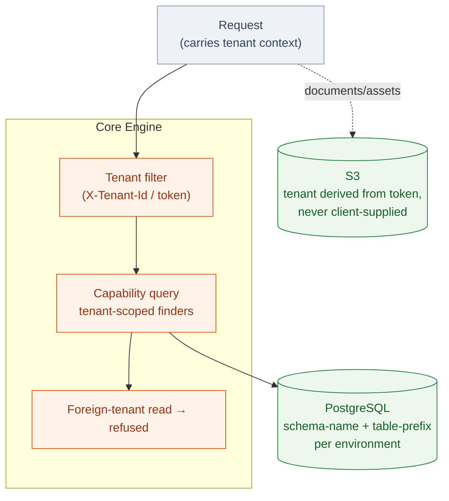

# Multi-Tenancy

Lukeflow is **multi-tenant** end to end: every process, capability record, form, email
template, signature and document belongs to exactly one tenant, and the platform enforces
that boundary at several layers.

## Isolation at a glance

## Tenancy in the engine

The [Core Engine](/services/core-engine) is built on Camunda-7's native **tenant** concept.
Process definitions, instances and capability data all carry a tenant id, and queries are
tenant-scoped. Two rules matter most:

1. **Reads are tenant-scoped.** A capability query only returns rows for the caller's active
   tenant. Because an admin credential can technically read across tenants, a by-id read that
   returns a **foreign-tenant** row is explicitly *refused* rather than displayed — both in
   the API and in the [Core UI](/apps/core-ui) (which shows a "not in this tenant" screen).
2. **Ownership is a scoped group.** Each tenant has an **`owner:<tenantId>`** group. The
   creator is the initial owner; ownership is transferable. This closed a cross-tenant
   org-admin escalation where an org-admin in one tenant could act in another. Backfill only
   seeds ownership where it is unambiguous.

::: warning Operator isolation
The [Core UI](/apps/core-ui) cockpit deliberately **never lists all tenants** — doing so would
leak other customers' organization names. Operators pick from the tenants they belong to; a
failed tenant fetch surfaces an error with a retry rather than silently showing "no tenant".
:::

## Tenant selection in the UIs

- **[Consumer UI](/apps/consumer-ui)** — the tenant is derived from the authenticated WorkOS
  session and the user's memberships.
- **[Core UI](/apps/core-ui)** — an explicit **tenant switcher** in the top bar. The active
  tenant is sent as a header (`X-Tenant-Id`) on every engine call and persisted locally, so
  capability lists (subscriptions, calendars, etc.) reflect the chosen tenant.

## Tenancy at the data layer

Two backing stores enforce isolation differently:

| Store | Mechanism |
| --- | --- |
| **PostgreSQL** (engine) | Shared instance with **schema-name + table-prefix isolation** per environment. This is mandatory — a shared instance without it crashes on first boot (duplicate `act_id_user`). |
| **S3** (documents / assets) | Tenancy is **token-derived, never client-supplied** — the [File Proxy](/services/file-proxy) computes the tenant/key from the request's verified token, so a client cannot address another tenant's objects. |

## Tenancy across services

- The [Auth Engine](/services/auth-engine) carries the tenant context in the minted
  act-as-user token; it does not decide tenancy, it transports it.
- The [Agents](/services/agents) service enforces **per-tenant isolation** and rate limiting
  on AI calls, and gates transcript storage on consent.
- The [File Proxy](/services/file-proxy) derives tenancy from the token, applies retention/
  purge per tenant, and never trusts a client-supplied tenant id.

## See also

- [Authentication & Authorization](/concepts/auth) — how tenant context is carried and enforced.
- [Core Engine](/services/core-engine) — the tenant filters and ownership model.
- [Deployment Topology](/concepts/deployment) — schema isolation across dev/qa/uat.
