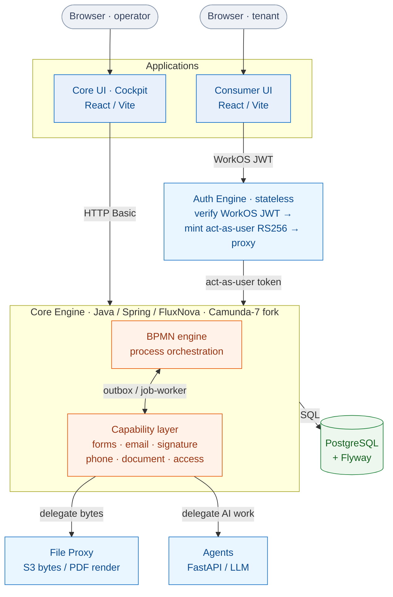

# Architecture

This page is the end-to-end picture: the components, how a request flows through them,
and the key architectural decisions that shape everything else.

## The big picture

Lukeflow is a **hub-and-spoke** system. The hub is the [Core Engine](/services/core-engine)
— a BPMN process engine that also hosts the capability data layer. The spokes are the
applications, headless libraries, auth gateway, file proxy and AI agents.

## The three architectural decisions

Everything in this manual follows from three deliberate choices.

### 1. Capabilities run *in-process*, not as microservices

Rather than a fleet of capability microservices, a capability's **data layer lives inside
the engine's Spring application**. The BPMN process orchestrates; the capability persists
its own tables; Camunda's transactional **outbox / job-worker** writes results back
atomically in the same transaction as the process state.

This is the [capability→core merge](/concepts/capabilities). It trades independent
deployability for **transactional integrity** (no dual-write / saga problem between
"process advanced" and "capability side-effect recorded") and drastically fewer moving
parts. `luke-capability-engine` and `luke-signature-engine` are the empty shells left
behind after their code moved into the core.

::: info Two things still leave the engine
Only two kinds of work are delegated out of process, because they don't belong in a JVM
transaction: **bulk bytes** (documents, generated PDFs, email assets) go to the
[File Proxy](/services/file-proxy), and **LLM work** (drafting a form, an email, sentiment)
goes to the [Agents](/services/agents) service.
:::

### 2. The engine is the single source of authorization truth

Authentication happens at the front door (WorkOS), but **authorization is enforced by the
engine**, using Camunda's native identity/authorization model plus per-tenant scoping. The
[Auth Engine](/services/auth-engine) is a *stateless translator* — it has no database and
makes no policy decisions. It verifies a WorkOS token and mints a short-lived "act-as-user"
token the engine trusts. See [Authentication & Authorization](/concepts/auth).

### 3. UIs consume headless libraries as vendored dist

The form/email/signature/list/analytics/workflow **engines are framework-agnostic TypeScript
libraries** (`core` + `react` + `builder`). They are built to `dist` and **vendored** into
the applications (copied under `vendor/@lukeflow/<pkg>/`), not consumed as published npm
packages. This keeps the authoring engines independently tested and versioned while letting
the apps theme and embed them. See [Headless Libraries](/libraries/forms).

## Request & data flow — a form submission

To make it concrete, here is how a single tenant-facing action threads through the fleet.

| Step | Component | What happens |
| --- | --- | --- |
| 1 | [Consumer UI](/apps/consumer-ui) | Renders a form using the vendored `@lukeflow/form-react`, driven by a schema fetched from the engine. |
| 2 | [Auth Engine](/services/auth-engine) | The submit request carries a WorkOS JWT; the gateway verifies it and mints an act-as-user token. |
| 3 | [Core Engine](/services/core-engine) | Validates the submission server-side, persists it in the forms capability tables, and correlates it to the waiting BPMN user task. |
| 4 | Engine (outbox) | Completing the task and recording the submission commit **in one transaction**; the process advances. |
| 5 | [File Proxy](/services/file-proxy) | If "save submission as PDF" is on, the engine calls the proxy to render a pixel-faithful PDF via headless Chromium and store it in S3. |
| 6 | [Agents](/services/agents) | Optional: an AI agent may have pre-filled or validated the form earlier in the flow. |

The same shape repeats for email, signatures and phone — the capability differs, the
orchestration pattern does not.

## Deployment topology

Every service is a container (or Render-native runtime) described by a single **Render
Blueprint** in [`luke-platform`](/operations/platform), across `dev`, `qa` and `uat`
environments, all sharing one schema-isolated PostgreSQL. Static apps deploy as Render
static sites. See [Deployment Topology](/concepts/deployment).

## Where to go next

- [Capabilities](/concepts/capabilities) — the domain model tenants actually subscribe to.
- [Authentication & Authorization](/concepts/auth) — the WorkOS → gateway → engine chain.
- [The Fleet](/guide/fleet-map) — every repo at a glance, with status.
- [Completeness Scorecard](/reference/completeness) — what's production-ready today.
