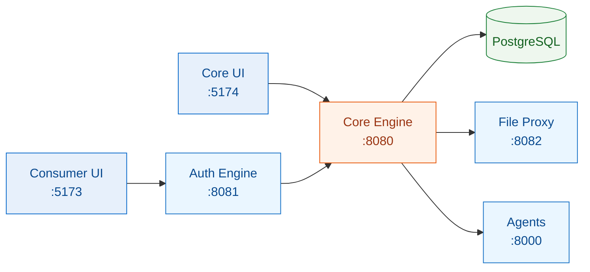

# Getting Started

This page gets a developer from a fresh checkout to the fleet running locally. It is a
map, not a turnkey script — each repo has its own README with the authoritative commands.

::: tip Prerequisites
- **Java 21** + Maven (the engine/gateway/proxy use the bundled `./mvnw`)
- **Node 22** + npm (the UIs and headless libraries)
- **Python 3.12** (the AI agents)
- **Docker** + **PostgreSQL** (the engine's datastore)
- A **WorkOS** account for real auth (or run the engine with local/dev auth)
:::

## The lay of the land

Everything orbits the [Core Engine](/services/core-engine). A minimal local stack is:



You rarely need *all* of it. To work on a UI you need the engine (+ Postgres); to work on a
headless library you need nothing but the library and the app you're vendoring it into.

## 1. Start PostgreSQL

The engine needs a Postgres instance. Point it at one via the env vars in
[Environment Variables](/reference/environment). If several engine instances share one
database, each **must** set a distinct `schema-name` + `table-prefix` — see the
[shared-database rule](/concepts/tenancy).

## 2. Run the Core Engine

```bash
cd luke-core-engine
./mvnw spring-boot:run          # dev profile; runs Flyway migrations on boot
```

The engine hosts the BPMN engine **and** the in-process capability data layer (forms,
email, signatures, phone, documents, access). See [Core Engine](/services/core-engine).

## 3. Run the supporting services (as needed)

```bash
cd luke-auth-engine  && ./mvnw spring-boot:run   # WorkOS ↔ engine gateway (:8081)
cd luke-file-proxy   && ./mvnw spring-boot:run   # S3 bytes + PDF render (:8082)
cd luke-agents       && uvicorn app.main:app --reload   # AI agents (:8000)
```

Each is optional depending on what you're touching — the [File Proxy](/services/file-proxy)
only matters for documents/PDF, the [Agents](/services/agents) only for AI features.

## 4. Run a UI

```bash
cd luke-consumer-ui  && npm install && npm run dev   # tenant orchestrator (:5173)
cd luke-core-ui      && npm install && npm run dev   # operator cockpit (:5174)
```

Set `VITE_API_BASE_URL` (and auth vars) per [Environment Variables](/reference/environment).
The [Consumer UI](/apps/consumer-ui) authenticates via WorkOS → the gateway; the
[Core UI](/apps/core-ui) uses HTTP Basic directly against the engine.

## Working on a headless library

The UIs consume `@lukeflow/form-*`, `@lukeflow/email-*`, etc. as **vendored built dist** —
copied into the app under `vendor/@lukeflow/<pkg>/`, not installed from npm. So the loop is:

```bash
# in the library repo (e.g. luke-forms)
npm install
npm run build                 # produces dist/
# then re-vendor into the app and rebuild the app
```

See each library page for its exact build/vendor commands
([Forms](/libraries/forms), [Email](/libraries/email), …) and the
[Deploy & Promote](/guides/deploy) guide for how a change reaches an environment.

## Verifying your setup

- Engine health: hit the actuator/health endpoint (see [Environment Variables](/reference/environment)).
- API smoke: import the [`luke-api-collection`](/operations/api-collection) Postman
  collection and run the Auth → login flow, then a capability folder.
- Endpoints: the [REST API / Endpoints](/reference/endpoints) index lists what's available.

## Where to go next

- [Architecture](/guide/architecture) — how the pieces fit.
- [Capabilities](/concepts/capabilities) — the domain features and their deep-dives.
- [Add a New Capability](/guides/add-a-capability) — the end-to-end recipe.
