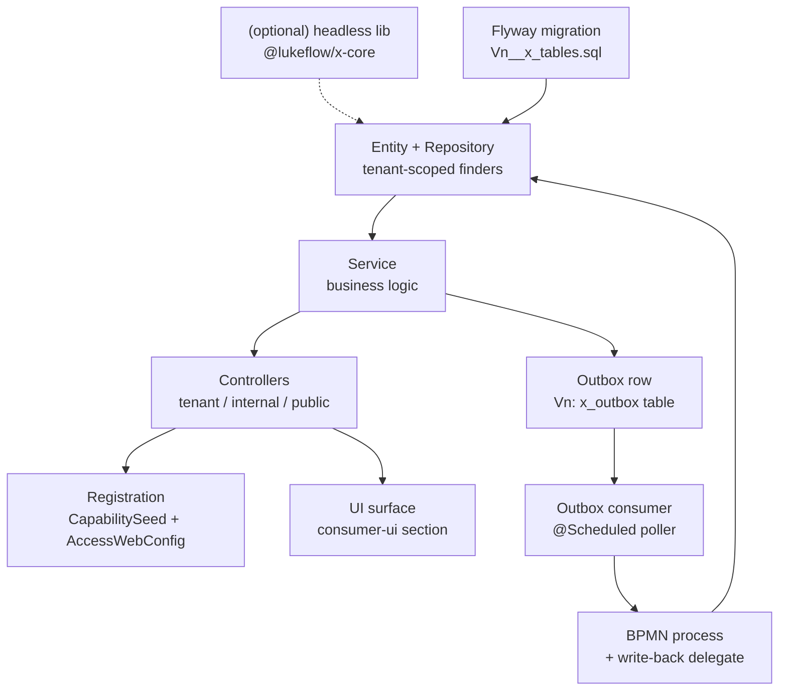

# Add a New Capability

A **capability** in Lukeflow is a feature/module a tenant subscribes to — FORMS, EMAIL,
SIGNATURES, PHONE, DOCUMENTS, and so on. Since the capability-into-core merge (Strategy A),
every capability is an **in-process module inside `luke-core-engine`**: its domain data lives
in core's own schema, its REST APIs are served by core, and Camunda orchestrates side-effects
transactionally through an outbox. There is no separate capability service to deploy.

This guide is the recipe an engineer follows to add one end-to-end. It cites the real
conventions from the existing modules under
`com.luke.engine.capability.*` — chiefly **phone** (`com.luke.engine.capability.phone`) and
**documents** (`com.luke.engine.capability.document`) — so mirror those rather than inventing
a new shape.

See also: [Capabilities](/concepts/capabilities) · [Architecture](/guide/architecture) ·
[Core Engine](/services/core-engine).

::: tip The one rule
A capability is **data + orchestration only**. Core owns the audit rows, the authZ, and the
Camunda binding; the actual side-effect (send the email, place the call, move the bytes) is a
provider call or a separate tier. Keep bytes and third-party media out of core.
:::

## Anatomy

A capability is the same handful of layers every time. The headless library is optional; the
engine module, migration, registration, and BPMN wiring are not.



Everything lives in one package, `com.luke.engine.capability.<name>`, one class per file, flat.
Phone has ~28 files in `capability/phone/`; that is the expected density for a full capability.

## Step-by-step

### 1. (Optional) headless library

If the capability has meaningful client-side logic — a builder, a renderer, a schema/validator —
extract it into a standalone monorepo mirroring **luke-forms** (`@lukeflow/form-core` +
`@lukeflow/form-react`) or **luke-email**. The library is headless and framework-thin; it is
**vendored** into `luke-consumer-ui` as built dist, not consumed live. Skip this entirely for a
data-only capability like documents — its logic is server-side.

### 2. Flyway migration `Vn__<cap>_tables.sql`

Under the `postgres` profile Hibernate `ddl-auto` is `none`, so **the migration is the source of
truth** for the schema and must stay faithful to your JPA entities. Add the next sequential file
under `src/main/resources/db/migration/` — the current head is `V13__email_asset_table.sql`, so a
new capability takes `V14__`. Phone's `V8__phone_tables.sql` is the model to copy.

Follow the house conventions (called out verbatim in the V8 header):

- `varchar(255)` default strings, `text` for large bodies, `timestamp(6)` for `LocalDateTime`
- `@Version Long` → `bigint`; plain `int` → `integer`; `Double` → `double precision`
- status/enum values as plain `varchar(N)` — **no CHECK constraints**
- `snake_case` columns; indexes declared separately; `create table if not exists` so re-runs are harmless
- one table per concern: e.g. `luke_phone_calls`, `luke_phone_numbers`, `luke_phone_settings`,
  `luke_phone_call_outbox`

Never edit a migration that has shipped — always add a new `Vn`.

### 3. Entity + Repository (tenant-scoped finders)

The entity is a plain JPA `@Entity` with an explicit `tenantId` column — **tenant isolation is by
column + scoped query**, not by schema (that is Strategy A). Copy `PhoneCall`:

- `@Id @GeneratedValue(strategy = GenerationType.UUID)` string id
- `@Version Long version` for optimistic locking
- `@Column(nullable = false) private String tenantId;`
- indexes on `tenantId` and `(tenantId, status)` via `@Table(indexes = …)`
- `@PreUpdate` to stamp `updatedAt`

The repository is a `JpaRepository` where **every finder is tenant-bound** — this is the isolation
boundary, so there are no bare `findById` calls in tenant code paths:

```java
public interface PhoneCallRepository extends JpaRepository<PhoneCall, String> {
    Optional<PhoneCall> findByIdAndTenantId(String id, String tenantId);
    Page<PhoneCall> findByTenantId(String tenantId, Pageable pageable);
    Page<PhoneCall> findByTenantIdAndStatus(String tenantId, String status, Pageable pageable);
}
```

The only un-scoped finder is a join key for an inbound webhook (`findByVapiCallId`), which
resolves the owning tenant rather than trusting a caller-supplied one.

### 4. Service

A `@Service`/`@Component` holding the business logic: create/list/mutate rows, call the provider,
enforce invariants. `PhoneCallService.placeOutbound(tenantId, userId, body)` records a `PhoneCall`
row **and** enqueues the outbox row **in the same transaction** (see step 7). Keep the tenant id
threaded through every method — the service never reads tenant from ambient state.

### 5. REST controller(s) — tenant / internal / public

Split controllers by trust boundary; phone has all three and is the canonical example:

| Controller | Path | Auth | Example |
|---|---|---|---|
| **Tenant** | `/api/phone-calls` | Gateway JWT + capability gate | `PhoneController` |
| **Internal** | `/api/internal/phone-calls` | shared-secret `InternalAuthFilter` | `InternalPhoneController` (BPMN/server-to-server) |
| **Public** | `/api/public/phone` | provider shared-secret / token | `PublicPhoneWebhookController` (Vapi webhooks) |

Conventions: tenant is supplied via the `X-Tenant-Id` header, initiator via `X-User-Id`; list
endpoints are **paged and size-capped server-side** (`MAX_PAGE`, `DEFAULT_PAGE`) since rows accrue
monotonically. Only add the controllers you need — a data-only capability may have just the tenant
one; a webhook-driven one needs the public route.

### 6. Register the capability (CapabilitySeed + gating)

Two edits make the capability real:

**a. Catalog seed.** Add a line to `CapabilitySeed.seedAll()` — it is idempotent (`existsByCode`
guard) and runs once per boot under `BootCoordinator.runExclusive`:

```java
seed(new Capability("PHONE", "Phone / Voice",
    "Inbound & outbound voice calls via Vapi.",
    "Phone", "/phone", "ACTIVE", "STANDARD"));
```

The tuple is `(code, name, description, lucideIcon, route, status, tier)`. `tier` is one of
`FREE` / `STANDARD` / `PREMIUM`; `status` one of `ACTIVE` / `INACTIVE` / `BETA`. The UI sidebar
consumes exactly this shape from `/api/my-subscriptions`.

**b. Route gating.** Register your guarded path prefixes in
`AccessWebConfig.addInterceptors()` — GET needs read, mutations need read-write:

```java
registry.addInterceptor(new CapabilityAccessInterceptor(access).forCapability("PHONE"))
        .addPathPatterns("/api/phone-calls/**", "/api/phone-numbers/**", "/api/phone-settings/**");
```

Do **not** list `/api/internal/**` or `/api/public/**` here — those are shared-secret /
token-authenticated by design and must stay off the capability interceptor.

### 7. Outbox + Camunda job-worker for side-effects

Side-effects that must survive a crash or drive a process go through a **transactional outbox**,
not a direct call in the request path. Mirror `PhoneCallProcessOutbox` (which itself mirrors
`SignatureProcessOutbox`):

1. **Outbox entity + table** (`luke_phone_call_outbox`) with a unique `businessKey`
   (= the domain row id, for idempotent retries) and a `state` machine:
   `QUEUED → STARTED → CLOSED` (plus `FAILED`).
2. **Write the QUEUED row in the same transaction** as the domain row (step 4). Nothing is lost if
   the process fails to start — the poller retries.
3. **A `@Scheduled` consumer** (`PhoneCallProcessOutboxConsumer`, `fixedDelayString` ~2s) drains it:
   phase 1 starts the Camunda process (`PhoneProcessService.start(...)`, parks at a receive task);
   phase 2 correlates a message once the row reaches a terminal status. Splitting start and closure
   across poll cycles avoids the start-vs-closure race.
4. **Write-back delegate**: a `JavaDelegate` referenced from the BPMN as `${phoneCallWriteBackDelegate}`
   stamps the process outcome back onto the domain row. It is **best-effort — catch and log, never
   rethrow** — so a write-back failure cannot roll back a logically complete process.

::: warning HA note
The poller must run on exactly one engine node. Phone gates it with
`LUKE_PHONE_OUTBOX_ENABLED` (`@Value("${luke.phone.outbox-enabled:true}")`) — set it `false` on the
other nodes. The unique `businessKey` is a backstop, not a substitute.
:::

### 8. Access / subscription gating

Beyond the interceptor in step 6b, access is layered:

- **Subscription** — a tenant must be subscribed to the capability code (`CapabilitySubscription`).
  Today an org-admin grant auto-subscribes the tenant; tier billing is not yet enforced (gate by
  `tier` before PREMIUM ships).
- **Grants** — per-user read / read-write levels (`CapabilityGrant`, `CapabilityLevel`) enforced by
  `CapabilityAccessInterceptor`.

You get all of this for free by registering the code and the path patterns — no per-capability
authZ code.

### 9. Tests + CI

Add tests alongside the existing suite (JUnit + `@SpringBootTest` slices). Cover: tenant-scoped
finders reject cross-tenant ids, the service enqueues the outbox row transactionally, the outbox
consumer advances state, and the controller enforces headers. The migration is exercised by boot
tests, so a schema/entity drift fails CI. Keep the build **green** — the fleet norm is
CI-green-before-merge, and core-engine runs its full suite on every PR.

### 10. UI surface + vendored lib

Add the tenant-facing section to `luke-consumer-ui` (route from the seed's `route`, e.g. `/phone`):
a list page, a detail page, a settings drawer, and a thin `xApi.ts` client — phone's
`Phone.tsx` / `CallDetail.tsx` / `PhoneSettingsDrawer.tsx` / `phoneApi.ts` is the template. If you
built a headless library in step 1, **vendor its built dist** into consumer-ui (the forms/email
model) rather than depending on it live. The sidebar entry appears automatically once the tenant's
`/api/my-subscriptions` includes the new code.

::: info Deploy target
Lukeflow deploys `develop` / `qa`, not `main`. Open service-repo PRs with
`gh pr create --base develop` or the change never ships.
:::

## Checklist

- [ ] (Optional) headless lib extracted, mirroring luke-forms; vendored, not live-linked
- [ ] `Vn__<cap>_tables.sql` added (next sequential; house conventions; `if not exists`)
- [ ] Entity with `tenantId` + `@Version` + UUID id + tenant/status indexes
- [ ] Repository with **only** tenant-scoped finders (plus webhook join key if needed)
- [ ] Service threads `tenantId`; writes domain row + outbox row in one transaction
- [ ] Controllers split by trust: tenant `/api/x`, internal `/api/internal/x`, public `/api/public/x`
- [ ] `CapabilitySeed.seedAll()` line added (code, name, desc, icon, route, status, tier)
- [ ] `AccessWebConfig` path patterns registered (tenant routes only)
- [ ] Outbox entity + table + `@Scheduled` consumer + `${xWriteBackDelegate}` + BPMN
- [ ] Outbox poller HA-gated by an env flag
- [ ] Tests green (tenant isolation, outbox, migration/entity parity); CI passing
- [ ] consumer-ui section + `xApi.ts`; PR based on `develop`

## Related

- [Phone (Voice)](/capabilities/phone) — the fullest webhook + outbox + provider example
- [Documents](/capabilities/documents) — the registry / bytes-in-another-tier split
- [Capabilities](/concepts/capabilities) — the in-process capability model
- [Core Engine](/services/core-engine) — the runtime everything plugs into
