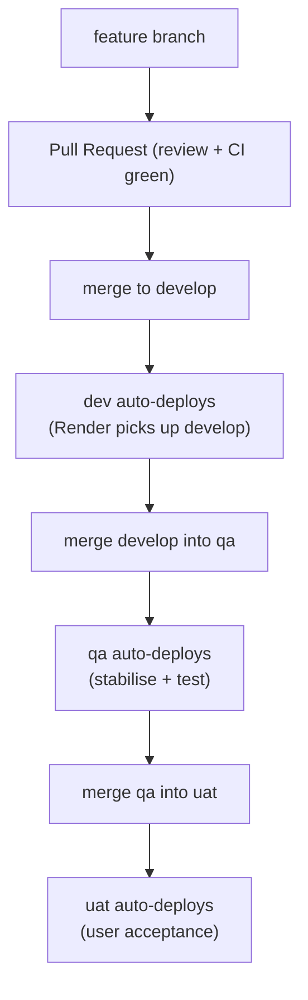

# Deploy & Promote a Change

The whole non-production fleet is deployed by a **single Render Blueprint** that lives in
`luke-platform/render.yaml`. There is no per-service dashboard clicking and no hand-rolled
CI/CD: you merge to the branch that maps to an environment, and Render redeploys that
environment's service from its own repo (`repo:` + `branch:`).

This guide is the practical checklist for shipping and promoting a change. For the shape of
the system it deploys into, see [Deployment Topology](/concepts/deployment) and
[Platform & Deployment](/operations/platform).

> As of July 2026. `uat` is defined in the blueprint but shipped commented-out — uncomment
> its block to enable it.

## Environments & branches

Each environment is a full stack — engine (Docker), consumer-auth gateway (Docker),
file-proxy (Docker), agents (Python), consumer-ui (static) and core-ui (static) — all pulled
from their own repos and sharing **one** Postgres instance (`luke-nonprod-db`), isolated by
schema. The branch a service repo is deployed from is what decides where a change lands.

| Environment | Branch | Purpose |
| --- | --- | --- |
| **dev** | `develop` | Integration / daily development. Merging here auto-deploys dev. |
| **qa** | `qa` | Stabilisation and test. Promote by merging `develop` → `qa`. |
| **uat** | `uat` | User-acceptance (currently disabled). Promote by merging `qa` → `uat`. |

::: warning Deploy from `develop`, not `main`
Service repos deploy from **`develop`** (and `qa`/`uat`) — **never `main`**. A change merged
only to a service's `main` **does not ship**: no environment is wired to it. Always open PRs
against `develop` (or `qa`).

The one exception is the **`luke-email`** headless library, whose deploy/publish branch **is**
`main`. Treat it as the odd one out, not the rule.
:::

## Promotion flow

A change rides the same one-way escalator through the environments. You do not deploy an
environment directly; you merge into its branch and Render does the rest.



The rule of thumb: **promotion is a merge**. `develop` → `qa` → `uat`, never skipping a rung
and never editing an environment out of band.

## Deploy a service

Java engines (`luke-core-engine`, `luke-auth-engine`, `luke-file-proxy`) and the Python
`luke-agents` service are all `type: web` services built by Render.

1. Open a PR into the service repo's **`develop`** branch and get it green.
2. Merge. Render detects the push and rebuilds that environment's service:
   - **Java services** build from `./Dockerfile` and expose a health check at
     `/actuator/health`. Render waits for it to pass before routing traffic.
   - **`luke-agents`** builds with `pip install -r requirements.txt` and runs the FastAPI
     app. It keeps its transcripts in its **own** schema (`luke_agents_<env>`), separate from
     the engine/capability schemas, so a redeploy does not touch process data.
3. Watch the deploy in the Render dashboard until it reports live and the health check is
   green.
4. Promote when ready: merge `develop` → `qa` (then `qa` → `uat`). Each merge redeploys only
   that environment.

::: tip Config changes ship the same way
Environment variables are declared in `render.yaml`. Changing a service's config means
editing the blueprint in `luke-platform` and syncing it — it is not a code deploy of the
service repo. Secrets marked `sync: false` (WorkOS keys, etc.) are set once in the dashboard.
:::

## Deploy a UI

The UIs (`luke-consumer-ui`, `luke-core-ui`) are **static sites**: Render runs
`npm ci && npm run build` and publishes `./dist`. Merge to `develop` and the static site
rebuilds and redeploys. Two things about UI deploys are easy to get wrong.

### Vendored headless libraries

The apps consume the headless libraries — `@lukeflow/form-*`, `@lukeflow/email-*`,
`@lukeflow/sign-*`, `@lukeflow/list-*` — as **vendored built `dist`**, not as live workspace
source. A library change is therefore a three-step rebuild, in order:

1. **Rebuild the package** in its own monorepo (produces fresh `dist`).
2. **Re-vendor** that `dist` into the consuming app.
3. **Rebuild/push the app** so the new vendored bundle is in `./dist`.

Skipping the re-vendor step means the app ships the old library — the build is green but the
change is invisible. See the [headless libraries](/libraries/forms) reference.

### The `/embed` bundle lives in the engine — not the UI

::: danger The public `/embed` page is served by the engine
The public **`/embed`** page is a **standalone bundle copied into the engine** at
`static/embed-assets`. It is **not** served by `luke-consumer-ui`. **A consumer-ui push does
not update it.**

The **`/respond`** bundle (`static/respond-assets`) works exactly the same way.

To ship an `/embed` or `/respond` change — including any change to a `@lukeflow/form-*`
package vendored into them:

```bash
# in luke-consumer-ui
npm run vendor:embed && npm run vendor:respond   # builds + copies into ../luke-core-engine
npm run bundles:lock                             # record the new hashes
# then commit + push BOTH repos — the engine push is what actually deploys
```

If you only push consumer-ui, the live `/embed` page stays on the old bundle.
:::

::: warning This drifted silently for five days — there is now a guard
On 2026-08-01 both committed bundles turned out to be five days and several features behind
source. The embed was serving a form with **none** of the forms layout fixes — and because those
bugs only appear where the host page ships no CSS reset, the third-party embed was simultaneously
the only place they mattered and the only place still broken.

`npm run bundles:check` now runs in consumer-ui CI and fails the moment the built output stops
matching `public-bundles.lock.json`, i.e. exactly when a re-vendor becomes necessary.

The bundles also read **no** `.env`: their `envDir` points at an empty committed folder. A build
on a laptop carrying `VITE_ANALYTICS_ENABLED=true` had compiled that personal flag into the public
artefact — six bytes' difference from a clean build, caught by the guard's first run. Anything the
bundles genuinely need is set explicitly via `define:` in the vite configs.
:::

## Shared database rule

All environments share the single `luke-nonprod-db` Postgres instance. They stay isolated
because each engine sets its **schema-name** (`DB_SCHEMA` = `platform_dev` / `platform_qa` /
`platform_uat`) and the engine creates that schema on first connect. The agents service does
the same with its own schema (`luke_agents_<env>`).

::: warning Schema-name + table-prefix isolation is a hard invariant
A shared-instance engine **must** set its `schema-name` **and** `table-prefix`. Without it,
the **second** environment to boot crashes while creating `act_id_user` (the tables already
exist in the shared schema). This is not optional tuning — it is what keeps dev/qa/uat from
colliding on one database. See [Multi-Tenancy](/concepts/tenancy).
:::

Never point a new environment at an existing schema, and never drop the table-prefix "to keep
it simple" — a first-boot collision is the immediate result.

## Rollback

Rollbacks are a Render operation, not a git-revert scramble:

- **Redeploy a previous build.** In the Render dashboard, pick the last-known-good deploy for
  the affected service and redeploy it. This is the fastest path back.
- **Revert the merge.** Revert the offending commit on the environment branch (`develop` /
  `qa` / `uat`); the revert push triggers a clean redeploy.
- **For `/embed` or vendored-library regressions**, remember the rollback must include the
  step you shipped: re-push the engine with the previous `static/embed-assets`, or re-vendor
  the previous library `dist` — reverting the app alone will not restore either.

For the authoritative, service-by-service rollback and incident procedures, follow the
runbooks in `luke-platform` (`README.md` and the `security/` program) and see
[Platform & Deployment](/operations/platform).
