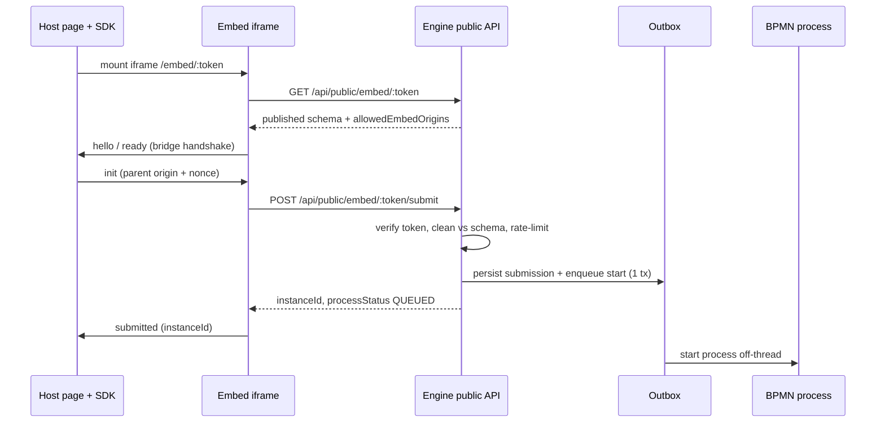

# Embed a Form

Drop a published Lukeflow **inbound** form onto any external website. The form renders in a cross-origin iframe served by the core engine, and each submission is validated server-side, recorded as a response, and starts a BPMN process.

## Prerequisites

Before you can embed, the form must satisfy the engine's public-surface gate ([`EmbedFormResolver`](/services/core-engine)):

- **Inbound kind** — the form must be an INBOUND form. Outbound forms are sent to a recipient and are never embeddable (`404`).
- **Published version** — the form has a published version. The embed always serves `@published`; re-publish to change what visitors see.
- **Submission handling decided** — an inbound form is locked until you choose what happens to submissions (e.g. "Collect submissions"). Until then the embed surface returns `404`.
- **Allowed embed origins (optional but recommended)** — the list of sites permitted to frame the form. Empty = any site may embed (the public default).

## How it works

The host page never talks to the engine directly. The `@lukeflow/form-embed` SDK mounts a cross-origin iframe pointed at `<engine>/embed/:token`; that page loads the self-contained renderer bundle, which calls the same-origin public API and reports events back over a nonce-guarded `postMessage` bridge.



## Step 1 — Configure allowed embed origins

Open the form in the builder and use **Embed this form → Allowed embed domains**. Enter one origin per line:

```
https://acme.com
https://*.acme.com
```

The engine sanitizes the list ([`FrameAncestors.normalizeList`](/services/core-engine)) — trimmed, lower-cased, de-duplicated, trailing slash removed, one optional leading `*.` wildcard label. Anything that can't be parsed as `scheme://host[:port]` is dropped, so a malformed entry can never widen the policy. If you type a list where **nothing** parses (e.g. `example.com` with no scheme) the save is rejected rather than silently falling back to "any site".

Leave the box empty to allow any site to frame the form.

## Step 2 — Get the embed token and snippet

The panel mints an opaque, HMAC-signed token on first open (via `GET /api/form-definitions/{id}/embed-token`) and renders a copy-paste snippet. It looks like this:

```html
<div data-lukeform-token="TOKEN" data-lukeform-host="https://engine.acme.com"></div>
<script src="https://app.acme.com/embed.js" data-lukeform-auto></script>
```

- `data-lukeform-token` — the signed token (carries only tenant + form code + embed-key version).
- `data-lukeform-host` — the engine/gateway origin that serves the embed page and public API.
- `embed.js` — the built `@lukeflow/form-embed` IIFE bundle. Because it carries `data-lukeform-auto`, it auto-initializes every `[data-lukeform-token]` element on the page — zero extra JavaScript.

Click **Copy snippet** and paste it wherever you want the form.

## Step 3 — Drop it into your page (zero-JS)

Paste the snippet directly into your HTML. On load, `autoEmbed()` finds each `[data-lukeform-token]` element and mounts an iframe into it. Host defaults to the script's own origin, or the value of `data-lukeform-host`:

```html
<h1>Contact us</h1>
<div data-lukeform-token="a7f2~eyJ0ZW5hbnQ...~9c1.Hk3f" data-lukeform-host="https://engine.acme.com"></div>
<script src="https://app.acme.com/embed.js" data-lukeform-auto></script>
```

That is all a marketing site needs.

## Step 4 — Or mount programmatically with `createEmbed`

For SPAs or when you want submission callbacks, install the SDK and call `createEmbed` yourself:

```bash
npm install @lukeflow/form-embed
```

```ts
import { createEmbed } from "@lukeflow/form-embed";

const handle = createEmbed({
  token: "a7f2~eyJ0ZW5hbnQ...~9c1.Hk3f",
  target: "#contact-form",            // CSS selector or an HTMLElement
  host: "https://engine.acme.com",    // the engine origin serving /embed/:token
  title: "Contact form",              // accessible iframe title
  autoResize: true,                   // grow the iframe to its content (default)
  onReady: () => console.log("form rendered"),
  onResize: (height) => console.log("new height", height),
  onSubmit: ({ instanceId }) => {
    console.log("submitted", instanceId);
    // redirect, show a thank-you, fire analytics, etc.
  },
  onError: (message) => console.error("embed error", message),
});

// later, e.g. on route change / unmount:
handle.destroy();
```

`createEmbed` returns an `EmbedHandle` — `{ iframe, destroy() }`. `destroy()` removes the `message` listener and the iframe. It throws if `target` can't be resolved or the host origin can't be determined.

## Step 5 — Handle the events

The four callbacks are the only channel between the iframe and your page. What crosses the bridge is deliberately **non-sensitive** — a ready/resize/submitted/error signal and the new instance id, never field values.

- `onReady` — fires once the form has actually rendered (not merely connected).
- `onResize(height)` — the iframe auto-grows to its content; pass `autoResize: false` to size it yourself.
- `onSubmit({ instanceId })` — a submission succeeded; `instanceId` is the created response/process instance. Use it to redirect or show confirmation.
- `onError(message)` — a load or submit error.

The bridge is nonce-guarded on both ends: the host only accepts a message that comes from the iframe's own window, from the exact form-host origin, and carries the per-embed nonce, so a sibling frame or malicious page can't spoof `submitted`.

## Security notes

- **HMAC token** — the embed token is opaque and signed with `HmacSHA256` ([`EmbedTokens`](/services/core-engine)). It wraps `tenantId | code | keyVersion` in random padding; the secret lives only in the engine (`luke.embed.hmac-secret`). No one can forge a token for another tenant, and the token is the auth on the only unauthenticated path in the system (`/api/public/embed/**`). It carries no field data.
- **Per-tenant `frame-ancestors`** — the embed page ([`EmbedPageController`](/services/core-engine)) emits `Content-Security-Policy: frame-ancestors <your allowed origins>`, computed per token from the form's allowlist. This is the authoritative, browser-enforced control over who may frame the form (an empty allowlist → `*`; a forged/stale token → `frame-ancestors 'none'`). The SDK's `postMessage` bridge does **not** solve clickjacking — the CSP does.
- **Server-side validation** — the public submit endpoint never trusts the client. `SubmissionValidator.clean` re-validates against the published schema: unknown fields stripped, required enforced, size bounded, control characters stripped, before anything is persisted or a process starts.
- **Token revocation** — **Regenerate link** bumps the form's `embedKeyVersion`. The version is signed into the token, so every previously pasted snippet immediately fails the version check and returns `404`. Replace the snippet with the newly minted one.
- **Anti-abuse** — fixed 1-minute rate-limit windows keyed per IP (40/min) and per token (20/min), a hidden honeypot field that silently drops bot submissions (returning a success shape so spammers don't learn), and a request-size limit filter on the submit path.

See [Auth](/concepts/auth) for how the public embed surface bypasses the WorkOS gateway while the signed token supplies tenant scope.

## Related

- [Forms deep-dive](/capabilities/forms) — the end-to-end forms capability (authoring, inbound/outbound, outbox-driven process starts).
- [Forms library](/libraries/forms) — the headless `@lukeflow/form-*` packages, including `form-embed`.
