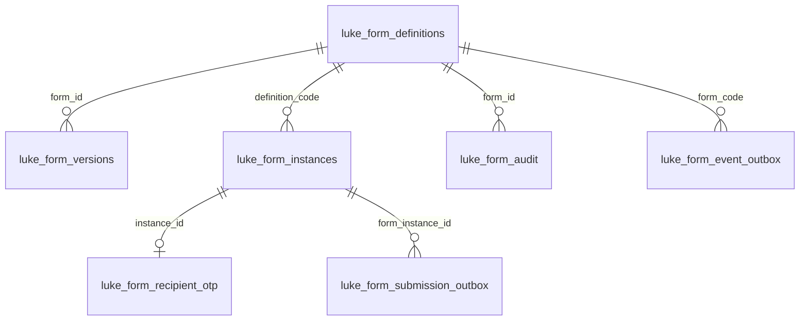
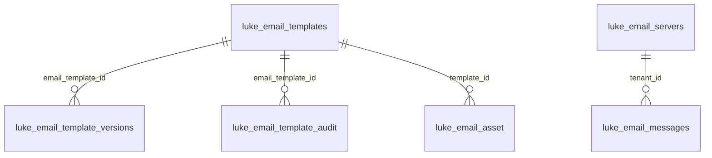
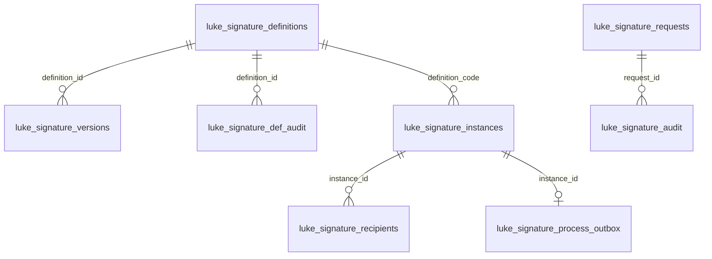
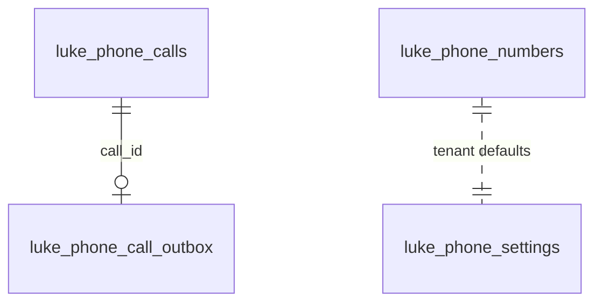
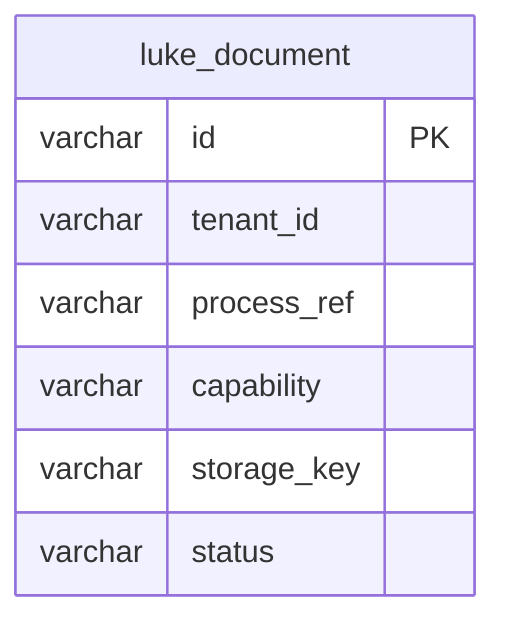
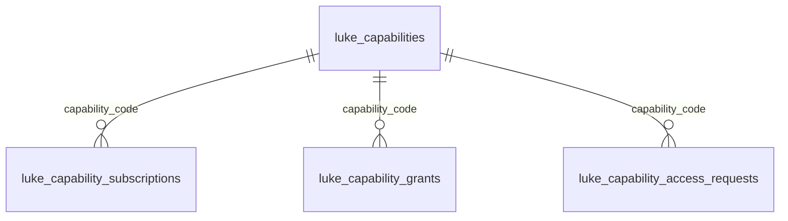
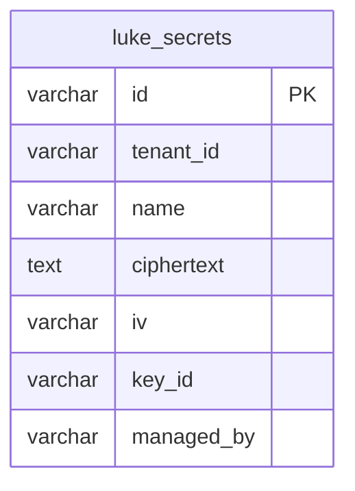
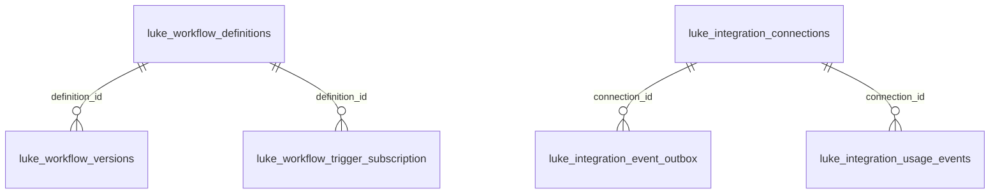

# Data Model

Every capability's persistent state lives in the **core engine's Postgres database**, alongside
the Camunda process-engine tables. There is no separate per-capability database: the
[capability→core merge](/concepts/capabilities) collapsed the standalone services into an
in-process data layer, so all application tables are prefixed `luke_` and sit in the same schema
the [Core Engine](/services/core-engine) boots against.

Two rules govern the schema:

- **Tenant isolation is by column, not by schema.** Almost every `luke_*` table carries a
  `tenant_id varchar(255)` column, and every query is scoped to the caller's tenant. See
  [Multi-Tenancy](/concepts/tenancy) for how the tenant is resolved and enforced.
- **Flyway owns `luke_*`; Camunda owns `act_*`.** The `luke_*` application tables are created and
  evolved by **Flyway migrations** (`V1__…` through `V13__…` — 13 versioned migrations as of
  July 2026, plus a `beforeMigrate.sql` callback). Camunda's `act_*` tables are managed
  separately by the engine's own `camunda.bpm.database.schema-update`; Flyway never touches them.

When several engine instances (dev / qa / prod) share one Postgres server, each **must** set a
distinct `schema-name` + `table-prefix` so their `act_*` tables don't collide — otherwise
first-boot fails on `act_id_user`. The `luke_*` tables follow the same schema isolation.

No table declares foreign-key constraints. Relationships below are **logical** — enforced in
application code — and are drawn from the id / code columns that link rows.

## Migrations

| Version | Adds |
| --- | --- |
| `V1__baseline_luke_tables` | Baseline: all `luke_*` tables for Forms, Email, Access/Capabilities, Secrets, plus the job-worker topic registry. Generated from JPA metadata; idempotent (`IF NOT EXISTS`). |
| `V2__form_allowed_embed_origins` | Adds `allowed_embed_origins` to `luke_form_definitions`. |
| `V3__form_embed_key_version` | Adds `embed_key_version` (embed-token key rotation) to `luke_form_definitions`. |
| `V4__form_definition_version_backfill` | Backfills `luke_form_definitions.version` to `0` and makes it `not null`. |
| `V5__form_version_signoff` | Adds `signed_off_at` / `signed_off_by` to `luke_form_versions` (per-version sign-off). |
| `V6__signature_tables` | SIGNATURES capability: the `luke_signature_*` tables (definition flow + single-shot request flow). |
| `V7__document_table` | DOCUMENTS layer: the `luke_document` system-of-record index (bytes live in S3). |
| `V8__phone_tables` | PHONE (Vapi) capability: `luke_phone_*` tables. |
| `V9__workflow_tables` | WORKFLOW capability + Nango INTEGRATIONS: `luke_workflow_*` and `luke_integration_*` tables. |
| `V10__form_event_rail` | `luke_form_event_outbox` + `luke_workflow_trigger_subscription` (form events → workflow triggers). |
| `V11__form_kind` | Adds `kind`, `submission_handling`, `outbound_roles_json` to `luke_form_definitions` (inbound vs outbound). |
| `V12__form_recipient_otp` | `luke_form_recipient_otp` (one-time-passcode gate for outbound form recipients). |
| `V13__email_asset_table` | `luke_email_asset` (public image store for the email builder). |

`beforeMigrate.sql` is a Flyway callback (not a versioned migration) that re-asserts the baseline
tables with `IF NOT EXISTS`, keeping re-runs against pre-existing schemas harmless.

## Forms

Design-time `definitions` snapshot into immutable `versions`; a published version is instantiated
per fill as an `instance`, whose submission is handed to Camunda through the
`submission_outbox`. Outbound-form recipients are gated by a one-time passcode, and form
lifecycle events flow onto an event outbox. See the [Forms deep-dive](/capabilities/forms).

| Table | Key columns | Purpose |
| --- | --- | --- |
| `luke_form_definitions` | `id`, `tenant_id`, `code` (uq per tenant), `status`, `published_version`, `kind`, `submission_handling`, `draft_schema` | The editable form template; tracks published version, inbound/outbound kind, embed origins + key version, and design-time lock. |
| `luke_form_versions` | `id`, `form_id`, `version` (uq per form), `schema`, `signed_off_at/_by` | Immutable checked-in schema snapshots; sign-off gates publish. |
| `luke_form_instances` | `id`, `tenant_id`, `token` (uq), `definition_code`, `state`, `data`, `prefill`, `recipient`, `expires_at` | One live fill of a form; `token` is the bearer for the embed / send link. |
| `luke_form_recipient_otp` | `id`, `instance_id` (uq), `code_hash`, `code_salt`, `attempts`, `expires_at` | OTP challenge protecting an outbound form instance. |
| `luke_form_submission_outbox` | `id`, `business_key` (uq), `form_instance_id`, `status`, `process_instance_id`, `retry_count` | Transactional outbox handing a submission to Camunda (form → process). |
| `luke_form_event_outbox` | `id`, `tenant_id`, `event_type`, `form_code`, `instance_id`, `state`, `retry_count` | Form lifecycle events published to the workflow trigger rail. |
| `luke_form_audit` | `id`, `form_id`, `tenant_id`, `action`, `actor`, `at` | Append-only audit of design-time form actions. |

## Email

Templates version and publish like forms, then push to Postmark (`postmark_alias` /
`postmark_template_id`); sent mail is logged in `luke_email_messages`. Per-tenant Postmark
sending is configured in `luke_email_servers` and gated by domain `verifications`. Builder image
uploads live in the dedicated public `luke_email_asset` store. See the
[Email deep-dive](/capabilities/email).

| Table | Key columns | Purpose |
| --- | --- | --- |
| `luke_email_templates` | `id`, `tenant_id`, `code` (uq per tenant), `status`, `published_version`, `postmark_alias`, `draft_doc` | The editable email template; owns the JSON doc + Postmark alias. |
| `luke_email_template_versions` | `id`, `email_template_id`, `version` (uq per template), `doc`, `postmark_alias/_template_id` | Immutable checked-in template snapshots pushed to Postmark. |
| `luke_email_template_audit` | `id`, `email_template_id`, `tenant_id`, `action`, `actor`, `at` | Audit trail of template actions. |
| `luke_email_messages` | `id`, `tenant_id`, `status`, `to_address`, `from_address`, `template_id`, `postmark_message_id`, `error_code` | Log of every outbound send, with delivery status + Postmark id. |
| `luke_email_servers` | `id`, `tenant_id` (uq), `company_slug`, `postmark_server_id`, `sender_domain`, `message_stream`, `status`, `verified_at` | Per-tenant Postmark server + verified sending domain. |
| `luke_email_verifications` | `id`, `tenant_id`, `domain`, `email`, `code_hash`, `status`, `expires_at` | Domain/email verification challenge for enabling sending. |
| `luke_email_asset` | `id`, `tenant_id`, `template_id`, `storage_key`, `status`, `sha256` | Public S3-backed image (logos etc.) served id-as-bearer to mail clients. |

## Signatures

Two families share the module. The **definition-driven** flow (definition → version →
instance → recipients) mirrors Forms and drives Camunda through a process outbox. The
**single-shot request** flow (`luke_signature_requests`) is a one-off "sign this PDF here"
with its own forensic audit. See the [Signatures deep-dive](/capabilities/signatures).

| Table | Key columns | Purpose |
| --- | --- | --- |
| `luke_signature_definitions` | `id`, `tenant_id`, `code` (uq per tenant), `status`, `published_version`, `document_key`, `draft_schema` | Design-time signature template (field placement + source doc). |
| `luke_signature_versions` | `id`, `definition_id`, `version` (uq per def), `schema`, `signed_off_at/_by` | Immutable checked-in signature-template snapshots. |
| `luke_signature_def_audit` | `id`, `definition_id`, `tenant_id`, `action`, `actor`, `at` | Design-time audit for definitions. |
| `luke_signature_instances` | `id`, `tenant_id`, `token` (uq), `definition_code`, `state`, `business_key` (uq), `signed_object_key`, `seal_status` | A campaign of one document out for signature; tracks sealing + process binding. |
| `luke_signature_recipients` | `id`, `instance_id`, `tenant_id`, `signer_id`, `email`, `signing_order`, `sign_token` (uq), `state` | Ordered signers of an instance, each with its own signing link. |
| `luke_signature_process_outbox` | `id`, `business_key` (uq), `instance_id`, `state`, `process_instance_id`, `retry_count` | Transactional outbox driving the signature Camunda process. |
| `luke_signature_requests` | `id`, `tenant_id`, `code` (uq per tenant), `status`, `signer_email`, `verification_method`, `field_x/y/w/h`, `sign_token` (uq), `source/signed_object_key`, `retain_until` | Single-shot signature request (one PDF, one signer, one field box). |
| `luke_signature_audit` | `id`, `request_id`, `tenant_id`, `action`, `ip_address`, `user_agent`, `geo_country/_city`, `ip_risk`, `at` | Forensic audit trail (IP / geo / risk) for a request. |

## Phone

Each inbound/outbound call gets one audit row bound to its Camunda process; a call outbox drives
the process. Owned numbers and per-tenant defaults are stored separately (the Vapi API key lives
in the [secret store](#secrets), not here). See the [Phone deep-dive](/capabilities/phone).

| Table | Key columns | Purpose |
| --- | --- | --- |
| `luke_phone_calls` | `id`, `tenant_id`, `direction`, `status`, `vapi_call_id` (uq), `customer_number`, `transcript`, `recording_url`, `business_key`, `process_instance_id` | One row per call, with Vapi outcome (transcript / recording / cost) + process binding. |
| `luke_phone_numbers` | `id`, `tenant_id`, `vapi_number_id` (uq), `number`, `provider`, `assistant_id` | A Vapi-provided or BYO (Twilio/Telnyx) number a tenant owns. |
| `luke_phone_settings` | `id`, `has_api_key`, `default_assistant_id`, `default_phone_number_id` | Per-tenant phone defaults (one row per tenant). |
| `luke_phone_call_outbox` | `id`, `business_key` (uq), `call_id`, `tenant_id`, `direction`, `state`, `retry_count` | Transactional outbox driving the phone-call Camunda process. |

## Documents

A single system-of-record index: bytes live in S3 (behind [luke-file-proxy](/services/file-proxy)),
and this row maps a stable `docId` to its `storage_key`, adds the authZ + status machine, and
links the document to a process / task. See the [Documents deep-dive](/capabilities/documents).

| Table | Key columns | Purpose |
| --- | --- | --- |
| `luke_document` | `id`, `tenant_id`, `process_ref`, `process_instance_id`, `task_id`, `kind`, `capability`, `owner_entity_id`, `storage_key`, `sha256`, `status`, `retain_until` | Durable, tenant-isolated index of every stored document; `storage_key` is server-only and never returned to clients. |

## Access / Capabilities

The capability catalog plus the per-tenant subscription and per-user grant model. Members raise
access requests against a capability; owners approve them into grants. See the
[Access deep-dive](/capabilities/access) and [Capabilities](/concepts/capabilities).

| Table | Key columns | Purpose |
| --- | --- | --- |
| `luke_capabilities` | `id`, `code` (uq), `name`, `status`, `tier`, `route` | The catalog of capabilities the platform offers. |
| `luke_capability_subscriptions` | `id`, `tenant_id`, `capability_code`, `status`, uq `(tenant_id, capability_code)` | Which capabilities a tenant is subscribed to. |
| `luke_capability_grants` | `id`, `tenant_id`, `user_id`, `capability_code`, `level`, uq `(tenant_id, user_id, capability_code)` | A user's access level to a capability within a tenant. |
| `luke_capability_access_requests` | `id`, `tenant_id`, `user_id`, `capability_code`, `requested_level`, `status`, `decided_by` | A member's pending/decided request for capability access. |

## Secrets

Per-tenant encrypted credential store (e.g. the Vapi API key). Values are held as ciphertext with
their IV + key id; only the last four characters are kept in clear for display.

| Table | Key columns | Purpose |
| --- | --- | --- |
| `luke_secrets` | `id`, `tenant_id`, `name`, uq `(tenant_id, name)`, `ciphertext`, `iv`, `key_id`, `last_four`, `managed_by`, `version` | Envelope-encrypted per-tenant secrets referenced by capabilities that call third-party APIs. |

## Workflow & Integrations

The composing WORKFLOW capability (JSON → BPMN design-time lifecycle) and its Nango-backed
integrations module. Definitions version + compile into immutable snapshots; trigger
subscriptions match inbound capability events to a workflow process. Nango connections hold only
the connection id (tokens live in Nango); inbound webhooks are logged for idempotency and bridged
to Camunda through an event outbox, with metered usage recorded per success. See the
[Workflow deep-dive](/capabilities/workflow).

| Table | Key columns | Purpose |
| --- | --- | --- |
| `luke_workflow_definitions` | `id`, `tenant_id`, `name`, `status`, `latest_version`, `published_version`, `draft_json` | The editable, tenant-scoped workflow template. |
| `luke_workflow_versions` | `id`, `definition_id`, `version` (uq per def), `json_source`, `bpmn_xml`, `compile_ok`, `signed_off_at/_by` | Immutable snapshot: JSON source + compiled BPMN + sign-off. |
| `luke_workflow_trigger_subscription` | `id`, `tenant_id`, `capability`, `event_type`, `form_code`, `definition_id`, `process_id` | Routes an inbound capability event to a workflow process. |
| `luke_integration_connections` | `id`, `tenant_id`, `provider_key`, `status`, `nango_connection_id`, `external_account` | A per-tenant Nango connection (we hold the id; tokens live in Nango). |
| `luke_integration_webhook_log` | `delivery_id` (PK), `type`, `signature_ok`, `processed_at` | Idempotency + audit for inbound Nango webhook deliveries. |
| `luke_integration_event_outbox` | `id`, `tenant_id`, `message_name`, `correlation_key`, `connection_id`, `state`, `retry_count` | Outbox bridging inbound integration events into Camunda correlation. |
| `luke_integration_usage_events` | `id`, `tenant_id`, `connection_id`, `type`, `quantity`, `idempotency_key` (uq), `occurred_at` | Metered usage (successful executions) for billing. |

## Camunda / engine tables

The BPMN process engine keeps its own schema — the `act_*` tables (`act_ru_*` runtime,
`act_hi_*` history, `act_id_*` identity, `act_ge_*` general, `act_re_*` repository). These are
**not** managed by Flyway: the engine creates and upgrades them via
`camunda.bpm.database.schema-update`, entirely independent of the `luke_*` migrations.

The engine also keeps one Flyway-owned helper table used by its runtime rather than by any one
capability:

| Table | Key columns | Purpose |
| --- | --- | --- |
| `luke_registered_topics` | `id`, `topic_name` (uq), `worker_type`, `worker_class`, `poll_type`, `lock_duration_ms`, `retries`, `active` | Registry of external-task / job-worker topics the engine polls to drive capability outboxes. |

**Schema-isolation rule (recap).** When multiple engine instances share one Postgres server, each
sets a distinct `schema-name` + `table-prefix`. This keeps both the `act_*` engine tables and the
`luke_*` capability tables isolated per environment; without it, the first instance to boot
crashes the others on shared identity tables such as `act_id_user`. See
[Multi-Tenancy](/concepts/tenancy) and the [Core Engine](/services/core-engine) service page.
